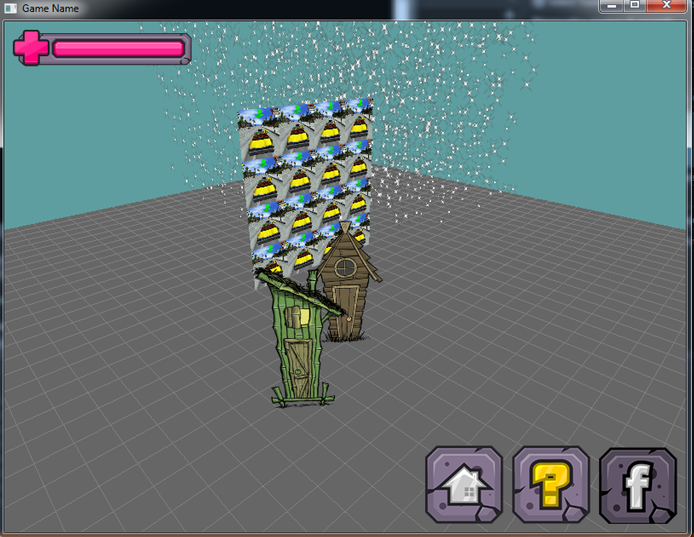

# Snow particle example

Lets start the class out with some constants. There are two parts to each constant. The default value that the constant will have, along with some random range that affects that value.
```cs
using OpenTK.Graphics.OpenGL;
using Math_Implementation;
using System.Drawing;
using System.Drawing.Imaging;

namespace GameApplication {
    class SnowstormParticleSystem : ParticleSystem {
        public static Vector3 SNOWFLAKE_VELOCITY = new Vector3(0f, -2f, 0f);
        public static Vector3 VELOCITY_VARIATION = new Vector3(0.2f, 0.5f, 0.2f);
        public static float SNOWFLAKE_SIZE = 0.25f;
        public static float SIZE_DELTA = 0.25f;
        public static float SNOWFLAKE_PER_SEC = 500;
```

Next, let's define some member values. The snow storm is a volumetric effect, so we need to define a cube for it. We're going to leverage the fact that the ```ParticleSystem``` base class already has an origin variable. We will define a cube by augmenting origin with width, height and depth.
```cs
        protected float height;
        protected float width;
        protected float depth;
        protected int texture;
```

The constructor takes 1 more variable than the base constructor, which is the size of the snow volume. Becuase of this, the default constructor is called using the : convention with the first two arguments only.

After we store the dimensions of the snow volume, we go ahead and load a snow texture. You can download the texture from [here](snow.png).

```cs
        public SnowstormParticleSystem(int maxParticles, Vector3 origin, Vector3 size)
            : base(maxParticles, origin) {
            height = size.Y;
            width = size.X;
            depth = size.Z;
            

            texture = GL.GenTexture();
            GL.BindTexture(TextureTarget.Texture2D, texture);
            GL.TexParameter(TextureTarget.Texture2D, TextureParameterName.TextureMinFilter, (int)TextureMagFilter.Linear);
            GL.TexParameter(TextureTarget.Texture2D, TextureParameterName.TextureMagFilter, (int)TextureMagFilter.Linear);
            Bitmap bmp = new Bitmap("Assets/snow.png");
            BitmapData bmp_data = bmp.LockBits(new Rectangle(0, 0, bmp.Width, bmp.Height), ImageLockMode.ReadOnly, System.Drawing.Imaging.PixelFormat.Format32bppArgb);
            GL.TexImage2D(TextureTarget.Texture2D, 0, PixelInternalFormat.Rgba, bmp_data.Width, bmp_data.Height, 0, OpenTK.Graphics.OpenGL.PixelFormat.Bgra, PixelType.UnsignedByte, bmp_data.Scan0);
            bmp.UnlockBits(bmp_data);
            bmp.Dispose();
        }
```

The shutdown function is straight forward, it deletes the snow texture.

```cs
        public override void Shutdown() {
            GL.DeleteTexture(texture);
        }
```

Update is a little funky, you might be able to write it cleaner than i could. Basically all particles that are alive in a list go from 0 to numParticles. This function goes ahead and updates each particles position by it's velocity. If a particle is below the ground plane, we go ahead and copy the last active particle to it's index. By not updating the loop counter when this happens we ensure that the next iteration will update the newly copied value. We also replace the old last particle with a new one. If the particle is still alive, we increase the iterator.

```cs
        public override void Update(float deltaTime) {
            for (int i = 0; i < numParticles; /*omitted*/) {
                // Update particles position based on velocity
                particleList[i].position = particleList[i].position + particleList[i].velocity * deltaTime;
                
                // If the particle hit the ground kill it
                if (particleList[i].position.Y <= systemOrigin.Y) {
                    // Copy last active particle into this slot, decrease avtive particle count.
                    // Because we dont step the loop counter here, the next iteration fo the for loop executes on the same index
                    particleList[i] = particleList[--numParticles];
                    particleList[numParticles] = new Particle();
                }
                // Move on to next particle
                else {
                    i++;
                }
            }
            
            // Store elapsed time
            accumulatedTime += deltaTime;
            
            // Determine how many particles should be alive
            int newParticles = (int)(SNOWFLAKE_PER_SEC * accumulatedTime);
            
            // Reduce stored time by number of newly spawned particles
            accumulatedTime -= 1.0f / SNOWFLAKE_PER_SEC * newParticles;
            
            // Request that more particles get spawned
            // Remember, Emit is only present in the base class
            Emit(newParticles);
        }
```

The render function is relativley easy, it just loops trough all the particles in the list and renders a textured quad for each of them.

```cs
        public override void Render() {
            GL.BindTexture(TextureTarget.Texture2D, texture);

            GL.Begin(PrimitiveType.Quads);
            for (int i = 0; i < numParticles; ++i) {
                Vector3 startPos = particleList[i].position;
                float size = particleList[i].size;

                GL.TexCoord2(0f, 1f);
                GL.Vertex3(startPos.X, startPos.Y, startPos.Z);

                GL.TexCoord2(1f, 1f);
                GL.Vertex3(startPos.X + size, startPos.Y, startPos.Z);

                GL.TexCoord2(1f, 0f);
                GL.Vertex3(startPos.X + size, startPos.Y - size, startPos.Z);

                GL.TexCoord2(0f, 0f);
                GL.Vertex3(startPos.X, startPos.Y - size, startPos.Z);
            }
            GL.End();
        }
```

We've saved the best for last, the InitParticle function is what makes the snow look like snow. It sets each variable to some default value plus some random value. The values are defined by the first constants that the class defined on the top. Other than that, this should be pretty straight forward

```cs
        public override void InitParticle(int index) {
            particleList[index].position.X = systemOrigin.X + (float)random.NextDouble() * width;
            particleList[index].position.Y = height;
            particleList[index].position.Z = systemOrigin.Z + (float)random.NextDouble() * depth;

            particleList[index].size = SNOWFLAKE_SIZE + (float)random.NextDouble() * SIZE_DELTA;

            particleList[index].velocity.X = SNOWFLAKE_VELOCITY.X + (float)random.NextDouble() * VELOCITY_VARIATION.X;
            particleList[index].velocity.Y = SNOWFLAKE_VELOCITY.Y + (float)random.NextDouble() * VELOCITY_VARIATION.Y;
            particleList[index].velocity.Z = SNOWFLAKE_VELOCITY.Z + (float)random.NextDouble() * VELOCITY_VARIATION.Z;
        }
    }
}
```

## Adding snow to the game
Let's head back to the latest texture mapped scene (the one we rendered the UI in) and add some particles to it! First thing is first, add a new ```SnowstormParticleSystem``` member variable, set it to null by default. I called mine ```snow```

In initialize, set the particle system to a new system. Use the below values.

```cs
snow = new SnowstormParticleSystem(5000, new Vector3(0f, 0f, 0f), new Vector3(10f, 10f, 10f));
```

Call the particle systems shutdown function in the scene shutdown.

In the scene render, after the world is rendered, but before anything else happens, render the particle system:

```cs
RenderWorld();
snow.Render();
```

The particle system also needs to be updated. This means you will have to override the scenes update function, and call the particle systems update function in it. When all is done, wait a few seconds in your scene for all the snow to spawn. The final scene should look like this:



Of course from this scene it's obvious that i'm not an artist . Usually a technical artist will play around with a particle systems attributes to create the desired effects.

## Other systems

Other particle systems like fire and lighting are done in similar fashions. If you are confused about how what we did so far has worked, or how that knowledge translates into creating a fire system give me a call on skype and i'll be happy to explain in more detail.