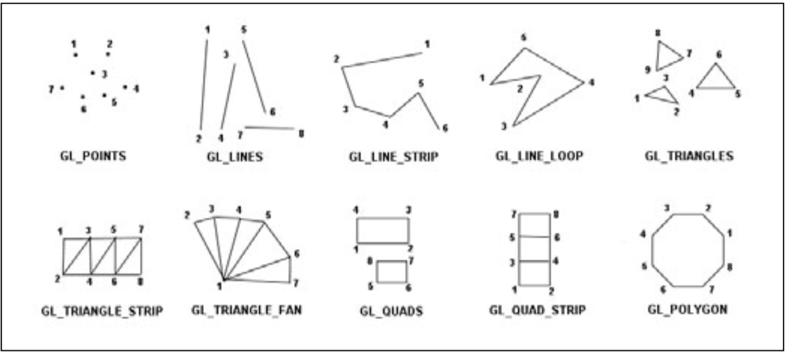

#Handling Primitives
So, what are primitives? Simply put primitives are basic geometric entities such as points, lines and triangles.

You will be using thousands and thousands of these primitives to make your games, so it is important to know how they work. Before we get into specific primitive types, we need to talk about a few OpenGL functions that you will be using often for working with primitives. The first is ```GL.Begin```. The function has the following prototype:

```
void GL.Begin(BeginMode mode);
```

You use ```GL.Begin``` to tell OpenGL two things:

 * That you are ready to start drawing
 * The primitive type you want to draw

You specify the primitive type with the ```BeginMode``` enum. It's values are:

* __BeginMode.Points__ Individual points
* __BeginMode.Lines__ Line segments composed of pairs of vertices
* __BeginMode.LineStrip__ A series of connected lines
* __BeginMode.LineLoop__ A closed loop of connected lines. The last segment is automatically created between the first and last vertices.
* __BeginMode.Triangles__ Single triangles as a triplet of vertices. This is what you will use most often!
* __BeginMode.TriangleStrip__ Series of connected triangles
* __BeginMode.TriangleFan__ Triangle around a common, central vertex
* __BeginMode.Quads__ A quadraletiral (Polygon with 4 vertices)
* __BeginMode.QuadStrip__ A series of connected quadralatirals
* __BeginMode.Polygon__ A convex polygon with an arbitrary number of vertices.

Here is an example of what each primitive would draw like:



Each call to ```GL.Begin``` needs to be accompanied by a call to ```GL.End```, the signature of this function looks like:

```
void GL.End();
```

```GL.End``` tells OpenGL that you are done drawing the primitive you specified with ```GL.Begin```.

```GL.Begin()``` and ```GL.End()``` blocks may __not__ be nested.

Not all OpenGL functions can be used inside a Begin / End block. Calling an invalid function will generate a ```InvalidOperation``` error and render nothing.

This is a list of valid functions that can be used between Begin and End:

* __GL.Vertex*()__
* __GL.Color*()__
* __GL.SecondaryColor*()__
* __GL.Index*()__
* __GL.Normal*()__
* __GL.TexCoord*()__
* __GL.MultiTexCoord*()__
* __GL.FogCoord*()__
* __GL.ArrayElement()__
* __GL_EvalCoord*()__
* __GL.EvalPoint*()__
* __GL.Material*()__
* __GL.EdgeFlag*()__
* __GL.CallList*()__
* __GL.CallLists*()__

Why do most of those functions end in an asterisk? Because they have multiple variations. Each variation has the asterisk replaced by a number, that number signifies how many arguments the function takes.

For example, ```GL.Vertex``` has the following variations:

```
void GL.Vertex2(float, float);
void GL.Vertex3(float, float, float);
void GL.Vertex4(float, float, float, float)
```