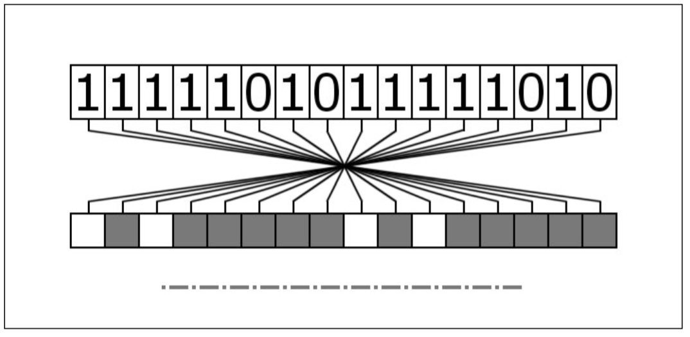

## Drawing lines in 3D
A line is just a connection between two points. As such, rendering a line is not too different from rendering two points. And because you already know how to do that, lets dive right in:

```
GL.Begin(PrimitiveType.Lines);
    GL.Vertex3(-2.0f, -1.0f, 0.0f);
    GL.Vertex3(2.0f, 1.0f, 0.0f);
GL.End();
```

This time you start off by passing Lines as the primitive type to Begin / End so that OpenGL knows that for every two vertices it needs to draw one line.

Just like with points, you can draw multiple lines within the Begin / End calls. If you wanted to render wo lines, you would need to supply four vertices.

As with points, OpenGL allows you to change several parameters of the state machine that affect how your line is drawn. In addition to setting the line width and setting anti-aliasing you can also specify a stipple pattern.

##Line Width
The default line width is 1.0. To find out the currently selected line with pass ```GetPName.LineWidth``` to ```GL.GetFloat```. To change the line width, call the ```GL.LineWidth``` function:

```
void GL.LineWidth(float);
```

## Anti aliasing lines
Anti Aliasing points works almost the same as it does for lines. You can toggle it by passing ```EnableCap.LineSmooth``` to ```GL.Enable``` and ```GL.Disable```. You can check if it's turned on by passing the same enum value to ```GL.IsEnabled```

Again, as with points, when using anti-aliasing OpenGL implementations are only required to support it for line widths of 1.0f.

##Stipple pattern
You can specify a stipple pattern with which to draw lines. The stipple pattern specifies a mask that will determine which portions of the line get drawn, therefore it can be used to create dahsed lines. Before specifying a pattern, you must enable stipple-ing with ```EnableCaps.LineStipple```. The you set the stipple with the following function:

```
void GL.Stipple(int factor, short pattern);
```

The factor paramater defaults to 1. It is capped to be between 1 and 256. It's used to specify how many times each bit in the pattern is repeated before moving on to the next bit. 

The pattern paramater is used to specify a 16-bit pattern. Any bits that are set will result in the coresponding pixels getting drawn. If a bit is not set, it's pixel is not drawn. Something to be aware of, these bits are applied in reverse, so the low-order bit effects the left most pixel.

Here is an example of a bitmask, and how it corelates to rendering:

