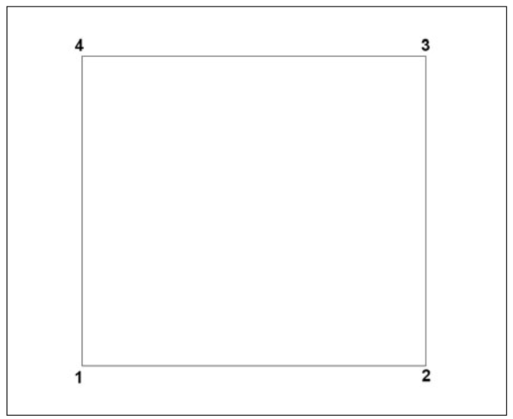
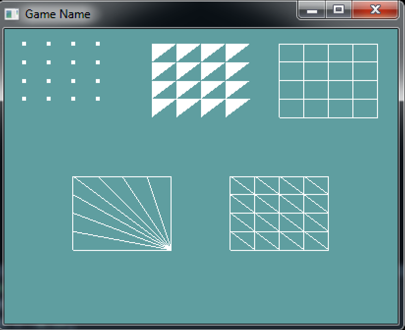

#Quadrilaterals

Quadrilaterals, or quads, are four-sided polygons that can be convenient when you want to draw a square or a rectangle. You create them by passing ```PrimitiveType.Quads``` to ```GL.Begin```, then supplying 4 vertices. Like triangles you can draw mulyiple quads within the same ```GL.Begin```/```GL.End``` block.

OpenGL provides Quad strips as a means of improving the rendering of multiple larger quads, but you will use this feature less than you will use triangle strips. They are kind of useless.

When rendering a quad strip, the first 4 vertices specify the first quad, after that every two vertices will be used with the previous two vertices to create new quads.

This is the order you should define a quad in:



##Polygons
As discussed earlyer OpenGL also supports rendering polygons with an arbitrary number of sides. In such cases, onyl one polygon can be drawn inside a ```GL.Beign``` / ```GL.End``` block. To render a polygon pass ```PrimitiveType.Polygon``` (Note, it's singular) to ```GL.Begin```.  Once ```GL.End``` is reached, the last vertex is connected to the first. If less than 3 vertices are provided, the polygon is considered degenerate and nothing will render. Here is an example of what an arbitrary polygon can look like:


##Sample
Lets put everything we've learned into one tidy little sample. Follow along with the following code, it goes in your render function:

```cs
// 0.125 is because 4 * 0.125 = 0.5. 
// The width of the screen is 2 (from -1 to +1)
// 1/4 of 2 is 0.5, the same as 4 * 0.125
float scale = 0.125f;

// Draw points
float xOffset = -0.9f;
float yOffset = 0.9f;
GL.PointSize(4.0f);
GL.Begin(PrimitiveType.Points);
for (int x = 0; x < 4; ++x) {
    for (int y = 0; y < 4; ++y) {
        // We use 0.9 instead of 1 to go close to the edge, not all the way
        // Why are we multiplying 4 by 0.125 (scale)?
        // Because X and Y both go from 0 to 3, a total of 4 units
        GL.Vertex3(xOffset + x * scale, yOffset - y * scale, 0);
    }
}
GL.End();

// Draw Triangles (note these are back facing!)
xOffset = -0.25f;
yOffset = 0.9f;
GL.Begin(PrimitiveType.Triangles);
for (int x = 0; x < 4; ++x) {
    for (int y = 0; y < 4; ++y) {
        GL.Vertex3(xOffset + x * scale,       yOffset - y * scale,          0);
        GL.Vertex3(xOffset + (x + 1) * scale, yOffset - y *scale,           0);
        GL.Vertex3(xOffset + x * scale,       yOffset - (y + 1.0f) * scale, 0);
    }
}
GL.End();

// Set polygons to render as lines
GL.PolygonMode(MaterialFace.FrontAndBack, PolygonMode.Line);

// Draw quads
xOffset = 0.9f;
yOffset = 0.9f;
GL.Begin(PrimitiveType.Quads);
for (int x = 0; x < 4; ++x) {
    for (int y = 0; y < 4; ++y) {
        GL.Vertex3(xOffset - x * scale,       yOffset - y * scale,       0);
        GL.Vertex3(xOffset - (x + 1) * scale, yOffset - y * scale,       0);
        GL.Vertex3(xOffset - (x + 1) * scale, yOffset - (y + 1) * scale, 0);
        GL.Vertex3(xOffset - x * scale,       yOffset - (y + 1) * scale, 0);
    }
}
GL.End();

// Draw triangle strip
xOffset = 0.15f;
yOffset = -0.5f;
for (int x = 0; x < 4; ++x) {
    GL.Begin(PrimitiveType.TriangleStrip);
    for (int y = 0; y < 4; ++y) {
        GL.Vertex3(xOffset + x * scale,       yOffset + y * scale,       0);
        GL.Vertex3(xOffset + (x + 1) *scale,  yOffset + y * scale,       0);
        GL.Vertex3(xOffset + x * scale,       yOffset + (y + 1) * scale, 0);
        GL.Vertex3(xOffset + (x + 1) * scale, yOffset + (y + 1) * scale, 0);
    }
    GL.End();
}

// Draw triangle fan (note this is back facing!)
xOffset = -0.15f;
yOffset = -0.5f;
GL.Begin(PrimitiveType.TriangleFan);
// Center of thefan
GL.Vertex3(xOffset - 0.0f, yOffset + 0.0f, 0.0f);
// Bottom side
for (int x = 5; x > 0; --x) {
    GL.Vertex3(xOffset - (x - 1) * scale, yOffset + 4 * scale, 0);
}
// Right side
for (int y = 5; y > 0; --y) {
    GL.Vertex3(xOffset - 4 * scale, yOffset + (y - 1) * scale, 0);
}
GL.End();

// Reset polygon modes for next render
GL.PolygonMode(MaterialFace.FrontAndBack, PolygonMode.Fill);
```

After it's all in there, the final screen should look like this:

