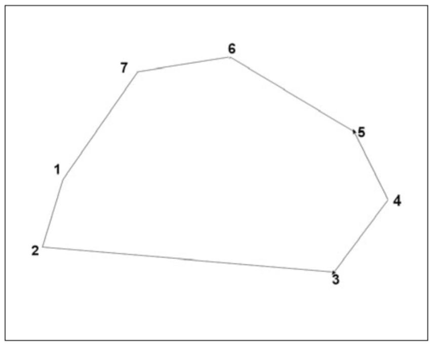

#Quadrilaterals

Quadrilaterals, or quads, are four-sided polygons that can be convenient when you want to draw a square or a rectangle. You create them by passing ```PrimitiveType.Quads``` to ```GL.Begin```, then supplying 4 vertices. Like triangles you can draw mulyiple quads within the same ```GL.Begin```/```GL.End``` block.

OpenGL provides Quad strips as a means of improving the rendering of multiple larger quads, but you will use this feature less than you will use triangle strips. They are kind of useless.

When rendering a quad strip, the first 4 vertices specify the first quad, after that every two vertices will be used with the previous two vertices to create new quads.

This is the order you should define a quad in:


##Polygons
As discussed earlyer OpenGL also supports rendering polygons with an arbitrary number of sides. In such cases, onyl one polygon can be drawn inside a ```GL.Beign``` / ```GL.End``` block. To render a polygon pass ```PrimitiveType.Polygon``` (Note, it's singular) to ```GL.Begin```.  Once ```GL.End``` is reached, the last vertex is connected to the first. If less than 3 vertices are provided, the polygon is considered degenerate and nothing will render. Here is an example of what an arbitrary polygon can look like:



##Sample