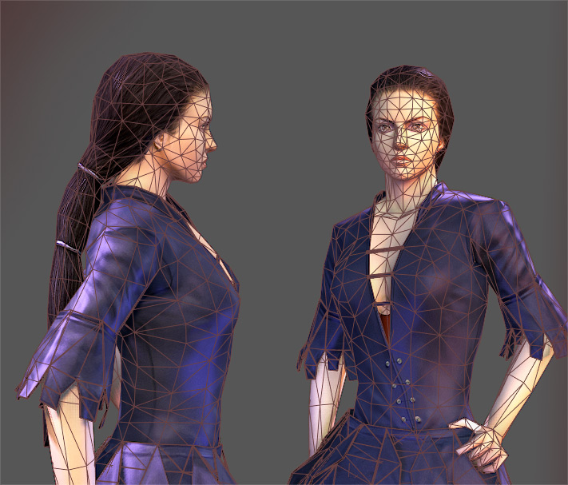
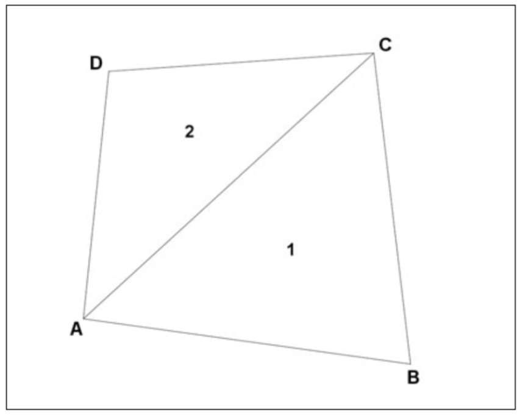
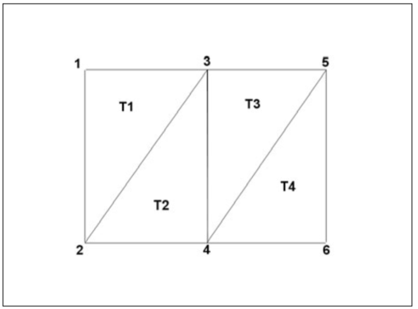
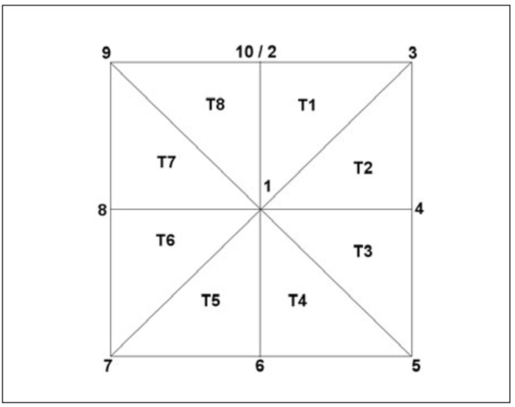

# Triangles
Triangles are generally the preffered polygon to be used in video games. There are several reasons for this:

* Triangles are always coplanar.
  * Because 3 points define a plane
* A triangle is always convex
  * That means it does not fold in on its-self 
  * Look up what a convex & concave polygon looks like if this confuses you
* A triangle will never cross over its-self
* A triangle will never have a hole in it

If you try to render a polygon that violates any of the above bullet points, the results will be unpredictable. Because any polygon can be broken down into a set of triangles (a process called triangulation), and rendering triangles is guaranteed to not have undefined behaviour, everything renderd in a video game is a triangle.



Most 3D artists prefer to model with quads. Because of this every 3D modelling program has an option to triangulate models and export only triangles. I wasn't kidding, every 3D model that gets rendered on screen is broken down into triangles!

Drawing a 3D triangle isn't much more difficult than drawing a point, or a line. You just need to pass ```PrimitiveType.Triangles``` to ```GL.Begin``` and provide 3 vertices. Every 3 vertices will make one triangle!

```
// Draw a full screen triangle
Gl.Begin(PrimitiveType.Triangles);
    GL.Vertex3(-1, -1, 0);
    GL.Vertex3(1, -1, 0);
    GL.Vertex3(0, 1, 0);
GL.End();
```

Just like with points and lines, you can draw multiple triangles at one time. OpenGL treats every vertex tripple as a seperate triangle. If the number of vertices isn't a multiple of 3, the extra vertices are discarded.

##Degenerates
A triangle with an area of 0 is essentially a point or a line, for example:

```
(1, 0, 0)
(1, 0, 0)
(0, 1, 0)
```

The above tirangle is a line, it has no height! This __WILL NOT RENDER__ as a line. Degenerate triangles are rejected and never rendered. (This behaviour is often exploited when rendering large terrains or mountains)

## Triangle Variations
OpenGL also supports a couple of primitives related to triangles that might save you some keystrokes. In the olden days they used to save performance too, but on modern cards (Graphics cards created after 2003) there is no performance difference.

Lets assume you use two triangles to render a distorted quad:



Here you have two connected triangles with vertices __A__ and __C__ in common. If you render them with ```PrimitiveType.Triangles``` you will need to define a total of 6 vertices. This means you will send vertices __A__ and __C__ trough the rendering pipeline twice! 

One way to aoid this is to use a __triangle strip__. When calling ```GL.Begin``` pass ```PrimitiveType.TriangleStrip``` for it's argument. OpenGL will __draw the first 3 vertices as a triangle__, after that it will take __every vertex specified and combine it with the previous two vertices__ to form another triangle. This means that after the first triangle, every additional triangle will only need one vertex for it's data.

Here is a visual example of a triangle strip:



Another variation on triangles is the __triangle fan__. You can visualize them as a series of triangles around a central vertex. You draw fans by passing ```PrimitiveType.TriangleFan``` to ```GL.Begin```. The first vertex specified is the center vertex. Every following two vertices make a triangle with the center vertex. Here is what that looks like:



Fans don't offer as much savins as strips, but they still offer some savings.

## A history lesson
From about 2000 to 2006 triangle strips provided a LOT of savings in BOTH memory and performance. We simply didn't have enough ram and horsepower on the GPU to support large models made up of too many triangles.

Many programmers capitalized on this, and wrote software that would take a triangulated model and create a model of triangle strips from it. These software where collectivley called strippers, because they made strips.

As you can imagine strippers where not very efficient with large complex models. As graphics cards grew more powerful, these software became more and more outdated.

On a fairly new graphcis card (2006+) it is faster to draw a million regular triangles than it is to draw the same number of triangles using a strip. This is because graphics cards manufacturers caught on that rendering triangles fast is important, so they built special circuitry to handle the situation.

And just like that modern games grew up. We have stopped stripping and are instead just rendering large sets of triangles.