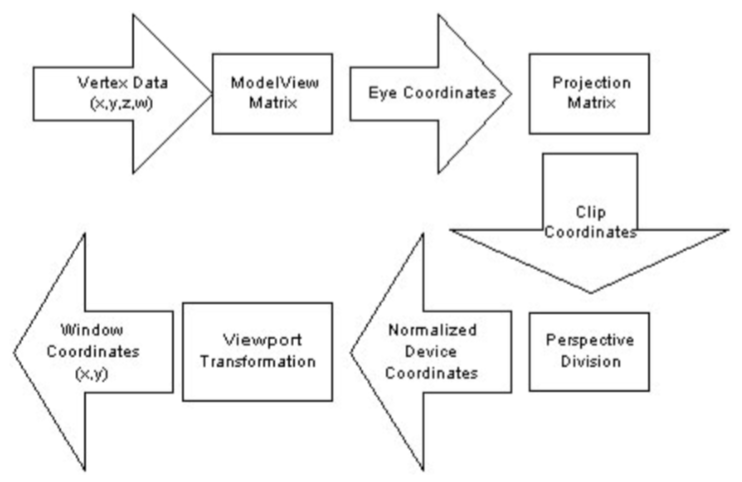

#And we're back
After taking a little deep-dive to explore the transformation pipeline in depth, let's finish our discussion of coordinate systems.

When you are writing your 3D programs, remember that these transformations execute in a specific order. The modelview transformation execute before the projection transformations; However the viewport can be specified any time and OpenGL will automatically apply it at the right time.

Let's re-visit this figure:

## Eye coordinates
One of the most critical conepts to transformations and viewing in OpenGL is the concept of the __camera__, or eye coordinates. In 3D graphics, the currrent viewing transformation matrix, which converts world coordinates to eye coordinates defines the cameras position and orientation. In contrast, OpenGL converts world coordinates to eye coordinates with the __modelview__ matrix. 

When an object is in eye coordinates, the geometric relationship between the object and the camera is known, which means our ojects are positioned relative to the camera. This is important to render correctly. 

This is the camera's world position, after it is multiplied with the view matrix (inverse of the cameras model matrix)

