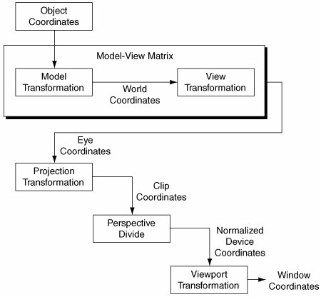
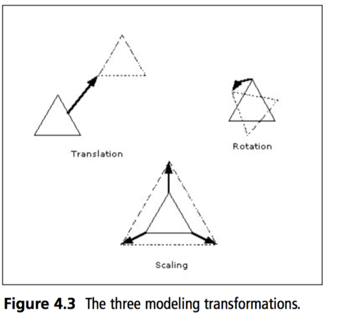

# Understanding Coordinate Transformations
The OpenGL transformation pipeline transforms application vertices into window coordinates, where they can be rasterized. Like all 3D graphics systems, OpenGL uses linear algebra; it treats vertices as vectors and transforms them by using vector-matrix multiplication. The transformation process is called a __pipeline__ because geometry passes trough several coordinate systems on the way to window space. Each coordinate system serves a purpose for one or more OpenGL features.

For each stage of the transformation pipeline, this section describes the characteristics of that coordinate system, what OpenGL operations are performed there, and how to construct and control transformations to the next coordinate system in the pipeline.

It's important to understand that when we render an object, we don't move it. We put a vertex trough a transformation pipeline, and a new, transformed vertex comes out. We render this transformed vertex, then throw it away. The original vertices of the models will never be changed.

 When rendering 3D scenes, vertices pass trough 4 types of transformations before they are rendered onto the screen:

* __Modeling Transform__ The modeling transformation moves objects around the scene and moves objects from local coordinates into world coordinates
* __Viewing Tranasform__ The viewing transformation specifies the location of the camera and moves objects from world coordinates into _eye coordinates_ (camera coordinates)
* __Projection Transform__ The projection transformation defines the viewing volume and clipping planes, it maps objects from eye coordinates to clip coordinates (-1 to +1 on all axis, clip coordinates are also called NDC)
* __Viewport transform__ The viewport transformation maps the clip coordinates (NDC) into the two-dimensional view port (the window on your screen)

A summary of the transformation pipeline:


While these four transformations are standard in 3D graphics, OpenGL combines the model and view transforms into a single __modelview__ transformation. The viewport transform (also known as w divide) is done automatrically by OpenGL.

If yo look at the above diagram, there are only two matrices in the pipeline. These are the matrices that the state machine let's you specify, the __ModelView__ matrix and the __Projection__ matrix.

## A closer look at the pipeline



This is the entire pipeline in a bit easyer to follow fashion. Let's take a closer look at what each section foes.

### Object Coordinates
Applications specify vertices in object coordinates. The definition of object coordinates is entireley up to the application. Some applications render scenes that are composed of many models, each created and specified in it's own individual coordinate system.

What this means is that each model is centered around it's own origin. When you export a 3D model from blender, that model was created around (0, 0, 0) and is said to be in model space.

When you load in an object, it is in Object space. It will be in the middle of your scene.

### The Model Transformation
The model transformation transforms geometry from object to world coordinates. Applications store both the model and view transforms in a single matrix called the __modelView matrix__.

Once you apply the model transform, the object is now in world space. That is, X, Y, Z is (potentially) no longer located at the origin of the world.

The modeling transformation allows you to position and orient a model by moving, rotating and scaling it You can perform these operations one at a time or as a combination of events. 


The order in which you specify modeling transformations is very important to the final rendering of your scene. (remember, order of matrix multiplication matters)


Rotating an object first, then translating it will give a very different result than translating an object and then rotating it. So, what's the proper order to transform your primitives? Well that depends on the result you want to get. But in general, multiplication order is accepted as:

* First Scale
* Second Rotate
* Lastly Translate

### World Coordinates
The world-coordinate system is an application construct that exists between the object and eye coordinate systems.  If we split the __ModelView__ matrix into two matrices, multiplying object space coordinates by the __Model__ matrix would get them to world space.

The reason that the __Model__ and __View__ matrices have been collapsed into a single matrix is because OpenGL has no internal concept of "World Space". There are no rendering calculations to be done in world space, so the state machine has no idea what that actually is.

### The View Transform
In precise terms, the __view  transform__ is the inverse transformation of the cameras world space coordinates.

This may sound a bit odd. Everything goes trough the render pipeline, even the camera. So, what happens when you multiply the cameras world coordinates by the view matrix (The inverse of the cameras world coordinates)? You get an identity matrix!

This means that the camera will be positioned at the origin of the world, looking down the negative Z axis. Every object will be transformed relative to this orientation. Do you know what this implies?

This implies that when we render a 3D world, as far as the graphics pipeline is concerned the camera does not move. It stays stationary at origin, instead the world moves around the camera!

### Eye Coordinates
OpenGL eye coordinates are defined as follows:

* The viewpoint is at the origin
* The view direction is down the negative Z axis
* Positive Y is up
* Positive X is to the right

For geometry to be visible in a standard perspecive projection it must lie somewhere along the negative Z axis. 

When you multiply an object bythe __ModelView__ matrix it ends up in eye coordinates, which meets all 4 of the above requirements. This is why we don't move the camera, rather the world around the camera.

Think of eye coordinates as "what the camera sees". This is what the eye coordinate space looks like, it is the camera multiplied by the view matrix.


### The Projection Transformation
OpenGL multiplies eye coordinates by the projection matrix to produce clip coordinates. The projection matrix defines the size and shape of the view volume, and therefore determines the portion of eye coordinates that will be visible or invisible. 

Typically applications create a __perspecive projection__ or a parallel projection. The proper name a parallel projection is __orthographic projection__

Here is an example of looking at two objects from the exact same position with the exact same orientation. The only difference is one is looking with perspective, the other is looking orthographic:


This is how the respective cameras see the world:


### Clip Coordinates
OpenGL clips primitives that lie outside the view volume in clip coordinate space. A clip coordinate vertex is within the viw volume if it's x, y and z values are all within the  -w to w space.

Wow that makes no sense! Don't worry, this is one of those things OpenGL does automatically for you! You will never have to concern yourself with the implementation of this step. 

You will configure clip coordinates using the ```GL.Ortho``` and ```GL.Frustum``` methods.

Basically, OpenGL ignores any geometry outside the view volume, (se the green sphere in the above picture)

### Perspective Division
OpenGL divides clip coordinate (x, y and z) values by the clip-coordinate w value to produce noramlized device coordinates (__NDC__). As with clipping, OpenGL will do this automatically for you (provided you have a projection matrix in place). If you have an orthographics projection matrix, nothing really happens here.

For perspective projections, the perspective division step effectivley shrinks distant geometry and expands near geometry.

Remember, __NDC__ space goes from -1 to +1 on all axis.

### Normalized Device Coordinates
In normalized device coordinate space all vertex values lie withing the -1 to +1 range. In previous coordinate systems, they could have been anywhere!

OpenGL performs no calulations in NDC space, it's simply a coordinate system that exists between the perspective division and the viewport transformation to window coordinates.

### The Viewport Transform
The viewport transformation is the final stage of the __transformation pipeline__. It's a scale and translation that maps the -1 to +1 NDC cube into X / Y window coordinates. Technically this stage also modifies the Z value to be within an acceptable range of the Z-Buffer, which we will talk about later.

Again, this happens automatically, you have some control using the ```GL.Viewport``` function, which we will discuss later.

### Window Coordinates
Window coordinates have their _x, y origin_
