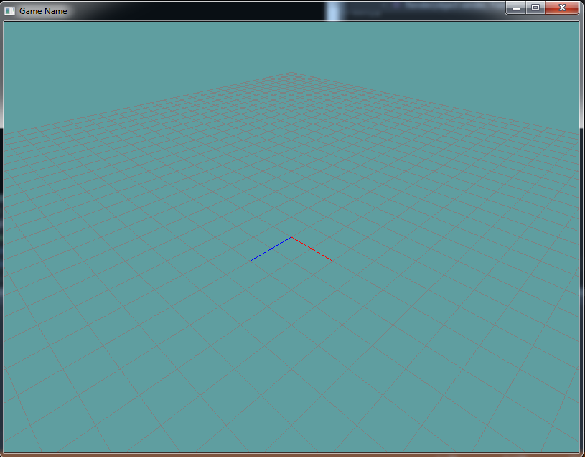

# OpenGL and Matrices
Now that you've learned about the verious transformation involved in OpenGL, lets take a look at how you actually use them. Transformations in OpenGL rely on the __matrix__ for all mathematical computations. As you will soon see, OpenGL has what is called the ___matrix stack___, which is useful for constructing complicated models composed of many simple objects.

## Visualize Origin
Let's start with a simple scene. We're going to draw a small grid on the X-Z plane, then we are going to render the 3 basis vectors of world space. At first this isn't going to show much on screen, because without a projection matrix it will be in the middle of NDC, so we will only see two lines.

You may want to add this render code to the ```MainGameWindow``` class, before the scene is rendered. This is going to be a visual baseline so we can see what is going on, and it should appear under every sample we will make in this chapter.


Once we are able to position the camera and add perspective you will see that what we did really looks like this:



# TODO
CH4 is not done, this is as far as i managed to get