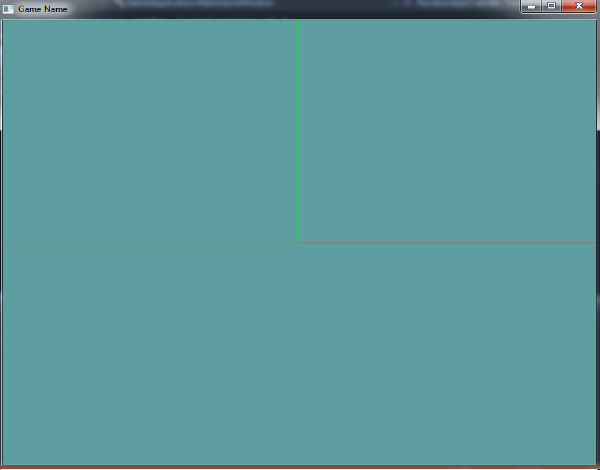

# OpenGL and Matrices
Now that you've learned about the verious transformation involved in OpenGL, lets take a look at how you actually use them. Transformations in OpenGL rely on the __matrix__ for all mathematical computations. As you will soon see, OpenGL has what is called the ___matrix stack___, which is useful for constructing complicated models composed of many simple objects.

## Visualize Origin
Let's start with a simple scene. We're going to draw a small grid on the X-Z plane, then we are going to render the 3 basis vectors of world space. At first this isn't going to show much on screen, because without a projection matrix it will be in the middle of NDC, so we will only see two lines.

You may want to add this render code to the ```MainGameWindow``` class, before the scene is rendered. This is going to be a visual baseline so we can see what is going on, and it should appear under every sample we will make in this chapter.

So, add the following code to the render function, before the demo game renders:

```cs
// Draw grid
// Set render color to gray
GL.Color3(0.5f, 0.5f, 0.5f);
// Draw a 40x40 grid at 0.5 intervals
// The grid will go from -10 to +10
GL.Begin(PrimitiveType.Lines);
// Draw horizontal lines
for (int x = 0; x < 40; ++x) {
    float xPos = (float)x * 0.5f - 10.0f;
    GL.Vertex3(xPos, 0, -10);
    GL.Vertex3(xPos, 0,  10);
}
// Draw vertical lines
for (int z = 0; z < 40; ++z) {
    float zPos = (float)z * 0.5f - 10.0f;
    GL.Vertex3(-10, 0, zPos);
    GL.Vertex3( 10, 0, zPos);
}
GL.End();

// Draw basis vectors
GL.Begin(PrimitiveType.Lines);
// Set the color to R & draw X axis
GL.Color3(1.0f, 0.0f, 0.0f);
GL.Vertex3(0.0f, 0.0f, 0.0f);
GL.Vertex3(1.0f, 0.0f, 0.0f);
// Set the color to G & draw the Y axis
GL.Color3(0.0f, 1.0f, 0.0f);
GL.Vertex3(0.0f, 0.0f, 0.0f);
GL.Vertex3(0.0f, 1.0f, 0.0f);
// Set the color to B & draw the Z axis
GL.Color3(0.0f, 0.0f, 1.0f);
GL.Vertex3(0.0f, 0.0f, 0.0f);
GL.Vertex3(0.0f, 0.0f, 1.0f);
GL.End();
```

Keep in mind, right now we're strictly looking at the center of NDC space. The above code will not look too impressive. Running your application, your screen should look like this:



Once we are able to position the camera and add perspective you will see that what we did really looks like this:


## The ModelView Matrix
The __modelView__ matrix defines the coordinate system that is used to place and orient objects.
This 4x4 matrix can either transform vertices, or it can be transformed its-self by other matrices. 

Before you can do anything, you must specify if you are going to be working with the __modelView__ or __projection__ matrix. You can do this with the ```GL.MatrixMode``` function. This is the signature:

```
GL.MatrixMode(MatrixMode);
```

The ```MatrixMode``` enum has two values we use, but the enum its-self has 5 values
* MatrixMode.Modelview
* MatrixMode.Projection
* MatrixMode.Color - we don't use this
* MatrixMode.Texture - we don't use this
* MatrixMode.Modelview0Ext

Usually (99% of the time) you want to set your modelView matrix to identity. So that you start around origin. you can achieve this by calling the ```GL.LoadIdentity``` function. This function loads the identity matrix into the OpenGL state machines active matrix. (You specified the active matrix with ```GL.MatrixMode```)

This snippet resets the modelview matrix:
```
GL.MatrixMode(MatrixMode.Modelview);
GL.LoadIdentity(); // Reset modelview matrix
// Do other transformation
```

## Multiplying OpenGL matrices
We're about to talk about 3 functions:

* ```GL.Translate```
* ```GL.Rotate```
* ```GL.Scale```

Before we discuss how these functions work, i want you to be aware of what they actually do. When you call ```GL.MatrixMode``` with ```MatrixMode.Modelview``` as an argument, you select the __modelView__ matrix of the OpenGL state machine as the active matrix.

Once you have a matrix set as the active matrix, all further matrix operations will be performed to that matrix. ```GL.LoadIdentity``` is one such operation. It takes the current matrix and sets it to identity.

The three functions above will generate an appropriate matrix and multiply the current matrix! ```GL.Rotate``` for instance will make a rotation matrix and multiply the current matrix by it.

The following OpenGL snippet

```
// Set the currently active matrix
GL.MatrixMode(MatrixMode.Modelview);

// Reset modelview matrix
GL.LoadIdentity();

// Create a rotation matrix
// then multiply the active matrix by it
GL.Rotate(90.0f, 0.0f, 0.0f, 1.0f);
```

Is the equivalent of:

```
void Render(ref Matrix4 modelView, ref Matrix4 projection) {
    // Set the currently active matrix
    Matrix4 currentMatrix = modelView;
    
    // Reset modelview matrix
    for (int i = 0; i < 4; ++i) {
        for (int j = 0; j < 4; ++j) {
            currentMatrix[i, j] = (i == j)? 1.0f : 0.0f;
        }
    }
    
    // Create a rotation matrix
    Matrix4 rotation = Matrix4.AngleAxis(90.0f, 0.0f, 0.0f, 1.0f);
    
    // then multiply the active matrix by it
    currentMatrix = rotation * currentMatrix;
}
```

## Translation
Translation allows you to move an object from one position in the world to another position in the world. The OpenGL function ```GL.Translate