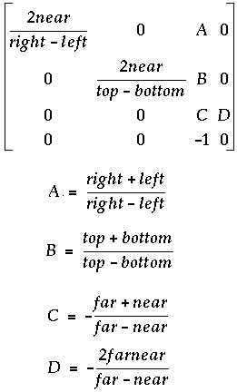
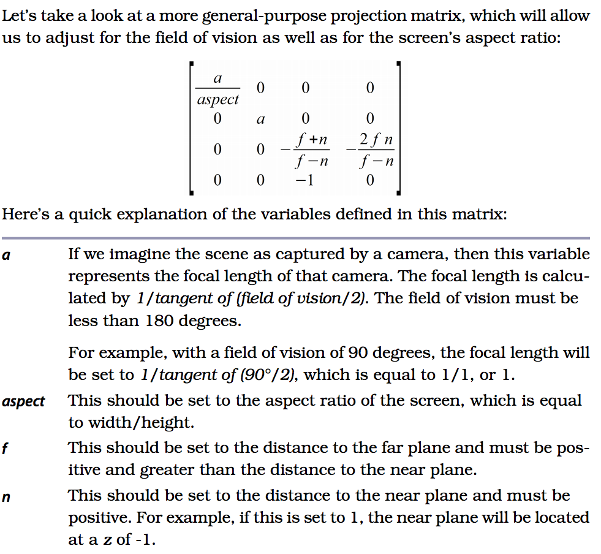

# The missing functions
One of the nice things about being able to use your own matrices in OpenGL is having to rely less on the OpenGL functions. After all, you don't really know what those functions are doing under the hood! If we want to fully break away from OpenGL we have timplement 3 more functions into our Matrix4 class: Ortho, Frustum and LookAt.

Make these changes in the __Math Implementation__ repository, once they are working, copy the Matrix4.cs file into your __OpenGL1X__ repository, replacing the old file.

All three of these functions are going to be static! They don't modify any existing matrix, just return a new matrix specifying some sort of transformtaion!

Deriving matrices is hard. I honestly have no idea how to derive an Orthographic projection matrix. What i will preset below is the formulas i've memorized and the things that work for me. If you want to be mathematically accurate, [this  tutorial](http://www.songho.ca/opengl/gl_projectionmatrix.html) is a decent walktrough of how to derive the matrices. It's not a skill you will ever need, i've never used it once.

## Ortho
How OpenGL makes an orthographic matrix is not a secret. It's actually outlined in the OpenGL specification. Use the following image to create your own ```Matrix4.Ortho``` function:


You can test this by changing the projection fo Mr.Roboto from the perspective projection to:

```
float aspect = (float)MainGameWindow.Window.Width / (float)MainGameWindow.Window.Height;
GL.Ortho(-25.0f * aspect, 25.0f * aspect, -25.0f, 25.0f, -25.0f, 25.0f);
```

Take not of what it looks like, then replace the ```GL.Ortho``` call with your own matrix:

```
float aspect = (float)MainGameWindow.Window.Width / (float)MainGameWindow.Window.Height;
Matrix4 ortho = Matrix4.Ortho(-25.0f * aspect, 25.0f * aspect, -25.0f, 25.0f, -25.0f, 25.0f);
GL.LoadMatrix(Matrix4.Transpose(ortho).Matrix);
```

The two screens should look the same.

## Frustum

Re-implementing OpenGL's Frustum function is not too difficult either, as the math behind it is toroughly documented. This matrix is one of the few matrices who's element [3,3] is not 1.



The formula is available as text on [the OpenGL man page](http://www.manpagez.com/man/3/glFrustum/). I know D is a bit hard to read it's ```D = -((2 * far * near) / (far - near))```

You can test if your function is correct, by changing the Mr.Roboto sample back to using it's original projection matrix. Then replace the ```Perspective``` function with one that uses your frustum instead of the built in one:

```
public static void Perspective(float fov, float aspectRatio, float zNear, float zFar) {
    float yMax = zNear * (float)Math.Tan(fov * (Math.PI / 360.0f));
    float xMax = yMax * aspectRatio;
    
    //GL.Frustum(-xMax, xMax, -yMax, yMax, zNear, zFar);
    Matrix4 frustum = Matrix4.Frusum(-xMax, xMax, -yMax, yMax, zNear, zFar);
    GL.MultMatrix(Matrix4.Transpose(frustum).Matrix);
}
```

## Look At
LookAt is an interesting beast, as it is not a part of the OpenGL specification. It's not really a part of OpenGL. The LookAt function was made popular by a library called GLU (GL Utilities).

http://www.songho.ca/opengl/gl_projectionmatrix.html

# Conveniance getter
Having to type out 

```
Matrix4.Transpose(frustum).Matrix
```

every time we want to use one of our custom matrices with OpenGL is very time consuming. We can save a LOT of time by adding a simple getter to the matrix class that returns the matrix as a transposed array of floating point numbers. How OpenGL is expecting it:

```
public float OpenGL {
    get {
        return Transpose(this).Matrix;
    }
}
```

There, much nicer. Now if i want to load my own matrix, i just have to:

```
Matrix4 frustum = Matrix4.Frusum(-xMax, xMax, -yMax, yMax, zNear, zFar);
GL.MultMatrix(frustum.OpenGL);
```

## Bonus:

