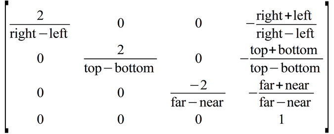

# The missing functions
One of the nice things about being able to use your own matrices in OpenGL is having to rely less on the OpenGL functions. After all, you don't really know what those functions are doing under the hood! If we want to fully break away from OpenGL we have timplement 3 more functions into our Matrix4 class: Ortho, Frustum and LookAt.

Make these changes in the __Math Implementation__ repository, once they are working, copy the Matrix4.cs file into your __OpenGL1X__ repository, replacing the old file.

All three of these functions are going to be static! They don't modify any existing matrix, just return a new matrix specifying some sort of transformtaion!

Deriving matrices is hard. I honestly have no idea how to derive an Orthographic projection matrix. What i will preset below is the formulas i've memorized and the things that work for me. If you want to be mathematically accurate, [this 3 page tutorial](http://www.codeguru.com/cpp/misc/misc/graphics/article.php/c10123/Deriving-Projection-Matrices.htm) is a decent walktrough of how to derive the matrices. It's not a skill you will ever need, i've never used it once.

## Ortho
How OpenGL makes an orthographic matrix is not a secret. It's actually outlined in the OpenGL specification. Use the following image to create your own ```Matrix4.Ortho``` function:



You can test this by changing the projection fo Mr.Roboto from the perspective projection to:

```
float aspect = (float)MainGameWindow.Window.Width / (float)MainGameWindow.Window.Height;
GL.Ortho(-25.0f * aspect, 25.0f * aspect, -25.0f, 25.0f, -25.0f, 25.0f);
```

Take not of what it looks like, then replace the ```GL.Ortho``` call with your own matrix:

```
float aspect = (float)MainGameWindow.Window.Width / (float)MainGameWindow.Window.Height;
Matrix4 ortho = Matrix4.Ortho(-25.0f * aspect, 25.0f * aspect, -25.0f, 25.0f, -25.0f, 25.0f);
GL.LoadMatrix(Matrix4.Transpose(ortho).Matrix);
```

The two screens should look the same.

## Frustum

## Look At

http://www.songho.ca/opengl/gl_projectionmatrix.html

## Bonus:

