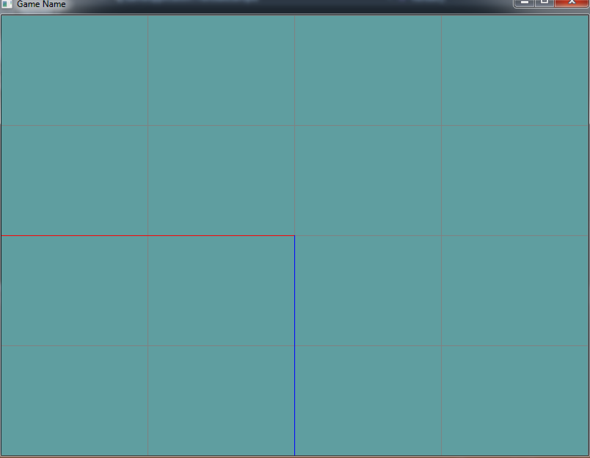

## Rotation

Rotation in OpenGL is accomplished trough the ```GL.Rotate``` function. The code for it will look familiar, that is because ```GL.Rotate``` creates a rotation matrix from an angle and an axis. Just like the ```Matrix4.AngleAxis``` function you wrote. It is defined as

```
void GL.Rotate(float angle, float xAxis, float yAxis, float zAxis);
```

The function rotates around the axis specified by xAxis, yAxis and zAxis. It rotates by angle degrees. The axis must be normalized. The function takes euler angles! The rotation is counter-clockwise!

For example, if you wanted to rotate by 90 degrees on the X axis, the call would be:

```
GL.Rotate(90.0f, 1.0f, 0.0f, 0.0f);
```

If you want to rotate clock-wise pass in a negative angle.

Let's say you want to rotate 45 degrees on the X axis and 7 degrees on the Y axis. Figuring out the arbitrary axis to rotate around and the new rotation angle would require a LOT of math. Luckily matrix multiplication is assosiative, so we can take advantage of that!

```
// First, rotate 45 degrees on X axis
GL.Rotate(45, 1.0f, 0.0f, 0.0f);
// Then, rotate 7 degrees on Y axis
GL.Rotate(7.0f, 0.0f, 1.0f, 0.0f);
```

## On your own
Just like i provided a new class for the translate sample, make a new class for the rotate sample.


Try to rotate your world by 90 degrees on the X axis and then 180 degrees on the Z axis. The resulting window will look like this:

