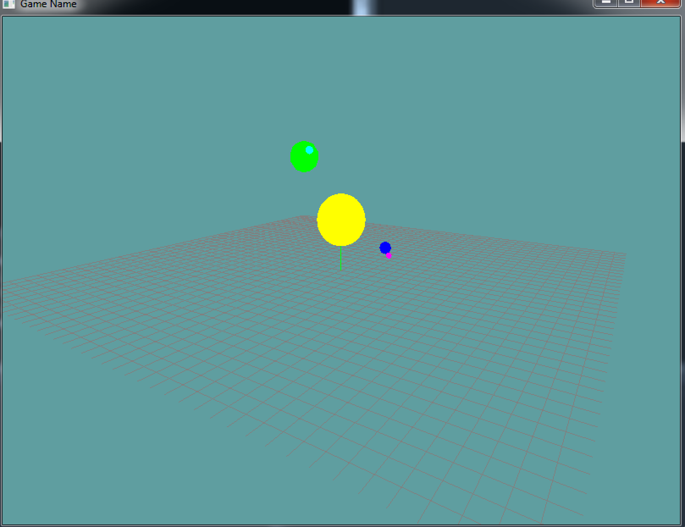

#Solar System
It's time to put all of your knowledge up to this point to the test. To finish CH4 you are going to make a small demo with minimal guidance. And becaue coding is fun, you get to do it twice!

I want you to write the below application two times. They can either look identical, or be different, it's up to you. Once using only OpenGL matrices, and once using only your own matrices. This does mean you need to write two demo classes that extend the game class.

## Assignment
I want you to write an application that draws a grid, and on top houses a small solar system. The minimum requirements are this:

* Must have only one sun, this is stationary, it does not move
* Must have minimum two planets, each circling the sun
* Every plante must have at least one moon, circling the planet

Feel free to add more stuff if you want, but those are the minimum requirements. You can [download](https://dl.dropboxusercontent.com/u/48598159/SolarSystem.zip) my version to see how this should work in action. This is what mine looks like:



## Drawing a sphere
Drawing a sphere is by no means a trivial task. Unlike a cube it's hard to plot down on paper and get the vertex coordinates. The default method of drawing a spehere is to draw a sub-divided icosahedron. 90% of the time the code used to do this copied from [the red book](http://www.amazon.com/OpenGL-Programming-Guide-Official-Learning/dp/0321773039/ref=sr_1_1?ie=UTF8&qid=1453018787&sr=8-1&keywords=OpenGL+programming+guide).

This is no exception to that rule. I've ported the code from the red-book to C# and we will be using that. Get the code [from here](https://gist.github.com/gszauer/0edfef5a2320f89b8221), add it to your project.

There is only one static function you need to use:

```
GLGeometry.DrawSphere(int ndiv);
```

The argument ```ndiv``` is how many times the sphere should be sub-divided. The more sub-divisions the worse the performance, but the better your scene looks. In my scene i subdivided the sun 3 times, the planets 1 time. Here is the difference between subdiv levels:

