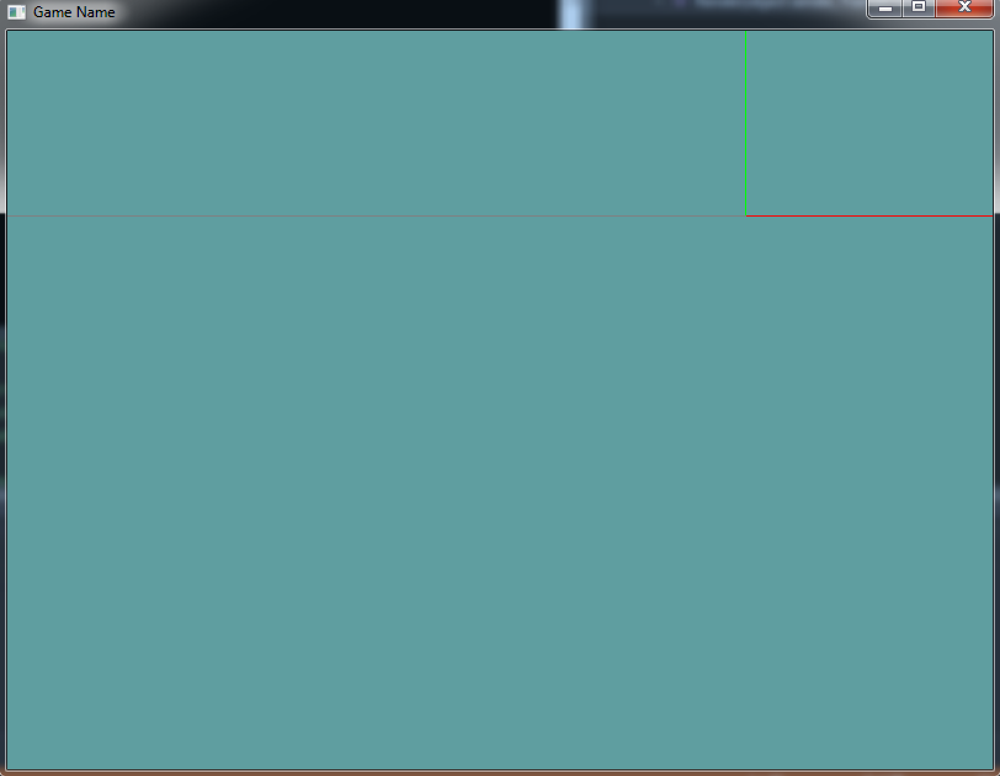

## Translation
Translation allows you to move an object from one position in the world to another position in the world. The OpenGL function ```GL.Translate``` performs this functionality, it is defined as follows:

```
void GL.Translate(float x, float y, float z);
```

Suppose you want to move an object from origin to position (0.25, 0.1, 0.4) you would run this bit of code:

```
GL.MatrixMode(MatrixMode.Modelview);
GL.LoadIdentity(); // Reset modelview matrix
GL.Translate(0.5f, 0.5f, 0.5f);
```

If you add that code BEFORE the render code we did above, the screen will look like this:



Because matrix multiplication is assosiative you can even chain these together!

Try this code:
```
GL.MatrixMode(MatrixMode.Modelview);
GL.LoadIdentity(); // Reset modelview matrix
GL.Translate(0.5f, 0.5f, 0.5f); // At (5, 5, 5)
GL.Translate(-0.5f, -0.5f, -0.5f); // At (0, 0, 0)
GL.Translate(-0.5f, -0.5f, -0.5f); // At(-5, -5, -5)
```

## Demo

```
using OpenTK.Graphics.OpenGL;

namespace GameApplication {
    class TranslateSample : Game {
        Grid grid = null;

        public override void Initialize() {
            grid = new Grid();
        }
        public override void Update(float dTime) {

        }
        public override void Render() {
            GL.MatrixMode(MatrixMode.Modelview);
            GL.LoadIdentity(); // Reset modelview matrix
            GL.Translate(0.5f, 0.5f, 0.5f);

            grid.Render();
        }
        public override void Shutdown() {

        }
    }
}
```