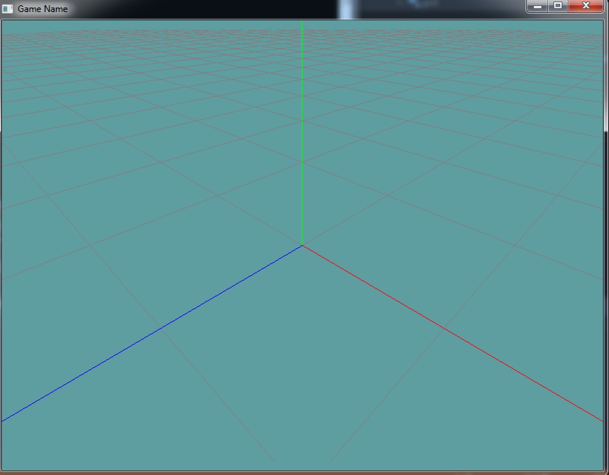

## The view matrix 
Combining translation, rotation and scale creates a transformation matrix. Sometimes also called the model matrix, or model to world matrix. But we're editing the mode-view matrix! So what is the view matrix?

As discussed earlyer, the view matrix is the inverse of the cameras world position! There are two things you need to know about your camera in world space, where it is (it's position) and which what it's looking (it's orientation).

Setting the view matrix with the fixed function pipeline is challenging at best, this is mainly because there is no fixed function equivalent of interting a matrix! 

This means if your camera is located at (90, 20, 30) and rotated to (7, 1, 0, 0) you would have to do the following commands:

```
// Negate the translation of the camera
GL.Translate(-90, -20, -30);
// Negate the rotation of the camera
GL.Rotate(-7, 1, 0, 0);
```

Well, that wasn't so bad... Was it? No, but your world position for the camera is NEVER going to be that simple. But there is an easy way to create the world matrix of the camera, we just won't cover it until later (we cover it in the custom matrices section).

Until then, copy/paste and use [this](https://gist.github.com/gszauer/91038dbb010755d719de) function. It is defined as follows:

```
void LookAt(float eyeX, float eyeY, float eyeZ, float targetX, float targetY, float targetZ, float upX, float upY, float upZ);
```

LookAt is actually a pretty standard OpenGL function. It's not included in the core of OpenGL, but it is so useful every programmer knows how it works!

The functions first three arguments are the position of the camera. So, if the camra is at (5, 3, 1) then the first 3 argumetns would be 5, 2, 1.

The second 3 arguments are the target that the camra is looking at. So if the camera is looking at world coordinates (0, 0, 0) then those would be the second three arguments.

The last three arguments are up. Which direction is up? Since the camera is in world space, and in world space positive Y is up, the last 3 arguments are almost always going to be 0, 1 0.

## Example
```
using System;
using OpenTK.Graphics.OpenGL;

namespace GameApplication {
    class LookAtExample : Game {
        Grid grid = null;

        protected static void LookAt(float eyeX, float eyeY, float eyeZ, float targetX, float targetY, float targetZ, float upX, float upY, float upZ) {
            float len = (float)Math.Sqrt(upX * upX + upY * upY + upZ * upZ );
            upX /= len; upY /= len; upZ /= len;

            float[] f = { targetX - eyeX, targetY - eyeY, targetZ - eyeZ };
            len = (float)Math.Sqrt(f[0] * f[0] + f[1] * f[1] + f[2] * f[2]);
            f[0] /= len; f[1] /= len; f[2] /= len;

            float[] s = { 0f, 0f, 0f };
            s[0] = f[1] * upZ - f[2] * upY;
            s[1] = f[2] * upX - f[0] * upZ;
            s[2] = f[0] * upY - f[1] * upX;
            len = (float)Math.Sqrt(s[0] * s[0] + s[1] * s[1] + s[2] * s[2]);
            s[0] /= len;  s[1] /= len; s[2] /= len;

            float[] u = { 0f, 0f, 0f };
            u[0] = s[1] * f[2] - s[2] * f[1];
            u[1] = s[2] * f[0] - s[0] * f[2];
            u[2] = s[0] * f[1] - s[1] * f[0];
            len = (float)Math.Sqrt(s[0] * u[0] + u[1] * u[1] + u[2] * u[2]);
            u[0] /= len; u[1] /= len; u[2] /= len;

            float[] result = {
                s[0], u[0], -f[0], -eyeX,
                s[1], u[1], -f[1], -eyeY,
                s[2], u[2], -f[2],  -eyeZ,
                0.0f, 0.0f, 0.0f, 1.0f
            };
            GL.MultMatrix(result);
        }

        public override void Initialize() {
            grid = new Grid();
        }

        public override void Update(float dTime) {

        }
        public override void Render() {
            GL.MatrixMode(MatrixMode.Modelview);
            GL.LoadIdentity(); // Reset modelview matrix
            LookAt(0.5f, 0.5f, 0.5f, 0.0f, 0.0f, 0.0f, 0.0f, 1.0f, 0.0f);

            grid.Render();
        }
        public override void Shutdown() {

        }
    }
}
```

Running the example produces this screen:



Cool, we can now see the grid with some perspective! Why are we so close? Well, we didn't set a projection matrix yet (we don't really know how to), so anything further than 1 will simply not render as our world projection is still in NDC. But hey, at least we can look at things with angles now!