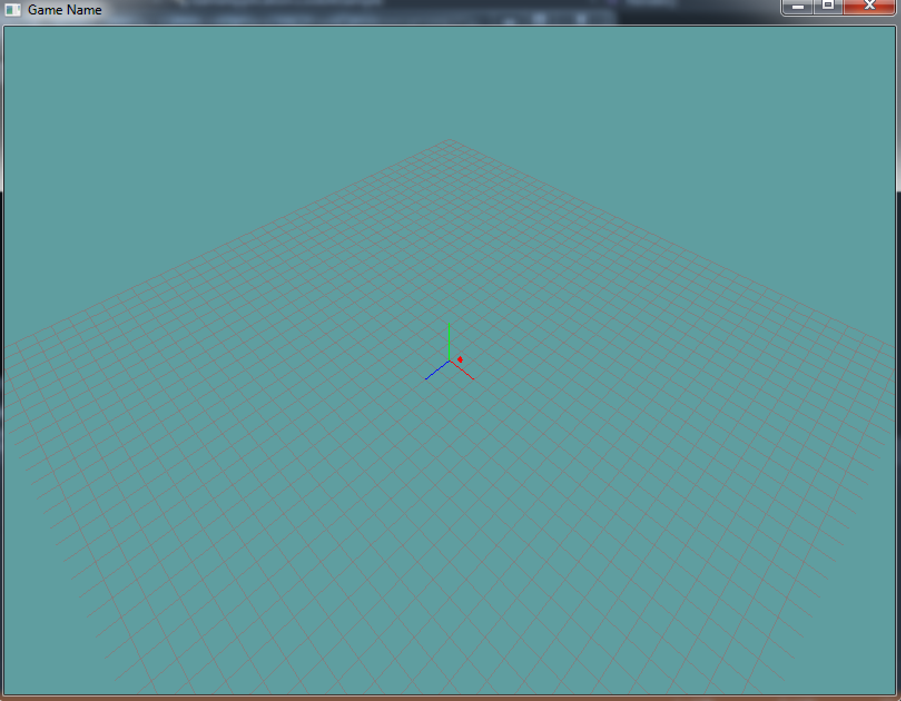

#Viewport

Some projection functions we just discussed are closely related to the viewport size. Take Perspective for example, we had to divide the viewport width and height. We know that the viewport transformation happens after the projection transformation, so now is as good a time as any to discuss it.

In essence the viewport specifies the dimensions and orientation of the 2D window on which you will be rendering. You can set it with:

```
void GL.Viewport(int x, int y, int width, int height);
```

x and y specify the coordinates of the __lower left__ corner of the viewprot. Width and height specify window size in pixels. 

The reson our windows didn't look the same up until this point is because we have had different default viewport values set. Once you are setting your own values for this our windows will look the same.

Let's take the scene we rendered in the Projections section, and manually specify a viewport for it

```
public override void Render() {
    // THIS IS THE ONLY NEW LINE!
    GL.Viewport(0, 0, MainGameWindow.Window.Width, MainGameWindow.Window.Height);

    GL.MatrixMode(MatrixMode.Projection);
    GL.LoadIdentity();
    float aspect = (float)MainGameWindow.Window.Width / (float)MainGameWindow.Window.Height;
    Perspective(60.0f, aspect, 0.1f, 100.0f);

    GL.MatrixMode(MatrixMode.Modelview);
    GL.LoadIdentity();
    LookAt(
        10.0f, 10.0f, 10.0f,
        0.0f, 0.0f, 0.0f,
        0.0f, 1.0f, 0.0f
    );

    grid.Render();

    GL.Translate(0.20f, 0.0f, -0.25f);
    GL.Rotate(45.0f, 1.0f, 0.0f, 0.0f);
    GL.Rotate(73.0f, 0.0f, 1.0f, 0.0f);
    GL.Scale(0.05f, 0.05f, 0.05f);

    GL.Color3(1.0f, 0.0f, 0.0f);
    DrawCube();
}
```

Now your screen should look exactly like mine:



## Split-Screen
Ever wonder how split-screen games are done? 

* Specify viewport to be half of the screen
  * ```GL.Viewport(0, 0, screen.Width / 2, screen.Height)```
* Render the game from player 1's camera. 
  * The aspect ratio will be the aspect ratio of the viewport, not the window
* Specify viewport to be second half of screen
  * ```GL.Viewport(screen.Width / 2, 0, screen.Width / 2, screen.Height)```
* Render game from player2's camera

## Pixel perfect
If you are ever doing any 2D rendering and want it to be pixel perfect, set your viewport to whatever the screen size is

```
GL.Viewport(0, 0, ScreenWidth, ScreenHeight);
```

Then set your orthographic matrix to be that exact size

```
GL.Ortho(0, ScreenWidth, ScreenHeight, 0, -1, 1);
```

Take note how we map the left side of ortho to 0 and the right side to width.

You now have a pixel perfect render context. So, if you want to draw a line from pixels 4 to 7 you just draw from 4 to 7. This is how our 2D framework used to work.