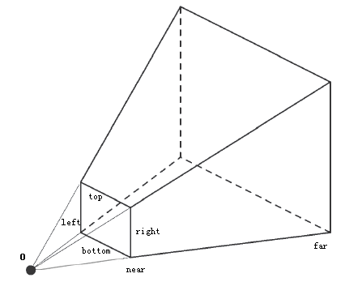
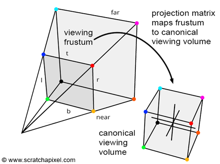
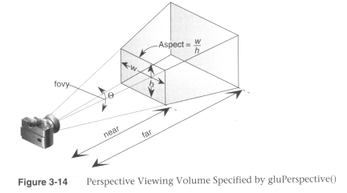

# Projections
We've mentioned projection transformations several times now, and even used them in code. It's about time we discuss how they work. As we've pointed out there are two general classes of projections available in OpenGL: __orthographic__ (or parallell) and __perspective__.

By setting a projection transform, you are, in effect creating a viewing volume, which serves two purposes. The first is that the viewing volume defines a number of clipping planes, which determine the portion of your 3D world that is visible at any given time. Objects outside the volume are not rendered.

The second purpose of the viewing volume is to determine how objects are draw. This depends on the shape of the viewing volume, which is the primary difference betwen perspective and orthographics render modes.


Before specifying any king of projection transformation you need to make sure that the projection matrix is the selected matrix stack. As with the modelView matrix, this is done trough the ```GL.MatrixMode``` function:

```
GL.MatrixMode(MatrixMode.Projection);
```

In most cases you want to follow this up with a call to ```GL.LoadIdentity``` to clear out anything that might be stored in this matrix. Then you set the actual matrix. 

Unlike the __modelView__ matrix, it's not likeley that the projection matrix will change much. Usually the only time this changes is when you resize the window.

Lets take a look at how to set the actual matrix

## Orthographic
Orthographics projections are those that involve no perspective correction. In other words, no adjustment is made for the distance of the camera. Objects appear the same size on screen weather they are close up or far away.

OpenGL provides the ```GL.Ortho``` function to set an orthographic projection:

```
void GL.Ortho(float left, float right, float bottom, float top, float near, float far);
```

Left and right specify the X-coordinate clipping planes. Bottom and top specify the Y, and near and far specify the Z. This function essentially builds a box to render things in.

The default values of the orthographic projection are NDC space, or:

```
GL.Ortho(-1, 1, -1, 1, -1, 1);
```

This is cool, but it gives us a few issues. For one, all our geometry has to fit into the -1 +1 range! 

Follow along in a new sample project. Let's use our scene that draws one cube as a starting point:

```
public override void Render() {
    GL.MatrixMode(MatrixMode.Modelview);
    GL.LoadIdentity();

    LookAt(
        0.5f, 0.5f, 0.5f, 
        0.0f, 0.0f, 0.0f,
        0.0f, 1.0f, 0.0f
    );
    grid.Render();

    GL.Translate(0.20f, 0.0f, -0.25f);
    GL.Rotate(45.0f, 1.0f, 0.0f, 0.0f);
    GL.Rotate(73.0f, 0.0f, 1.0f, 0.0f);
    GL.Scale(0.05f, 0.05f, 0.05f);

    GL.Color3(1.0f, 0.0f, 0.0f);
    DrawCube();
}
```

Now, the projection is the last step in the transform pipeline, because of that, it's the first thing we should multiply! Let's set a projection that's 5 times bigger than the default NDC space!

```
public override void Render() {
    GL.MatrixMode(MatrixMode.Projection);
    GL.LoadIdentity();
    GL.Ortho(-5, 5, -5, 5, -5, 5);

    GL.MatrixMode(MatrixMode.Modelview);
    GL.LoadIdentity();

    LookAt(
        0.5f, 0.5f, 0.5f,
        0.0f, 0.0f, 0.0f,
        0.0f, 1.0f, 0.0f
    );
    grid.Render();

    GL.Translate(0.20f, 0.0f, -0.25f);
    GL.Rotate(45.0f, 1.0f, 0.0f, 0.0f);
    GL.Rotate(73.0f, 0.0f, 1.0f, 0.0f);
    GL.Scale(0.05f, 0.05f, 0.05f);

    GL.Color3(1.0f, 0.0f, 0.0f);
    DrawCube();
}
```

Run that code, all of a sudden you can see a lot more of the scene! Play around with the numbers, try 10, maybe even 15. See what a larger orthographic projection does. 

As your projection matrix gets bigger, you can move your camera to positions other than 0.5f, as they will still hold the scene in View! Experiment a bit, see if you can predict what things will look like. Othro projection can be a bit of a trip!

Before we leave off, i just want to metnion, ortho projections don't have to be cubes. The following is perfectly valid:

```
GL.Ortho(-1, 1, -1, 1, -100, 100);
```

Fun fact, the graphics manager for our 2D framework uses orthographic projection to render the sprites. Maybe take a peek at what it does ;)

##Perspective
Altough orthographic projections can be interesting (not always in a good way) you need to create perspective projections to make realistic looking images.

In a perspective projection, the further an object gets from the screen the smaller it becomes. Just like in the real world. This is commonly reffered to as __foreshortening__ (that term will probably never come up again)

The viewing volume of a perspective projection is called a __frustum__ (that term will come up all the time), which looks like a pyramid with the top cut off.



The projection matrix is actually a matrix that maps the Frustum into a cube that occupies NDC space! So, if you have a cube which ranges from -1 to +1 and multiply it by the inverse of the projection matrix you will get a visual for the frustum!

When the projection matrix maps the frustum into a NDC cube, obejcts closer become smaller and object further become larger.



There are a couple of ways to set up a view frustum. The canonical way OpenGL provides is the ```GL.Frustum``` function.

```
void GL.Frustum(float left, float right, float bottom, float top, float near, float far);
```

In the above function ```left``` ,```right``` and ```bottom``` specify the X and Y coordinates of the near clipping plane. ```near``` and ```far``` specify the distance from the viewer to the near and far clipping planes. 

This means that the top left corner of the near plane is at (left, top, -near) and the bottom right corner is at (right, bottom, -near). The corners of the far plane are determined by casting a ray from the viewer passing trough the near corners by a length for the far value.

Using ```GL.Frustum``` will allow you to set asymetrical frustums, which can be cool but are not very useful. At all. In fact, i never use ```GL.Frustum``` in my code, because it is a VERY hard way to picture a view frustum. Instead i use this helper function (add it to your code!)

```
public static void Perspective(float fov, float aspectRatio, float znear, float zfar) {
    float ymax = znear * (float)Math.Tan(fov * Math.PI / 360.0f);
    float xmax = ymax * aspectRatio;

    GL.Frustum(-xmax, xmax, -ymax, ymax, znear, zfar);
}
```

We will discuss the math behind this function later, in the custom matrices section. The arguments are much simpler, what is the field of view of the player. Human vision is about 90 degrees FOV, most games use a FOV of 60 because it looks good. The aspect ratio is simply the windows width divided by it's height. Don't forget to cast these to floats! And the near and far plane are just the length of the frustum.



This is again such a common function, almost every game programmer will recognize it's signature!