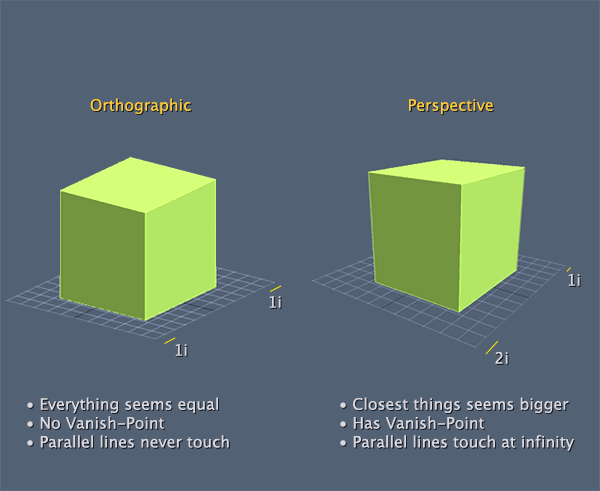

# Projections
We've mentioned projection transformations several times now, and even used them in code. It's about time we discuss how they work. As we've pointed out there are two general classes of projections available in OpenGL: __orthographic__ (or parallell) and __perspective__.

By setting a projection transform, you are, in effect creating a viewing volume, which serves two purposes. The first is that the viewing volume defines a number of clipping planes, which determine the portion of your 3D world that is visible at any given time. Objects outside the volume are not rendered.

The second purpose of the viewing volume is to determine how objects are draw. This depends on the shape of the viewing volume, which is the primary difference betwen perspective and orthographics render modes.

