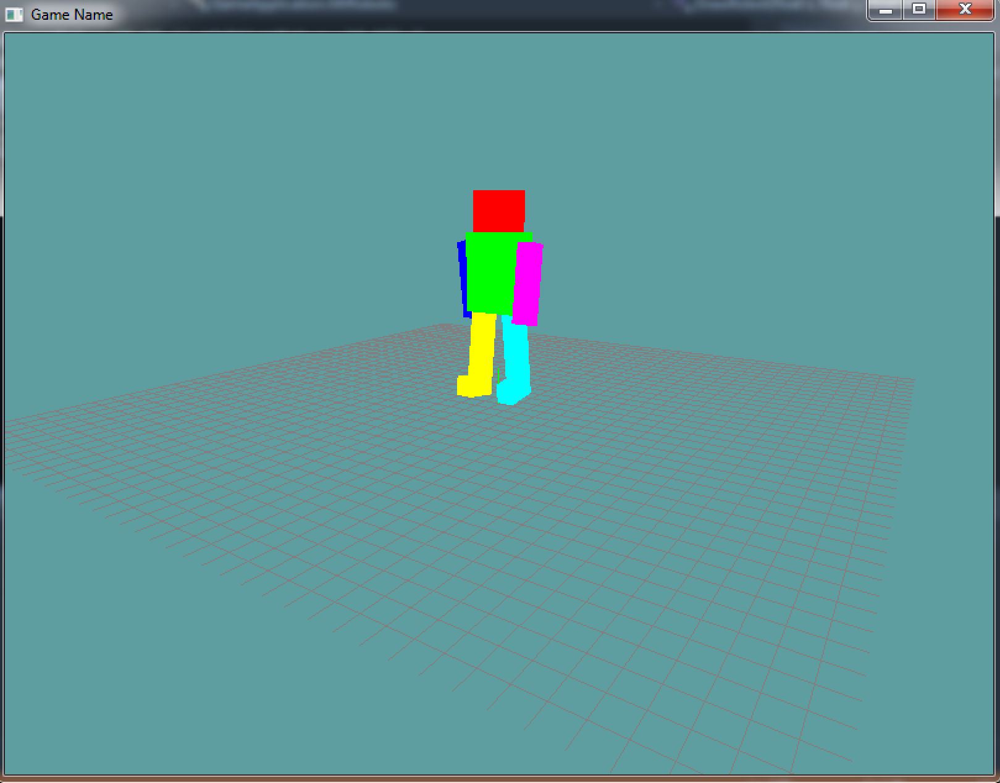
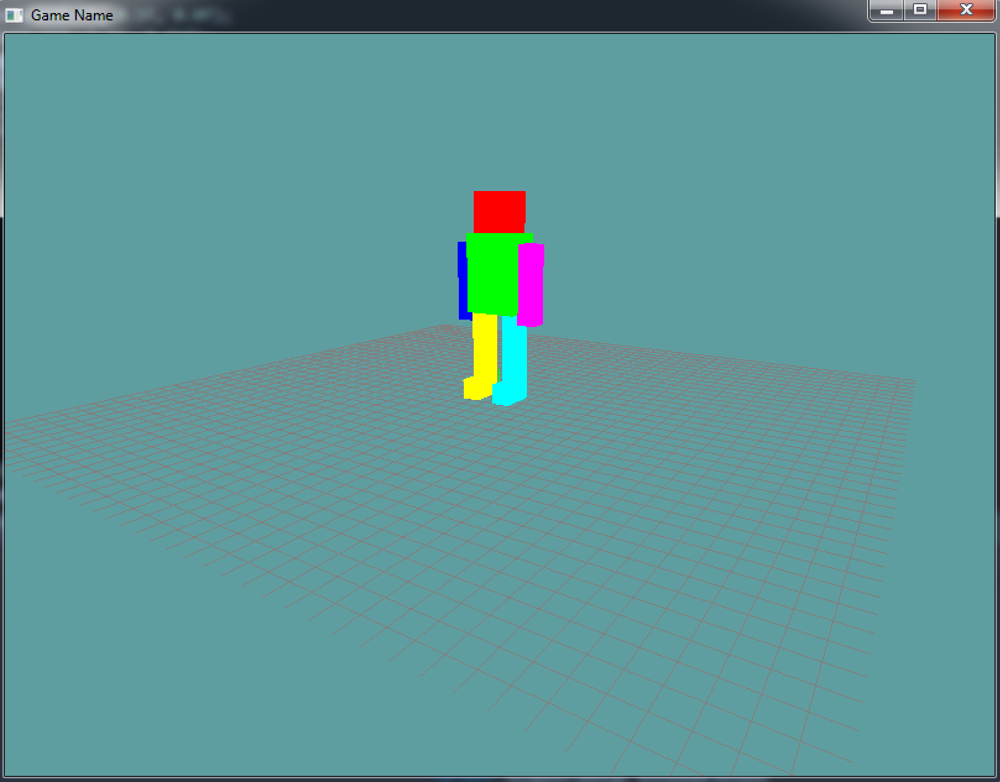

# Mr.Roboto
Now that we can set the perspetive, model-view matrix and can position different elements using push and pop matrix lets make a complex scene. Instead of just drawing a few boxes, we're going to draw a box robot. At that, one that moves!

The final project will look something like this:



## New scene
So, lets get started! Make a new demo scene that extends the ```Game``` class. Add the DrawCube, LookAt and Perspective helper functions to this class. Also, add a grid.

We're ging to add 8 floats to this class. The first 4 are the angles for the arms and legs of the robot. The last 4 are the direction in which the arms / legs are moving!

```
using System;
using System.Collections.Generic;
using System.Linq;
using System.Text;
using System.Threading.Tasks;
using OpenTK.Graphics.OpenGL;

namespace GameApplication {
    class MrRoboto : Game {
        Grid grid = null;

        float leftArmRot = -15.0f;
        float rightArmRot = 15.0f;
        float leftLegRot = 15.0f;
        float rightLegRot = -15.0f;

        float leftArmDir = 1.0f;
        float rightArmDir = -1.0f;
        float leftLegDir = -1.0f;
        float rightLegDir = 1.0f;

        public override void Initialize() {
            grid = new Grid();
            // THIS CALL IS NEEDED
            // We will discuss what it does later!
            GL.Enable(EnableCap.DepthTest);
        }

        protected static void LookAt(float eyeX, float eyeY, float eyeZ, float targetX, float targetY, float targetZ, float upX, float upY, float upZ) {
            // copy / paste
        }

        public static void Perspective(float fov, float aspectRatio, float znear, float zfar) {
            // copy / paste
        }

        public static void DrawCube() {
            // copy / paste
        }

        public override void Update(float dTime) {
            // todo
        }

        public override void Render() {
            // todo
        }
    }
}
```

The only thing to note in the above code is the ```GL.Enable(EnableCap.DepthTest)``` call. We have not discussed what that does yet, we will in a later chapter. For now, just turn it on, it's needed for the game to run.

##Update
Next up, lets animate those rotation variables! In the update we're going to animate the rotation of each limb by 50 degrees / second. If a limb's rotation is > +20 or < -20 we will reverse it's direction

```
public override void Update(float dTime) {
    // Update rotations
    leftArmRot += 50.0f * dTime * leftArmDir;
    rightArmRot += 50.0f * dTime * rightArmDir;
    leftLegRot += 50.0f * dTime * leftLegDir;
    rightLegRot += 50.0f * dTime * rightLegDir;

    // Clamp & change direction at edge
    if (leftArmRot > 20.0f || leftArmRot < -20.0f) {
        // Clamp to -15 or +15, depending on if the number
        // is negative or positive
        leftArmRot = (leftArmRot < 0.0f) ? -20.0f : 20.0f;
        // Change direction
        leftArmDir *= -1.0f;
    }
    
    if (rightArmRot > 20.0f || rightArmRot < -20.0f) {
        rightArmRot = (rightArmRot < 0.0f) ? -20.0f : 20.0f;
        rightArmDir *= -1.0f;
    }

    if (leftLegRot > 20.0f || leftLegRot < -20.0f) {
        leftLegRot = (leftLegRot < 0.0f) ? -20.0f : 20.0f;
        leftLegDir *= -1.0f;
    }

    if (rightLegRot > 20.0f || rightLegRot < -20.0f) {
        rightLegRot = (rightLegRot < 0.0f) ? -20.0f : 20.0f;
        rightLegDir *= -1.0f;
    }
}
```

##Render
Let's start out by simply rendering our grid, up to this point, the render function should look rather familiar. I'm also going to include a function called ```RenderRobot```, i want to write the render code for the robot in it's own function, to make it re-usable and to keep the render loop clean.

```
public override void Render() {
    GL.Viewport(0, 0, MainGameWindow.Window.Width, MainGameWindow.Window.Height);

    GL.MatrixMode(MatrixMode.Projection);
    GL.LoadIdentity();
    Perspective(60.0f, (float)MainGameWindow.Window.Width / (float)MainGameWindow.Window.Height, 0.01f, 1000.0f);

    GL.MatrixMode(MatrixMode.Modelview);
    GL.LoadIdentity();
    LookAt(
        10.0f, 5.0f, 15.0f,
        0.0f, 0.0f, 0.0f, 
        0.0f, 1.0f, 0.0f
    );

    grid.Render();

    DrawRobot(-1.0f, 1.0f, 0.0f);
}
```

The draw robot function takes 3 arguments, world x, world y and world z. The cameras positon is 10, 5, 15 and it is looking at point 0, 0, 0. The near and far plane are almost 1000 units apart, so we can see just about anything in the scene.

## Draw Robot
This is going to be the basic function to draw our (un-animated) robot:

```
void DrawRobot(float x, float y, float z) {
    // Save the matrix state we enter this function with
    GL.PushMatrix();

    // Translate the robot to the desired coordinates
    // because all body parts will be based off of this position
    // we don't need to push a matrix here
    GL.Translate(x, y, z);

    // Draw the head, becuase it multiplies a position we have to push matrix
    GL.Color3(1.0f, 0.0f, 0.0f); // Red
    GL.PushMatrix();
        GL.Translate(1.0f, 4.0f, 0.0f);
        GL.Scale(0.5f, 0.5f, 0.5f);
        DrawCube();
    GL.PopMatrix(); // finish head

    // Draw the body
    GL.Color3(0.0f, 1.0f, 0.0f); // green
    GL.PushMatrix();
        GL.Translate(1.0f, 2.5f, 0.0f);
        GL.Scale(0.75f, 1.0f, 0.5f);
        DrawCube();
    GL.PopMatrix(); // finish body

    // Draw left arm
    GL.Color3(0.0f, 0.0f, 1.0f); // blue
    GL.PushMatrix();
        GL.Translate(0.0f, 2.25f, 0.0f);
        GL.Scale(0.25f, 1.0f, 0.25f);
    DrawCube();
    GL.PopMatrix();

    // Draw right arm
    GL.Color3(1.0f, 0.0f, 1.0f); // magenta
    GL.PushMatrix();
        GL.Translate(2.0f, 2.25f, 0.0f);
        GL.Scale(0.25f, 1.0f, 0.25f);
        DrawCube();
    GL.PopMatrix();

    // Draw left leg
    GL.Color3(1.0f, 1.0f, 0.0f); // yellow
    GL.PushMatrix();
        GL.Translate(0.5f, 0.5f, 0.0f);
        GL.Scale(0.25f, 1.0f, 0.25f);
        DrawCube();
        // Draw left foot. Since nothing else uses the modellview matrix beofore
        // the next pop, we don't have to technically include this push call.
        // But i think including it makes it obvious that the foot is being
        // drawn relative to the leg!
        GL.PushMatrix();
            GL.Translate(0.0f, -1.0f, 1.0f);
            GL.Scale(1.0f, 0.25f, 2.0f);
            DrawCube();
        GL.PopMatrix();
    GL.PopMatrix();

    // Draw right leg
    GL.Color3(0.0f, 1.0f, 1.0f); // baby blue
    GL.PushMatrix();
        GL.Translate(1.5f, 0.5f, 0.0f);
        GL.Scale(0.25f, 1.0f, 0.25f);
        DrawCube();
        // Draw right foot.
        GL.PushMatrix();
            GL.Translate(0.0f, -1.0f, 1.0f);
            GL.Scale(1.0f, 0.25f, 2.0f);
            DrawCube();
        GL.PopMatrix();
    GL.PopMatrix();

    // Restore original matrix state, like if this function
    // never did anything to matrices ;)
    GL.PopMatrix();
}
```

The comments in the code above outline what is happening, but lets discuss it real quick anyway. The robot is made up of 8 cubes. We first scale the cube into the shape of a certain body part. Once the body part has the right shape, we translate it into position.

The most interesting bit here are the feet on the legs. Because each foot is rendered inside the push / pop block of the leg it belongs to, when we rotate the leg we will also rotate the foot. 

How did we come up with the scale (1.0f, 0.25f, 2.0f) for the feet? Well, if we don't translate or scale in there, just draw a cube it will draw the leg cube. We want the foot cube to be just as wide as the leg, so the X-scale stays 1. Relative to the leg, we want to foot to be 1/4 the height of the leg. So y scale becomes 0.25. We want the foot to be deeper than the leg, so it can jot out. Relative to the leg we want the foot twice as long, so we scale Z by 2.

This is an important concept. Each time we transform something, we are transforming it relative to the space it's in. The leg is relative to view space, the foot is relative to the legs model space. If we had toes they would be relative to the foots model space.

The concept of relative spaces is very important. If you don't understand it talk to me on skype!

With the above render code in place, your robot should render like so:



##Animate
Awesome! Now we have a robot!But it's not doing anything.... Lame. Let's animate some movement!

To add animation, all we have to do is account for rotation for all major joints. Left and right arms both rotate. Left and right legs both rotate. The left and right feed don't rotate independently, they rotate with the legs.

Here is how you would rotate the left arm:

```
// Draw left arm
GL.Color3(0.0f, 0.0f, 1.0f); // blue
GL.PushMatrix();
    GL.Translate(0.0f, 2.25f, 0.0f);
    GL.Rotate(leftArmRot, 1.0f, 0.0f, 0.0f);
    GL.Scale(0.25f, 1.0f, 0.25f);
DrawCube();
GL.PopMatrix();
```

The only thing new is we added Rotate to the transfomration matrix of the arm. Try to rotate the otehr limbs yourself.

Once you have all of this, you should see the limbs swinging. Only one problem, the arms are not rotating at the shoulder, they are rotating at the elbow! Same for the legs... 

##Pivot