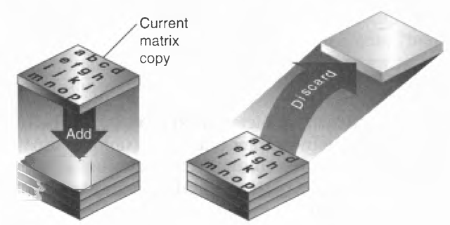

# Matrix Stacks
Rendering the cube scene is actually a pretty big deal! We now have a scene with a cube in it! I would call this the start of a game. What if we want to add another cube to our scene to make the game a bit more interesting? 

After we transform the inital cube, we have to reset the modelview matrix to how it was before we rendered the first cube, otherwise the second cube will not render relative to the world origin, but rather relative to the first cube. 

So this is what you would have to do:

* Select modelview matrix
* Load itentity
* Apply view matrix (LookAt)
* Draw grid
* Apply cube 1 model matrix
* Draw cube 1
* Apply inverse of cube 1 model matrix
* Apply cube 2 model matrix
* draw cube 2

This is what the code for the above steps might look like

```
public override void Render() {
    // Mark modelview matrix as selected
    GL.MatrixMode(MatrixMode.Modelview);

    // Reset modelview matrix
    GL.LoadIdentity();

    // Apply View Matrix
    LookAt(
        0.5f, 0.5f, 0.5f, 
        0.0f, 0.0f, 0.0f,
        0.0f, 1.0f, 0.0f
    );

    // Render grid, it has no model matrix
    grid.Render();

    // Construct the model matrix for first cube
    GL.Translate(0.20f, 0.0f, -0.25f);
    GL.Rotate(45.0f, 1.0f, 0.0f, 0.0f);
    GL.Rotate(73.0f, 0.0f, 1.0f, 0.0f);
    GL.Scale(0.05f, 0.05f, 0.05f);

    // Render first cube
    GL.Color3(1.0f, 0.0f, 0.0f);
    DrawCube();

    // UNDO model matrix for first cube
    GL.Translate(-0.20f, -0.0f, 0.25f);
    GL.Rotate(-45.0f, 1.0f, 0.0f, 0.0f);
    GL.Rotate(-73.0f, 0.0f, 1.0f, 0.0f);
    GL.Scale(20.0f, 20.0f, 20.0f);

    // Construct model matrix for second cube

    // Now that the modelview matrix is correct, render cube
    GL.Translate(-2.5f, 0.0f, 0.25f);
    GL.Rotate(33.0f, 0.0f, 0.0f, 1.0f);
    GL.Rotate(97.0, 0.0f, 1.0f, 0.0f);
    GL.Scale(0.05f, 0.05f, 0.05f);
    GL.Color3(0.0f, 1.0f, 0.0f);
    DrawCube();
}
```

Study the code, if you run it you will see two cubes, one red and one green. This code does work!

You might be thinking to yourself, i see that applying the inverse of cube 1's model matrix just sets the _modelview_ matrix back to the view. Instead of those 4 lines, why don't i just call LoadIdentity and LookAt again?

That logic is sound. Doing that would work, and you'd make your program a bit more readable. But that's not a maintainable solution! As soon as you have nested objects that approach breaks.

We can't stay with the first approach either! It's verbose, it's messy and it has the potential to introduce a lot of floating point error.

## The stack
OpenGL fixes this issue of matrix-crazyness with matrix stacks! A matrix stack is exactly what it sounds like, a stack of matrices. There are two functions that you can use to control this stack:

```
void GL.PushMatrix();
void GL.PopMatrix();
```

* __GL.PushMatrix__ will add a new matrix to the stack. This matrix is a copy of whatever the current top of the stack is
* __GL.PopMatrix__ will take one matrix off of the stack

All matrix functions (LoadIdentity, LookAt, Translate, Rotate, Scale, etc...) only effect the top of the stack! This matrix stack acts as a history of matrices, allowing you to undo actions.

There is always at least one matrix on the stack, by default. This is what the state machine starts working on. For every PushMatrix call you make you MUST provide a matching PopMatrix.

The __modelView__ matrix stack is guaranteed to be at least 32 elements deep. the __projetion__ stack is only guaranteed to be 2 elements deep. Better graphics cards _might_ provide deeper stacks.

The same list of steps we took at the top of this  page to render two cubes becomes this simple:

* Select modelview matrix
* Load itentity
* Apply view matrix (LookAt)
* Draw grid
* __Push Matrix (save modelView)__
* Apply cube 1 model matrix
* Draw cube 1
* __Pop Matrix (restore modelView)__
* __Push Matrix (save modelView)__
* Apply cube 2 model matrix
* draw cube 2
* __PopMatrix(restore modelView)__

Basically you push before making changes to the matrix, then pop to undo those changes. 
Visually, here is an example of the matrix stacks:



For example:

```
// Stack height: 1
GL.MatrixMode(MatrixMode.Modelview);
GL.LoadIdentity();
// The top of the stack is now identity

GL.PushMatrix(); // Stack height: 2
// The top of the stack is still identity

LookAt(
    0.5f, 0.5f, 0.5f, 
    0.0f, 0.0f, 0.0f,
    0.0f, 1.0f, 0.0f
);
// The top of the stack is now whatever the camera sees

GL.PushMatrix(); // Stack height 3
// The top of the stack is still whatever the camera sees

GL.Translate(3.0f, 0.0f, 0.0f);
// The top of the stack is now translated to 3.0f world space & multiplied by the view matrix

DrawModel();

GL.PopMatrix(); // Stack height 2
// The top of the stack is still whatever the camera sees

GL.PushMatrix(); // Stack height 3
// The top of the stack is still whatever the camera sees

GL.Rotate(45.0f, 1.0f, 0.0f);
// The top of the stack is now rotated at origin & multiplied by the view matrix
DrawModel();

GL.PopMatrix(); // Stack Height 2
// The top of the stack is still whatever the camera sees

GL.PopMatrix(); // Stack Height 1
// The top of the stack is now identity
```

##On your own
Make a new demo. Render 3 cubes, one red one blue and one green. Use Push and Pop to save and restore matrix states between rendering them. Render all 3 at different locations on screen. When you are done, update git and let me know so i can review the code.

Hint: Keep the scale small, 0.05f or smaller. And don't translate mode than 1.0 units. I'd try to keep under 0.5f. Remember, everything has to fit into NDC space!