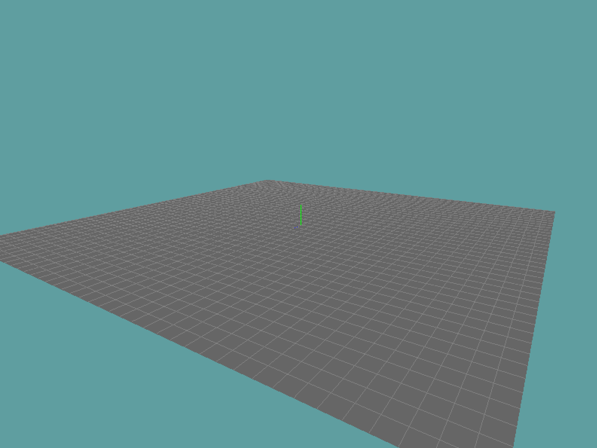

# Exercises

The last section covered a LOT of ground about lighting, what it is and how it works. But i don't feel like it demonstrated clearly how to actually use lights. That's what this chapter is all about. In this chapter we're going to create several demo scenes, some together, some on your own to create some fully lit scenes

## Changing the grid
Before we get started, there are a few things we need to change within our code to get well lit objects. First, in order to actually view lighting, it helps to have a solid ground plane. Let's modify the grid class to optionally draw a solid plane.

First, let's add a public boolean that is going to control the render mode. By default drawing a filled in grid is going to be off (So that we don't break any of the example scenes we've already written)

```
namespace GameApplication {
    class Grid {
        // Control if the grid is rendered solid or not
        public bool RenderSolid = false;

        public Grid() {
            RenderSolid = false;
        }

        public Grid(bool solid) {
            RenderSolid = solid;
        }
```

Now, let's modify the render function to actually render the solid grid. Remember, our grid is 20 units wide, and centered around the 0 point. So the far left is -10, the far right is 10. We're going to draw one large quad to cover this area. The quad is going to be a dark gray. 

We're going to draw the quad at -0.01f on th Y axis. We do this because i still want the grid to render, this way the quad renders just underneath the grid and will look pretty good. 

Lets add this to the begenning of the render function:

```
public void Render() {
    // Only render this bit if solid is enabled
    if (RenderSolid) {
        // Set the color to a dark gray
        GL.Color3(0.4f, 0.4f, 0.4f);
        // Draw one large rectangular primitive
        // this large rectangle is 2 triangles ;)
        GL.Begin(PrimitiveType.Triangles);
            // Triangle 1
            GL.Vertex3(10.0f, -0.01f, 10.0f);
            GL.Vertex3(10.0f, -0.01f, -10.0f);
            GL.Vertex3(-10.0f, -0.01f, -10.0f);
            // Triangle 2
            GL.Vertex3(10.0f, -0.01f, 10.0f);
            GL.Vertex3(-10.0f, -0.01f, -10.0f);
            GL.Vertex3(-10.0f, -0.01f, 10.0f);
        GL.End();
    }
    // ... The rest of the render function stays the same
```

Thats all the changes we need to make to the grid. If you run one of the existing samples, and turn on ```RenderSolid``` on, your scene should look something like this:



## Additional Geometry
You added the ```DrawCube``` function to every program that uses it. And you added the function ```DrawSphere``` to a calss called ```Circle```. There is nothing wrong with this, its a solid approach. The circle code is better than the cube code for the sake that it is more portable.

However, neither solution is robust. Ideally you will have many different primitives to render, so we need a class that is a convenient holder for them. I would call this class either ```Primitives``` or ```Geometry```. Go ahead and create this class in your project.

Add the code found [at this gist](TODO) to the class. Don't copy any of the existing code in your project, the gist is special in that it adds normal information (we will cover this later) for each primitive. The following static functions are exposed for you:

```
public static void Geometry.Cube();
public static void Geometry.Sphere(int nDiv = 2);
public static void Torus(float ringRadius = 0.2f, float tubeRadius = 0.8f, int numc = 24, int numt = 12)
```

Cube and Sphere work like they always have. I've added some sensible defaults.

## The test scene