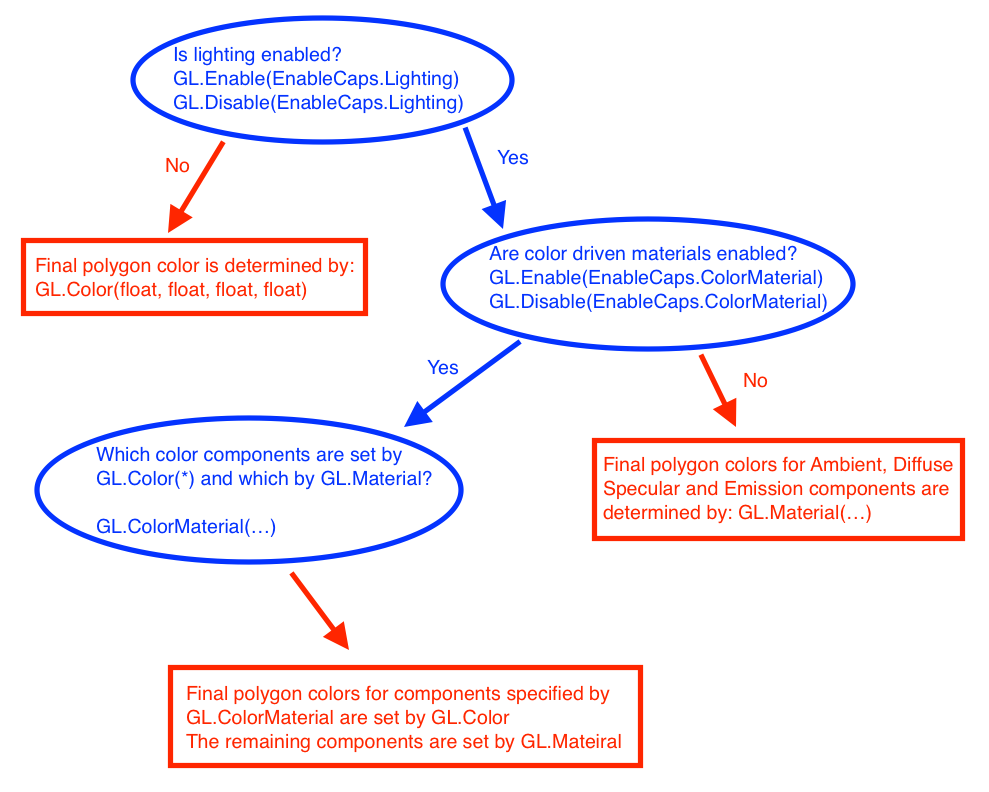

# Where render color comes from
This page is a straight up rip of [Steve Baker's OpenGL Lighting](http://www.sjbaker.org/steve/omniv/opengl_lighting.html) tutorial.

Many people starting out with OpenGL are confused by the way that OpenGL's built-in lighting works - and consequently how color functions. I hope to be able to clear up some of the confusion. What is needed to explain this clearly is a flow chart:



## Lighting ENABLED or DISABLED?

The first - and most basic - decision is whether to enable lighting or not.

```
GL.Enable(EnableCaps.Lighting);
```

...or...

```
GL.Disable (EnableCaps.Lighting);
```

If it's disabled then all polygons, lines and points will be colored according to the setting of the various forms of the ```GL.Color``` command. Those colors will be carried forward without any change other than is imparted by texture or fog if those are also enabled. Hence:

```
GL.Color3(1.0f, 0.0f, 0.0f) ;
```

...gets you a pure red triangle no matter how it is positioned relative to the light source(s).

With ```EnableCaps.Lighting``` enabled, we need to specify more about the surface than just it's color - we also need to know how shiny it is, whether it glows in the dark and whether it scatters light uniformly or in a more directional manner.

The idea is that OpenGL switches over to using the current settings of the current _"material"_ instead of the simplistic idea of a polygon _"color"_. This is an over-simplistic explanation - but keep it firmly in mind.