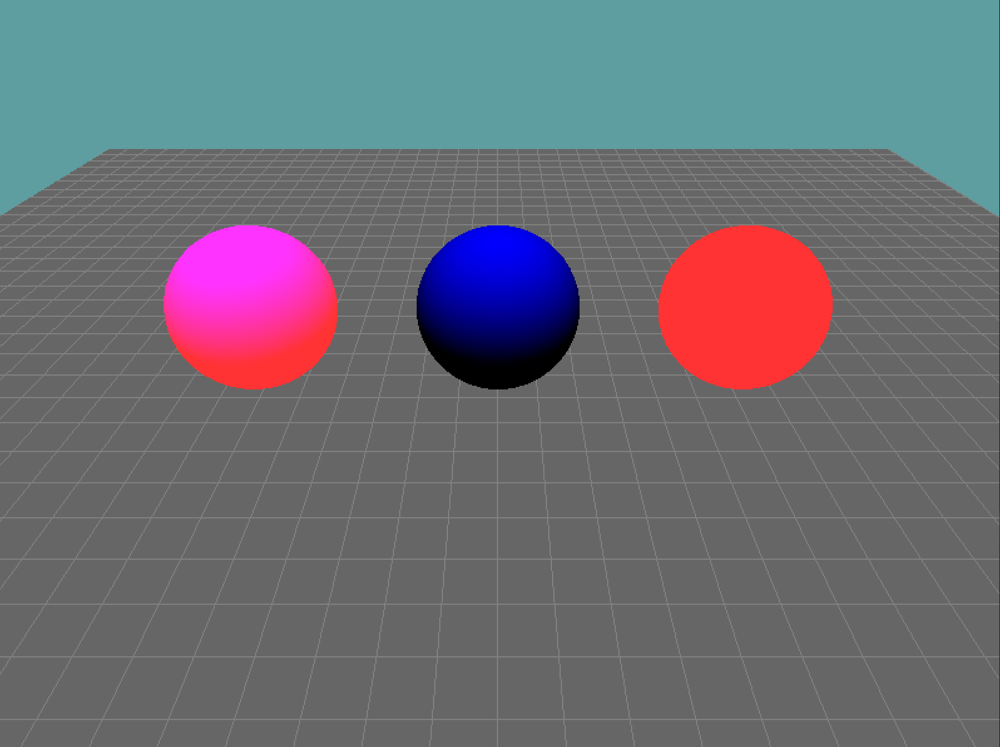
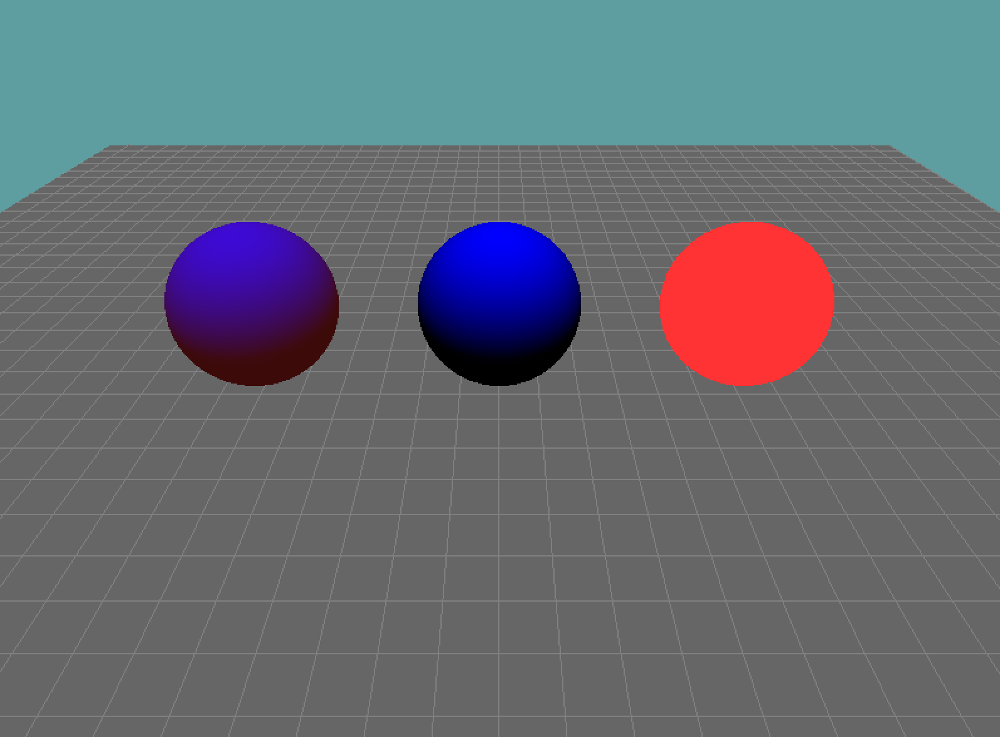

# Using material colors
Now that you know how materials work, lets take some time and actually implement some code using materials!

Let's get started by making a new demo class we'll call it ```MaterialColors```. Get the code in it up to par with the test scene.

Once you have that, we're just going to play around with material colors.

## Ambient and Diffuse
First, lets set the following materials

* Sphere 1
  * Set the material ambient to white
  * Set the material diffuse to black
* Sphere 2
  * Set the material ambient to black
  * Set the material diffuse to white
* Sphere 3
  * Set the material ambient to white
  * Set the material diffuse to white

Try setting the material paramaters yourself first. The code for how to do it is given below the image, but you should be able to set these without the sample code. The scene will look like this:



The code to set the material color paramaters, looks like this:

```
// Set up camera
// Render unlit grid

GL.Material(MaterialFace.FrontAndBack, MaterialParameter.Ambient, new float[] { 1, 1, 1, 1 });
GL.Material(MaterialFace.FrontAndBack, MaterialParameter.Diffuse, new float[] { 0, 0, 0, 1 });
// Render first sphere

GL.Material(MaterialFace.FrontAndBack, MaterialParameter.Ambient, new float[] { 0, 0, 0, 1 });
GL.Material(MaterialFace.FrontAndBack, MaterialParameter.Diffuse, new float[] { 1, 1, 1, 1 });
// Render secong sphere

GL.Material(MaterialFace.FrontAndBack, MaterialParameter.Ambient, new float[] { 1, 1, 1, 1 });
GL.Material(MaterialFace.FrontAndBack, MaterialParameter.Diffuse, new float[] { 1, 1, 1, 1 });
// Render third sphere
```

Like we discussed earlyer, the materials ambient property determines how much of the lights ambient property effects the object. Same for all other properties. When this is set to white, it means the lights ambient fully effects the object, when it's set to black it means the ambient does not affect the object at all.

A few important observations can be made from this code. Notice that the sphere only affected by ambient lighting isn't shaded. It's solid. That's because ambient light is constant, it doesn't really have a source! Notice, the diffuse lighting IS shaded. This is because the diffuse is the directional component of the light.

Lastly, take a look at the third sphere. We have both ambient and diffuse lights effecting this, but it looks AWEFUL! Shouldn't it look like the default lit sphere? No, not exactly. By default the lighting model sets the following values

* Ambient - (0.2, 0.2, 0.2, 1.0)
* Diffuse - (0.8, 0.8, 0.8, 1.0)

The two values when added to come out to (1, 1, 1, 1). This is purley coincidental, not a requirement! Go ahead, update the render code for that last sphere to reflect these numbers. All of a sudden the scene looks like this:



The material code was changed to:

```
// Set up camera
// Render unlit grid

// Render first sphere
// Render secong sphere

GL.Material(MaterialFace.FrontAndBack, MaterialParameter.Ambient, new float[] { 0.2f, 0.2f, 0.2f, 1 });
GL.Material(MaterialFace.FrontAndBack, MaterialParameter.Diffuse, new float[] { 0.8f, 0.8f, 0.8f, 1 });
// Render third sphere
```

Now that third sphere looks the same as it did in the test scene. You can really see how the shading works. To get the final color of this sphere. Let's walk trough how this color was obtained.

First we take the ambient component of the light (1, 0, 0) and multiply it with the ambient component of the material (0.2, 0.2, 0.2). The result is the objects ambient component (0.2, 0, 0). 

Next we take the diffuse component of the light (1, 0, 1) and multiply it with the diffuse component of the material (0.8, 0.8, 0.8). The result is the objects diffuse component (0, 0, 0.8)

Finally, to get the color of the object, we add the ambient and diffuse components of the object together, resulting in (0.2, 0, 0.8). The color interpolation (dark on bottom, light on top) is contributed by the diffuse component.

Play around with the colors a bit. See if you can predict what your code will look like once its on screen.

## Specular