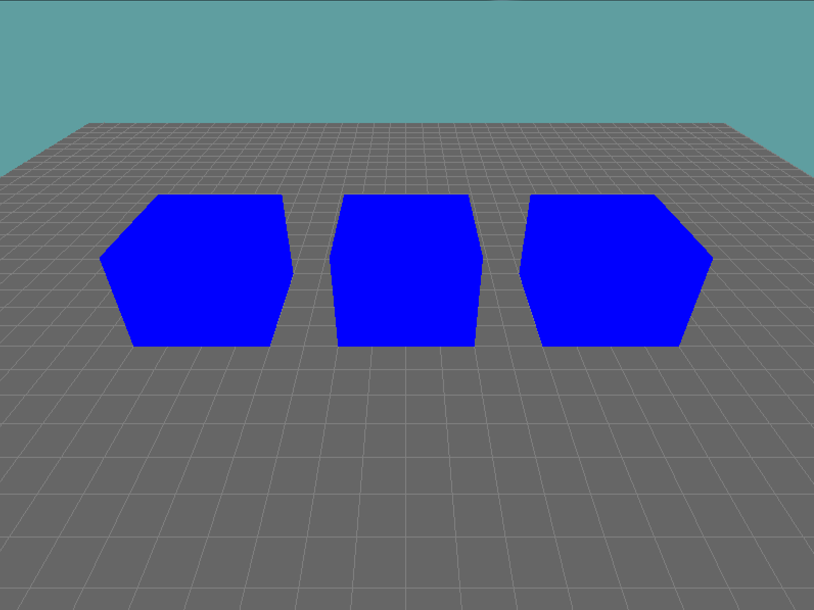

# Using material colors
Now that you know how materials work, lets take some time and actually implement some code using materials!

Lets create a new scene. 

* You should be in a perspective projection, with a 60 degree field of view
  * The base class already does this, but review the code. 
  * I'm concerned that this bit isn't being practiced!
  * Take note that it's set in the constructor and resize function
  * Also, pay attention to the viewport. Every time projection is set, so is the viewport
* Set up your view matrix
  * The camera should be positioned at (0, 5, -7)
  * The camera should be looking at (0, 0, 0)
* Add a solid grid as the ground. 
  * You can use a subdivision of 0, we're only using directional lights
* Render 3 cubes
  * One at (-3, 0.5, 0)
  * One at (0, 0.5, 0)
  * One at (3, 0.5, 0)

Running your game, you should see this:

