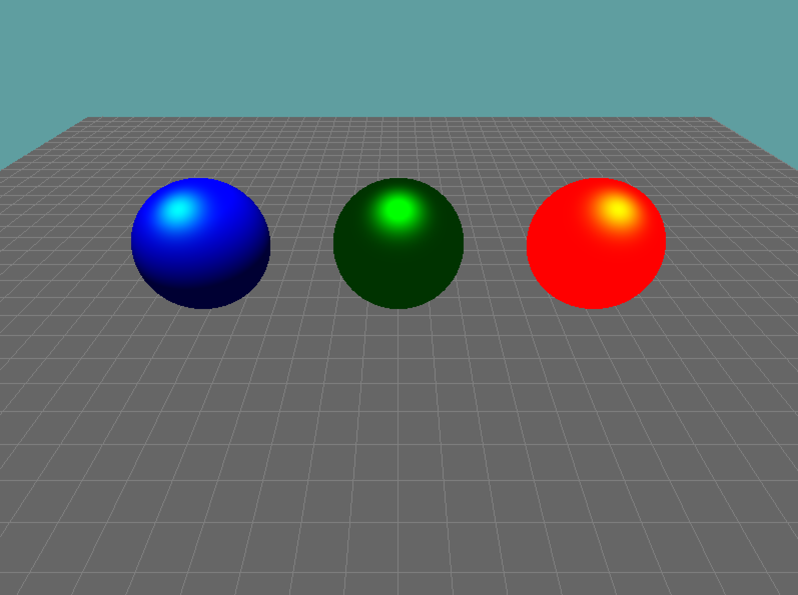

# Color Tracking

We call it color tracking, but more often than not people simply refer to this technique as __Changing material paramaters with GL.Color__, sometimes it's also refered to as __color material mode__

Earlyer we saw that OpenGL uses the current material color (set with ```GL.Material```) when lighting is enabled, but uses the current primary color (set with ```GL.Color```) when lighting is disabled. This inconsistency can often get confusing. It's also slightly more expensive to call ```GL.Material``` than it is to call ```GL.Color``` because of the safety checks the functions do. Whenever you change a materials color, most often you only change the diffuse and ambient components.

color mateiral mode adresses these issues. When you enable color material mode, certain current material colors track the current primary color instead. To use color materials, you must first enable them:

```
GL.Enable(EnableCaps.ColorMaterial);
```

This will cause calls to ```GL.Color``` to change not only the primary color, but also the current ambient and diffuse material colors. Of course you can change which properties color tracking affects by calling ```GL.ColorMaterial```.

We've already discussed how to change which color is tracked in the __Defining Materials__ section.

### Example 1

Lets make a new demo scene, call it ```ColorTrackingDemo``` and get it up to par with the test scene. Once you have that:

* In the initialize function
  * Call ```GL.Mateiral``` to:
    * Set the specular component to white
    * Set the shininess to 20
  * Enable color material
  * Set color materials to track the ambeint AND diffuse components for front and back face
* In the render function
  * Set the first spheres render color to red
  * Set the second spheres render color to green
  * Set the third spheres color to blue

Your scene should look like the below image:



In case your scene doesn't look like that, here is the code i used to get that result

```
 public override void Initialize() {
    base.Initialize();

    // Enable lighting and configure light 0
    
    GL.Material(MaterialFace.FrontAndBack, MaterialParameter.Specular, new float[] { 1, 1, 1, 1 });
    GL.Material(MaterialFace.FrontAndBack, MaterialParameter.Shininess, 20.0f);

    GL.Enable(EnableCap.ColorMaterial);
    GL.ColorMaterial(MaterialFace.FrontAndBack, ColorMaterialParameter.AmbientAndDiffuse);
}

public override void Render() {
    // Set up view matrix

    // Render unlit grid

    GL.Color3(1f, 0f, 0f);
    // Draw first sphere

    GL.Color3(0f, 1f, 0f);
    // Draw second sphere

    GL.Color3(0f, 0f, 1f);
    Draw third sphere
}
```