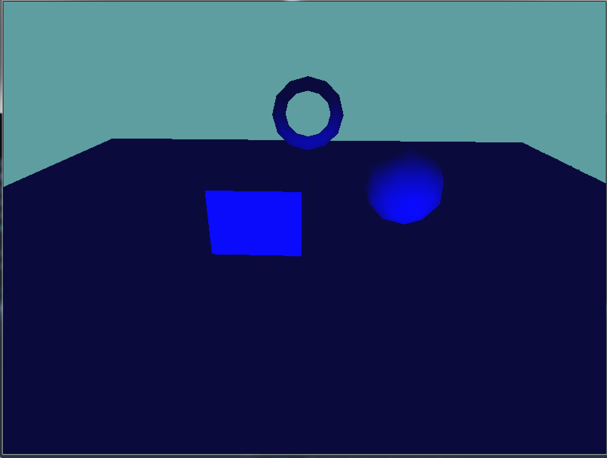
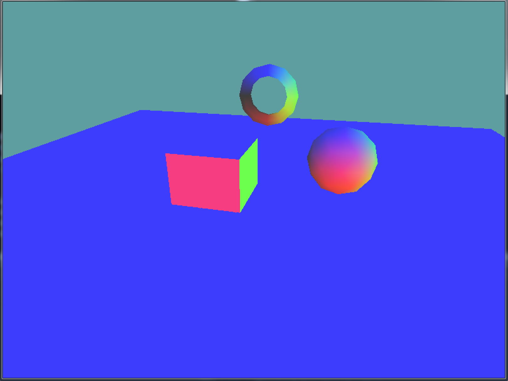
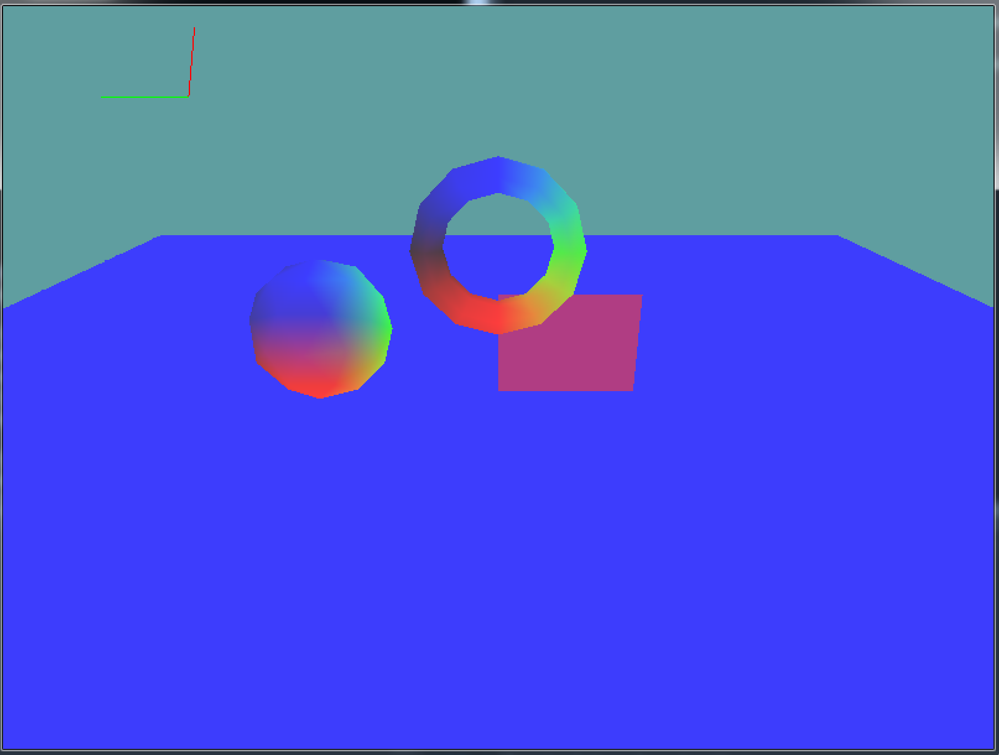
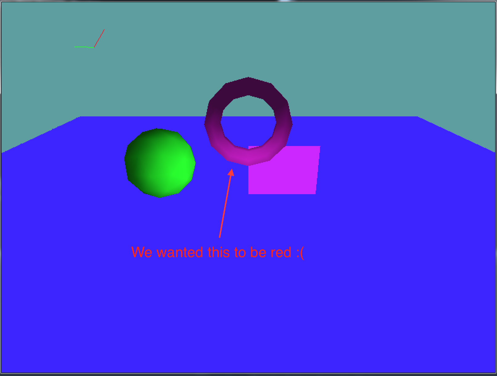

# Directional lights
Directional lights are perhaps the easyest to program. They are simply a direction that the light comes from, like sunlight. Let's give it a go.

Follow along, make a new scene for each sub-section here. For this (Directional Light) section alone you should have 6 test scenes.

## Adding one light

The first thing we need to do is enable lighting and light 0. This isn't necesarley something that needs to happen every frame, so lets handle it in the initialize function.

```
public override void Initialize() {
    grid = new Grid(true);
    GL.Enable(EnableCap.DepthTest);
    GL.Enable(EnableCap.CullFace);
    Resize(MainGameWindow.Window.Width, MainGameWindow.Window.Height);

    GL.Enable(EnableCap.Lighting);
    GL.Enable(EnableCap.Light0);
}
```

Now we are ready to do some lighting! I'm going to set light 0 to be a blue light comming from the upper front of the scene. For now, the light is static (it doesn't change from frame to frame) so it's safe to configure in the Init function as well.

```
public override void Initialize() {
    grid = new Grid(true);
    GL.Enable(EnableCap.DepthTest);
    GL.Enable(EnableCap.CullFace);
    Resize(MainGameWindow.Window.Width, MainGameWindow.Window.Height);

    GL.Enable(EnableCap.Lighting);
    GL.Enable(EnableCap.Light0);

    float[] white = new float[] { 0f, 0f, 0f, 1f };
    float[] blue = new float[] { 0f, 0f, 1f, 1f };

    GL.Light(LightName.Light0, LightParameter.Position, new float[] { 0.0f, 0.5f, 0.5f, 0.0f } );
    GL.Light(LightName.Light0, LightParameter.Ambient, blue );
    GL.Light(LightName.Light0, LightParameter.Diffuse, blue );
    GL.Light(LightName.Light0, LightParameter.Specular, white );
}
```

That's all there is to it. If you run your code, it should look like this:


## Light direction

It may not be obvious from the previous example, but OpenGL shades (lights) objects independently! That is, no object casts a shadow on another object. When the light is comming from the top, like in the above scene it's easy to miss that. So, let's change the light direction to come from the negative Y axis!

```
    GL.Light(LightName.Light0, LightParameter.Position, new float[] { 0.0f, -0.5f, 0.5f, 0.0f } );
```

Let's take a look at what that looks like:



As you can see the shading on the primitives has changed, the floor is the most noticable. In the first example, the floor got a LOT of light, in the second example, the floor is unlit. This happens because in the second example the floor is facing away from the light.

In the real world, the floor would stop light from reaching the objects. In OpenGL each object is shaded and lit indevidually, like if no other object was in the scene. It is possible to add code to support shadows, but it's a complicated process that we will talk about later.

## Two Lights
So, actually using a light us pretty easy. OpenGL supports up to 8 lights! Let's try to add one more and see what happens. We're going to add a second light, this one is going to be red. It's going to come from the Opposite direction of the blue light from the original example.

First things first, in the Initialize function we have to enable and configure light 1:

```
public override void Initialize() {
    grid = new Grid(true);
    GL.Enable(EnableCap.DepthTest);
    GL.Enable(EnableCap.CullFace);
    Resize(MainGameWindow.Window.Width, MainGameWindow.Window.Height);

    GL.Enable(EnableCap.Lighting);
    GL.Enable(EnableCap.Light0);
    GL.Enable(EnableCap.Light1);

    float[] white = new float[] { 0f, 0f, 0f, 1f };
    float[] blue = new float[] { 0f, 0f, 1f, 1f };
    float[] red = new float[] { 1f, 0f, 0f, 1f };

    // Config light 0
    GL.Light(LightName.Light0, LightParameter.Position, new float[] { 0.0f, 0.5f, 0.5f, 0.0f } );
    GL.Light(LightName.Light0, LightParameter.Ambient, blue );
    GL.Light(LightName.Light0, LightParameter.Diffuse, blue );
    GL.Light(LightName.Light0, LightParameter.Specular, white );

    // Config light 1
    GL.Light(LightName.Light1, LightParameter.Position, new float[] { 0.0f, -0.5f, 0.5f, 0.0f });
    GL.Light(LightName.Light1, LightParameter.Ambient, red);
    GL.Light(LightName.Light1, LightParameter.Diffuse, red);
    GL.Light(LightName.Light1, LightParameter.Specular, white);
}
```

Lets see what that looks like:


The top of any object is shaded blue. The bottom is shaded red. Colors in the middle interpolate between the two lights, based on the direction of the surface normal.

## On your own
Using the last example, add a third light (Light2). Configure this light to point straight left (1, 0, 0, 0), and be green. The final scene should look like this:



The torus and cube are especially interesting as we look at this scene. The floor is also noteworthy too. It's compleatly blue! That's because the floor gets blue light from the top. It's facing away from the red light on the bottom, and is paralell to the green light. So the red and green lights don't directly effect it.

But every time we added a light, the floor became a different shade of blue! If the lights don't directly effect floor, why is it's color changing? Ambient light. Each light adds a bit of ambient light to the scene. Remember, ambient lighting is light that has scattered so much it has no direction, so it uniformly effects everything in the scene!

The lighting models diffuse component is direct lighting, the ambient component is indrect lighting and the specular component is shininess! So, can we turn off the ambient light? Yes. Set the ambient component of any light that you don't want an ambient contribution from to __black__. Because black is RGB(0, 0, 0), it is absent of color, therefore it has no contribution to lighting.

## Dynamic lights
We now have a scene lit by 3 static lights. But lighting in OpenGL can be so much more than just static lights. It can be dynamic! Lights can move with objects! Using the previous scene as a base, let's animate the lights! 

We're going to make the green light orbit the scene horizontally, the red light orbit the scene vertically, and we're going to make the camera stay static.

First, let's add some variables to the scene. We're going to use the same orbit logic we used for the camera, so these variables will be simialr.

```
namespace GameApplication {
    class LightingScene : Game{
        Grid grid = null;

        float cameraAngleX = 0.0f;
        float cameraAngleY = -25;
        float cameraDistance = 10.0f;

        float redAngleX = 0.0f;
        float redAngleY = 0.0f;

        float greenAngleX = 0.0f;
        float greenAngleY = 0.0f;

        public override void Initialize() {
            // ... rest of code unchanged
```

We have an X and a Y angle for both lights, we don't have a distance, to keep the vectors of unit length, we will use 1.0f for the distance. Next lets change the Update function to stop rotating the camera, and start rotating the lights!

```
public override void Update(float dTime) {
    //cameraAngleX += 30f * dTime;

    redAngleY += 15.0f * dTime;
    greenAngleX += 30.0f * dTime;
}
```

Now that the actual rotation logic is in place, all that's left to do is actually rotate the lights. We do this by changing the ```LightParameter.Position``` parameter of light 1 (red) and light 2 (green) every time a frame is rendered. 

```
public override void Render() {
    Vector3 eyePos = new Vector3();
    eyePos.X =  cameraDistance * -(float)Math.Sin(cameraAngleX * (float)(Math.PI / 180.0)) * (float)Math.Cos(cameraAngleY * (float)(Math.PI / 180.0));
    eyePos.Y =  cameraDistance * -(float)Math.Sin(cameraAngleY * (float)(Math.PI / 180.0));
    eyePos.Z = -cameraDistance * (float)Math.Cos(cameraAngleX * (float)(Math.PI / 180.0)) * (float)Math.Cos(cameraAngleY * (float)(Math.PI / 180.0));
    
    Matrix4 lookAt = Matrix4.LookAt(eyePos, new Vector3(0.0f, 0.0f, 0.0f), new Vector3(0.0f, 1.0f, 0.0f));
    GL.LoadMatrix(Matrix4.Transpose(lookAt).Matrix);
    grid.Render();

    // Compute position of red light
    Vector3 redPosition = new Vector3();
    redPosition.X = 1.0f * -(float)Math.Sin(redAngleX * (float)(Math.PI / 180.0)) * (float)Math.Cos(redAngleY * (float)(Math.PI / 180.0));
    redPosition.Y = 1.0f * -(float)Math.Sin(redAngleY * (float)(Math.PI / 180.0));
    redPosition.Z = -1.0f * (float)Math.Cos(redAngleX * (float)(Math.PI / 180.0)) * (float)Math.Cos(redAngleY * (float)(Math.PI / 180.0));

    // Compute position of green light
    Vector3 greenPosition = new Vector3();
    greenPosition.X = 1.0f * -(float)Math.Sin(greenAngleX * (float)(Math.PI / 180.0)) * (float)Math.Cos(greenAngleY * (float)(Math.PI / 180.0));
    greenPosition.Y = 1.0f * -(float)Math.Sin(greenAngleY * (float)(Math.PI / 180.0));
    greenPosition.Z = -1.0f * (float)Math.Cos(greenAngleX * (float)(Math.PI / 180.0)) * (float)Math.Cos(greenAngleY * (float)(Math.PI / 180.0));

    // Update light positions every frame
    GL.Light(LightName.Light1, LightParameter.Position, new float[] { redPosition.X, redPosition.Y, redPosition.Z, 0.0f });
    GL.Light(LightName.Light2, LightParameter.Position, new float[] { greenPosition.X, greenPosition.Y, greenPosition.Z, 0.0f });
    
    // ... rest of code unchanged
```

Running your scene now, you can see that the lights are changing in real time. But it's pretty hard to get a firm grasp of what is happening. We can kind of see where the lights are coming from, but not really. Lets add some debug code to actually visualize the lights.

We're going to render two lines, one for the red light, one for the green light. They are going to have a local origin somewhere in space, and will point in the direction that the lights are pointing in. Both of the lines will be of unit length to make debugging easyer. 

The only catch is, because we are rendering the lines in a lit scene, we can't really define a set color for them; becuase the lighting equasion ignores ```GL.Color3```. So to cope with this we're going to disable lighting in the middle of our draw function, draw the indicators and re-enable the lights after.

```
// Update light positions every frame
GL.Light(LightName.Light1, LightParameter.Position, new float[] { redPosition.X, redPosition.Y, redPosition.Z, 0.0f });
GL.Light(LightName.Light2, LightParameter.Position, new float[] { greenPosition.X, greenPosition.Y, greenPosition.Z, 0.0f });

// Add some debug visualization so we can see the direction of the lights
// Disable lights, so the color of the lines comes from GL.Color, not lighting
GL.Disable(EnableCap.Lighting);
GL.PushMatrix();
GL.Translate(4f, 4f, 0f);
GL.Begin(PrimitiveType.Lines);
// Draw red ray
GL.Color3(1f, 0f, 0f);
GL.Vertex3(0f, 0f, 0f);
redPosition.Normalize(); // We want to render a unit vector
redPosition *= -1.0f; // Invert so we see the light direction
GL.Vertex3(redPosition.X, redPosition.Y, redPosition.Z);
// Draw green ray
GL.Color3(0f, 1f, 0f);
GL.Vertex3(0f, 0f, 0f);
greenPosition.Normalize();
greenPosition *= -1.0f;
GL.Vertex3(greenPosition.X, greenPosition.Y, greenPosition.Z);
GL.End();
GL.PopMatrix();
// Re-enable lights, we want the rest of the scene lit
GL.Enable(EnableCap.Lighting);

// ... rest of code unchanged
```

Running your game now, you should have a nice indicator as to which way your lights point, the scene looks like this:



This is a really good example of rendering a lit scene with some unlit objects. At any point during your objects execution you can enable / disable lighting as a whole, you can enable / disable specific lights; OR you can change indevidual properties of specific lights. This is how we are able to do so much with just 8 lights, they can be 8 different lights for every object!

## Independently lit objects

In games (ang movies) it's common to have "local lights". A local light is a light that an artists places in a scene, and is attached to a model (using the matrix stack, the same way a foot is attached to a leg). The light moves with a specific character and effects only the character. So a character is lit by the scene lighting, and then some extra character specific lighting to really make it pop.

Movies take this one step further, and have lights only affect certain parts of a character. In [Tangled](http://www.imdb.com/title/tt0398286/), [Flynn](http://disney.wikia.com/wiki/Flynn_Rider) had 8 lights attached to him that only affected his hair! Highlights where added to the hair using local lights.

We need independently lit objects to do local lighting. The process for doing local lights and the process for light culling (having the bedroom light not affect objects in the kitchen) is the same. We simply disable lights that don't effect the object, and configure the lights that do affect it appropriateley.

We're going to make a new scene using the final Dynamic Lights scene as a base. This is what we are about to render

* The tarus only be lit by the green light
* The sphere lit only by the red light
* The cube will be lit by the blue light and a purple light.   
  * Instead of adding a 4th light (Light3) to the scene, we're going to recycle the red light and turn it purple
  * The purple light will be static. 
* The floor will be lit only by the blue light.

The torus and sphere are simple, we just need to enable / disable lights before drawing each of them. Update your render code to reflect this:

```
// We want to set the state of all 3 lights here
// because this is the first lit object that is drawn
// The enable / disbale states carry over from last frame
// so setting all states here acts as a kind of reset

// Disable blue light
GL.Disable(EnableCap.Light0);
// Disable green light
GL.Disable(EnableCap.Light2);
// Enable the red light
GL.Enable(EnableCap.Light1);

// Draw tarus
GL.PushMatrix();
GL.Color3(0f, 1f, 0f);
GL.Translate(0.0f, 2.5f,-2f);
Primitives.Torus(0.2f, 0.8f, 6,12);
GL.PopMatrix();

// Right now, only the red light is enabled, disable it
GL.Disable(EnableCap.Light1);
// The green light is still disabled, enable it
GL.Enable(EnableCap.Light2);
// We don't need to disable light 0, it's still disabled from last call

// Draw sphere
GL.PushMatrix();
GL.Color3(1f, 0f, 0f);
GL.Translate(2.5f, 1.0, -0.5f);
Primitives.DrawSphere(1);
GL.PopMatrix();
```

Run the game, see what it looks like. The cube and the rest of the scene are only a little bit more complicated as we need to actually update the color and of the red light to essentially become a new purple light. Lets update the render function to reflect these changes:

```
 // Disable the green light
GL.Disable(EnableCap.Light2);
// Enable the red light
GL.Enable(EnableCap.Light1);
// Enable the blue light
GL.Enable(EnableCap.Light0);

// Change the color of light 1 from red to purple
float[] purple = new float[] { 1f, 0f, 1f, 1f };
GL.Light(LightName.Light1, LightParameter.Diffuse, purple);
GL.Light(LightName.Light1, LightParameter.Ambient, purple);
// Specular component can stay white
// Update the position of light 1 so it's static (purple will just have a static direction)
GL.Light(LightName.Light1, LightParameter.Position, new float[] { 0.0f, -0.5f, -0.5f, 0.0f });

// Draw cube
GL.PushMatrix();
GL.Color3(0f, 0f, 1f);
GL.Translate(-1f, 0.5f, 0.5f);
Primitives.Cube();
GL.PopMatrix();
```

Run the game to see what it looks like. The sphere is rendered green like we wanted. The cube is rendered purple and blue like we wanted. The ground is rendeed purple and blue like we wanted. The torus however is wrong! It's not red, it's purple and blue! Why?




One thing to note, even tough we have independently lit objects in this scene, we don't actually have local lights. This is because all of the lights are static to the scene, none of the lights move with objects in the scene. Local lights don't make much sense with a directional light. We will implement them when doing point lights.