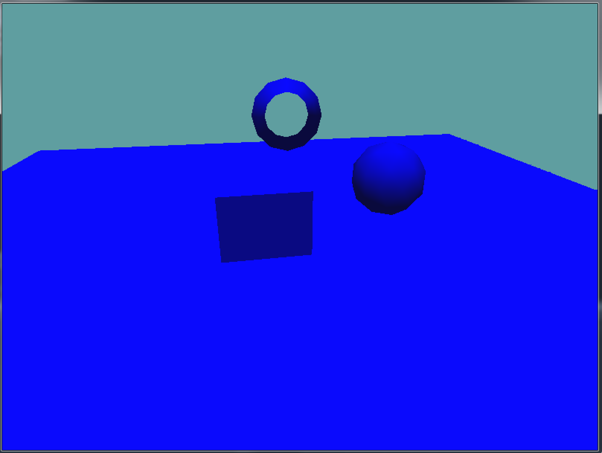
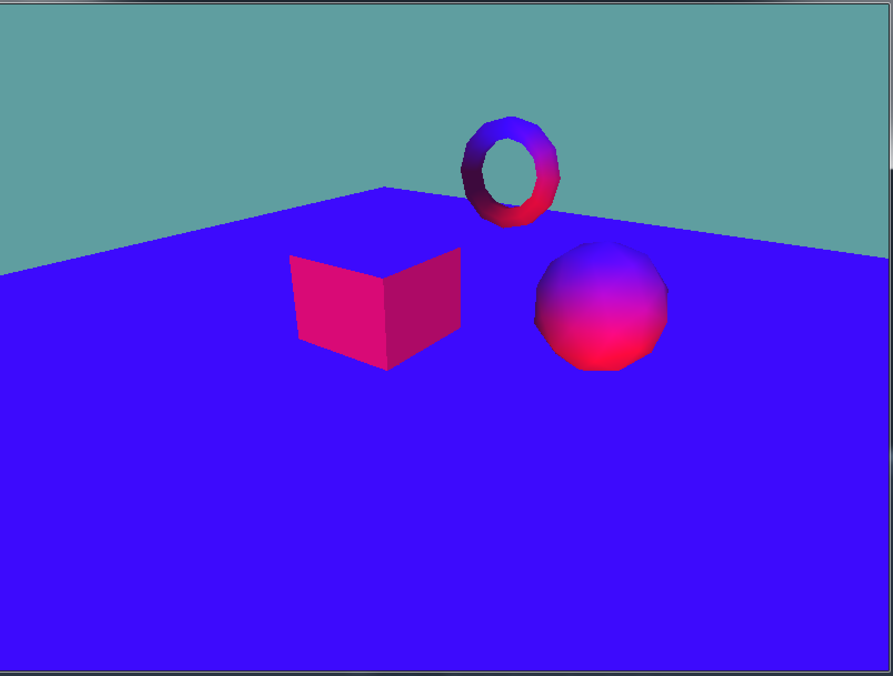

# Directional lights
Directional lights are perhaps the easyest to program. They are simply a direction that the light comes from, like sunlight. Let's give it a go.

Follow along, make a new scene for each sub-section here. For this (Directional Light) section alone you should have 6 test scenes.

## Adding one light

The first thing we need to do is enable lighting and light 0. This isn't necesarley something that needs to happen every frame, so lets handle it in the initialize function.

```
public override void Initialize() {
    grid = new Grid(true);
    GL.Enable(EnableCap.DepthTest);
    GL.Enable(EnableCap.CullFace);
    Resize(MainGameWindow.Window.Width, MainGameWindow.Window.Height);

    GL.Enable(EnableCap.Lighting);
    GL.Enable(EnableCap.Light0);
}
```

Now we are ready to do some lighting! I'm going to set light 0 to be a blue light comming from the upper front of the scene. For now, the light is static (it doesn't change from frame to frame) so it's safe to configure in the Init function as well.

```
public override void Initialize() {
    grid = new Grid(true);
    GL.Enable(EnableCap.DepthTest);
    GL.Enable(EnableCap.CullFace);
    Resize(MainGameWindow.Window.Width, MainGameWindow.Window.Height);

    GL.Enable(EnableCap.Lighting);
    GL.Enable(EnableCap.Light0);

    float[] white = new float[] { 0f, 0f, 0f, 1f };
    float[] blue = new float[] { 0f, 0f, 1f, 1f };

    GL.Light(LightName.Light0, LightParameter.Position, new float[] { 0.0f, 0.5f, 0.5f, 0.0f } );
    GL.Light(LightName.Light0, LightParameter.Ambient, blue );
    GL.Light(LightName.Light0, LightParameter.Diffuse, blue );
    GL.Light(LightName.Light0, LightParameter.Specular, white );
}
```

That's all there is to it. If you run your code, it should look like this:



## Light direction

It may not be obvious from the previous example, but OpenGL shades (lights) objects independently! That is, no object casts a shadow on another object. When the light is comming from the top, like in the above scene it's easy to miss that. So, let's change the light direction to come from the negative Y axis!

```
    GL.Light(LightName.Light0, LightParameter.Position, new float[] { 0.0f, -0.5f, 0.5f, 0.0f } );
```

Let's take a look at what that looks like:


As you can see the shading on the primitives has changed, the floor is the most noticable. In the first example, the floor got a LOT of light, in the second example, the floor is unlit. This happens because in the second example the floor is facing away from the light.

In the real world, the floor would stop light from reaching the objects. In OpenGL each object is shaded and lit indevidually, like if no other object was in the scene. It is possible to add code to support shadows, but it's a complicated process that we will talk about later.

## Two Lights
So, actually using a light us pretty easy. OpenGL supports up to 8 lights! Let's try to add one more and see what happens. We're going to add a second light, this one is going to be red. It's going to come from the Opposite direction of the blue light from the original example.

First things first, in the Initialize function we have to enable and configure light 1:

```
public override void Initialize() {
    grid = new Grid(true);
    GL.Enable(EnableCap.DepthTest);
    GL.Enable(EnableCap.CullFace);
    Resize(MainGameWindow.Window.Width, MainGameWindow.Window.Height);

    GL.Enable(EnableCap.Lighting);
    GL.Enable(EnableCap.Light0);
    GL.Enable(EnableCap.Light1);

    float[] white = new float[] { 0f, 0f, 0f, 1f };
    float[] blue = new float[] { 0f, 0f, 1f, 1f };
    float[] red = new float[] { 1f, 0f, 0f, 1f };

    // Config light 0
    GL.Light(LightName.Light0, LightParameter.Position, new float[] { 0.0f, 0.5f, 0.5f, 0.0f } );
    GL.Light(LightName.Light0, LightParameter.Ambient, blue );
    GL.Light(LightName.Light0, LightParameter.Diffuse, blue );
    GL.Light(LightName.Light0, LightParameter.Specular, white );

    // Config light 1
    GL.Light(LightName.Light1, LightParameter.Position, new float[] { 0.0f, -0.5f, 0.5f, 0.0f });
    GL.Light(LightName.Light1, LightParameter.Ambient, red);
    GL.Light(LightName.Light1, LightParameter.Diffuse, red);
    GL.Light(LightName.Light1, LightParameter.Specular, white);
}
```

Lets see what that looks like:



The top of any object is shaded blue. The bottom is shaded red. Colors in the middle interpolate between the two lights, based on the direction of the surface normal.

## On your own
Using the last example, add a third light (Light2). Configure this light to point straight left (1, 0, 0, 0), and be green. The final scene should look like this:


The torus and cube are especially interesting as we look at this scene. The floor is also noteworthy too. It's compleatly blue! That's because the floor gets blue light from the top. It's facing away from the red light on the bottom, and is paralell to the green light. So the red and green lights don't directly effect it.

But every time we added a light, the floor became a different shade of blue! If the lights don't directly effect floor, why is it's color changing? Ambient light. Each light adds a bit of ambient light to the scene. Remember, ambient lighting is light that has scattered so much it has no direction, so it uniformly effects everything in the scene!

The lighting models diffuse component is direct lighting, the ambient component is indrect lighting and the specular component is shininess! So, can we turn off the ambient light? Yes. Set the ambient component of any light that you don't want an ambient contribution from to __black__. Because black is RGB(0, 0, 0), it is absent of color, therefore it has no contribution to lighting.

## Dynamic lights
We now have a scene lit by 3 static lights. But lighting in OpenGL can be so much more than just static lights. It can be dynamic! Lights can move with objects! Using the previous scene as a base, let's animate the lights! 

We're going to make the green light orbit the scene horizontally, the red light orbit the scene vertically, and we're going to make the camera stay static.

## Independently lit objects

