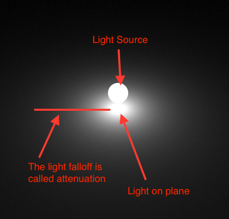

# Attenuation
In the real world, the farther an object is away from a light, the less effect that light has on the object. For example, if you look at a street lamp at night (especialy in the fog) you'll be able to see the intensity of the light dropping off away from the lamp. This phenomenon is known as _attenuation_.



This effect is modelled by OpenGL using an attenuation factor, which can reduce the effect of a lights contribution to the color of an oject based on the distance to the object. The attenuation factor is calulated as follows:


Each factor has a default of (1, 0, 0) which results in no attenuation by default. You can change the factors by passing ```LightParamater.ConstantAttenuation```, ```LightParamater.LinearAttenuation``` and ```LightParamater.QuadraticAttenuation``` to the ```GL.Light``` function. Each of these attenuation factors takes a single floating point number as an argument.

This sample code sets all attenuation factors

```
            GL.Light(LightName.Light0, LightParameter.ConstantAttenuation, 0.0f);
```