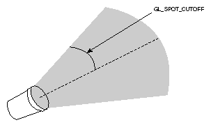
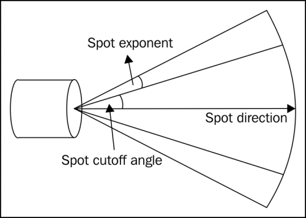

# Spotlights
Normally positional lights radiate in all directions. However you can limit the effect of the line to a cone. This would look like a flash light, the effect is called a _spotlight_.

To create a spotlight, you set up a positional light like you normally would and then set a few spotlight-specific paramaters: cutoff, direction and focus.

###Cutoff

Lets think about what a spotlight looks like for a moment. If you where looking at a spot light in pure darkness, you would see that the light creates a cone of light in the direction that the spotight is pointing.


With OpenGL, you can define how wide this cone of light should be by specifying the angle between the edge of teh cone and its axis by passing ```LightParameter.SpotCutoff``` to ```GL.Light```.



A cutoff value of 10 for example results with a spotlight whose cone spreads out 20 degrees. OpenGL accepts only values between 0 and 90 for this paramater, with the special exception of 180. 180 is the default value and turns the spotlight into a regular point light.

This is the code you would use to create a spotlight with a 30 degree cone

```
GL.Light(LightName.Light0, LightParameter.SpotCutoff, 15.0f);
```

### Direction

The next paramater to specify is the direction that the spotlight is facing. This is done with the ```LightParameter.SpotDirection``` paramater, which takes a 3 component vector (x, y, z). The default direction is (0, 0, -1), which points the spotlight down the negative z axis.  You can specify your own direction like so:

```
// Direction vector is normalized
float[] direction = {0, 0.5, -0.5};
GL.Light(LightName.Light0, LightParameter.SpotDirection, direction);
```
###Exponent

And finally you can specify the focus of the spotlight, which can be defined as the concentration of the spotlight in the center of the light cone. As you move away from the center of the cone the light is attenuated until there is no more light at the edge of the cone.

