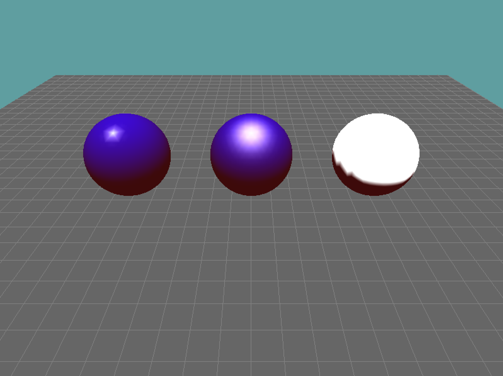

## Specular

The ambient and diffuse components of the material define the overall color of the object. The specular component defines how shiny the object is.

Let's make a new demo class we'll call it ```MateiralSpecular```. Get the code in it up to par with the test scene.

When setting the Ambient and Diffuse colors, OpenGL expected a floating point array. Setting the specular is a two part process. You must set the color (RGBA array) and the power (single float, ranging from 0 to 128).

Quick recap, you set the specular color with:

```
GL.Material(MaterialFace, MaterialParameter.Specular, float[]);
```

And the specular power with:

```
GL.Material(MaterialFace, MaterialParameter.Shininess, float);
```

# Simple Specular

* Sphere 1
  * Set ambient and diffuse to default values
  * Set specular color to white
  * Set specular power to 0
* Sphere 2
  * Set ambient and diffuse to default values
  * Set specular color to white
  * Set specular power to 16
* Sphere 3
  * Set ambient and diffuse to default values
  * Set specular color to white
  * Set specular power to 128

If you set up the properties correctly, your scene should look like this:



To get to that, i set the above material components like so:

```
// Setup camera
// Render unlit grid

// Set ambient and diffuse
GL.Material(MaterialFace.FrontAndBack, MaterialParameter.Specular, new float[] { 1, 1, 1, 1 } );
GL.Material(MaterialFace.FrontAndBack, MaterialParameter.Shininess, 0.0f);
// Draw sphere 1

// Set ambient and diffuse
GL.Material(MaterialFace.FrontAndBack, MaterialParameter.Specular, new float[] { 1, 1, 1, 1 } );
GL.Material(MaterialFace.FrontAndBack, MaterialParameter.Shininess, 16.0f);
// Draw sphere 2

// Set ambient and diffuse
GL.Material(MaterialFace.FrontAndBack, MaterialParameter.Specular, new float[] { 1, 1, 1, 1 } );
GL.Material(MaterialFace.FrontAndBack, MaterialParameter.Shininess, 128.0f);
// Draw sphere 3
```

The sphere with a specular power of 0 is all white. That's because with a low specular power, the specular component dominates the object's color.

The sphere with a specular power of 16 looks like it's lit strongly, the light is dispursing on it evenly.

The sphere with a specular power of 128 looks like a real hard light is shining on it, as the light reflection is super tiny.

The lower your specular power, the larger the specular color will be accross the surface of your object.