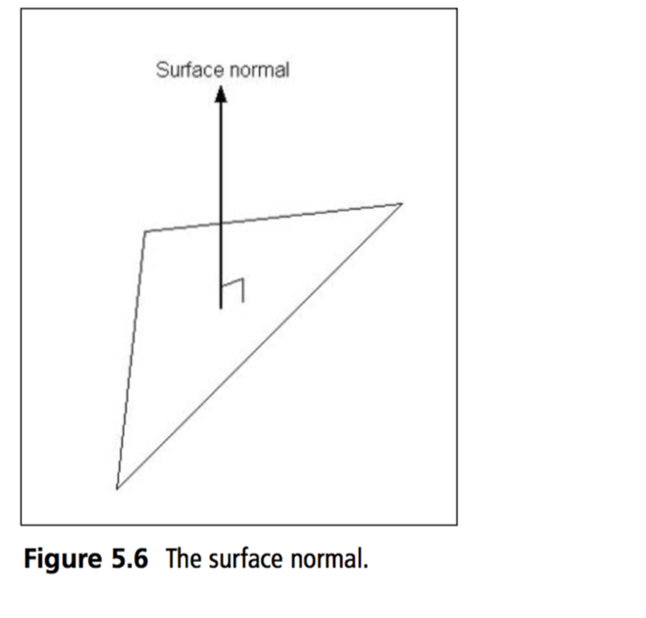
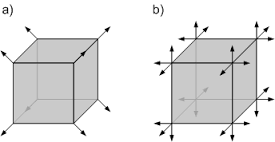
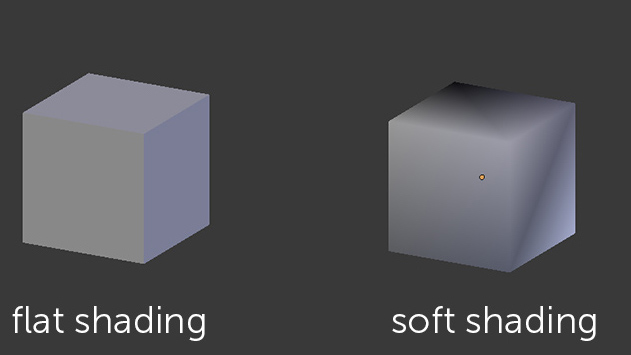

#Normals

We've already discussed normal vectors a litle bit as a mathematical concept, but seeing how normals are the key to realistic lighting, they warrant further discussion.

_Normals_ in terms of lighting are vectors that are perpendicular to a surface, and have  a lenght of 1.



They are pivotal to lighting because normals are used to describe the orientation of a surface. When you specify a light you either specify it at a point in space, or at some direction. When you draw an object, light rays from the light source will strike the surface at some angle. The color of a surface is calculated using the angle that the ray hit the surface with and the normal of the surface.

The actual math behind how the normal is used to calculate a surface color is pretty involved, we will cover it, but much later.

In OpenGL normals are defined per vertex. This allows us a great deal of flexibility in making an object look smooth or sharp. Take the following cube for example, there are two ways to possibly define it's normals:



Method A) is soft shaded, method B) is flat shaded. This is what they would look like lit:



Notice, soft shading does not really have defined edges. Flat shading does. You generally want to use flat shading for things like houses, and soft shading for organic things like poeple.

If you want to use normals in lighting, every time a vertex is specified, a normal must also be give. You can specify a normal with the function:

```
void GL.Normal3(float, float, float);
```

The function works the same as ```GL.Vertex3```. The values you pass to it represent a 3 dimensional vector. This vector MUST BE NORMALIZED, or your lighting results will be wrong. This is how you could specify a triangle:

```
GL.Begin(PrimitiveType.Triangles);
    GL.Normal3(0f, 1f, 0f);
    GL.Vertex3(-3f, 0f, 2f);
    
    GL.Normal3(0f, 1f, 0f);
    GL.Vertex3(2f, 0f, 0f);
    
    GL.Normal3(0f, 1f, 0f);
    GL.Vertex3(-1f, 0f, -3f);
GL.End();
```

Notice how every vertex has a normal. Because of the way the OpenGL state machine works, you could simply specify one normal, and all subsequent vertices would use it. That it, this code is valid:

```
GL.Begin(PrimitiveType.Triangles);
    GL.Normal3(0f, 1f, 0f);
    GL.Vertex3(-3f, 0f, 2f);
    GL.Vertex3(2f, 0f, 0f);
    GL.Vertex3(-1f, 0f, -3f);
GL.End();
```

But that becomes hard to manage later on. I encourage you to specify a normal for ever vertex, even if it's a duplicate. You can take a look at the static Primitives class we use to draw primitives. It draws all primitives WITH normals.

## Calculating normals
Finding the normal of a flat surface is easy, given a little vector math, in particular the cross product. You might remember, given two 3D vectors A and B, the cross product will produce a vector that is perpendicular to both A and B.

Check your math code for implementation details.

This means, that you need two vectors, A and B to calculate the normal of a surface. Where can you find these vectors? All triangles are made up of 3 points: P1, P2 and P3. You can use them to find the vectors. Here is a visual example:

