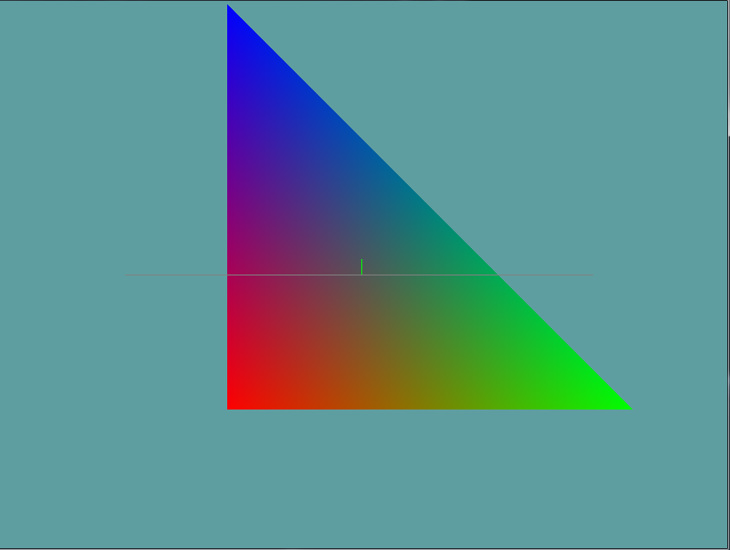

# Example
The example  below assume the following projection matrix:

```
public override void Resize(int width, int height) {
    GL.Viewport(0, 0, width, height);
    //set projection matrix
    GL.MatrixMode(MatrixMode.Projection);
    float aspect = (float)width / (float)height;
    Matrix4 perspective = Matrix4.Perspective(60, aspect, 0.01f, 1000.0f);
    GL.LoadMatrix(Matrix4.Transpose(perspective).Matrix);
    //switch to view matrix
    GL.MatrixMode(MatrixMode.Modelview);
    GL.LoadIdentity();
}
```


This is bit of code should render a smooth shaded triangle

```
public override void Render() {
    Matrix4 lookAt = Matrix4.LookAt(new Vector3(0.0f, 0.0f, 30.0f), new Vector3(0.0f, 0.0f, 0.0f), new Vector3(0.0f, 1.0f, 0.0f));
    GL.LoadMatrix(lookAt.OpenGL);
    grid.Render();

    // use smooth shading 
    GL.ShadeModel(ShadingModel.Smooth);

    // draw our smooth-shaded triangle 
    GL.Begin(PrimitiveType.Triangles);
    GL.Color3(1.0f, 0.0f, 0.0f);
    GL.Vertex3(-10.0f, -10.0f, -5.0f); // Red vertex
    GL.Color3(0.0f, 1.0f, 0.0f); 
    GL.Vertex3(20.0f, -10.0f, -5.0f); // Green vertex  
    GL.Color3(0.0f, 0.0f, 1.0f);
    GL.Vertex3(-10.0, 20.0f, -5.0f);  // Blue vertex
    GL.End();
}
```

And this is what it should look like



Try changing the shading model of the triangle from 