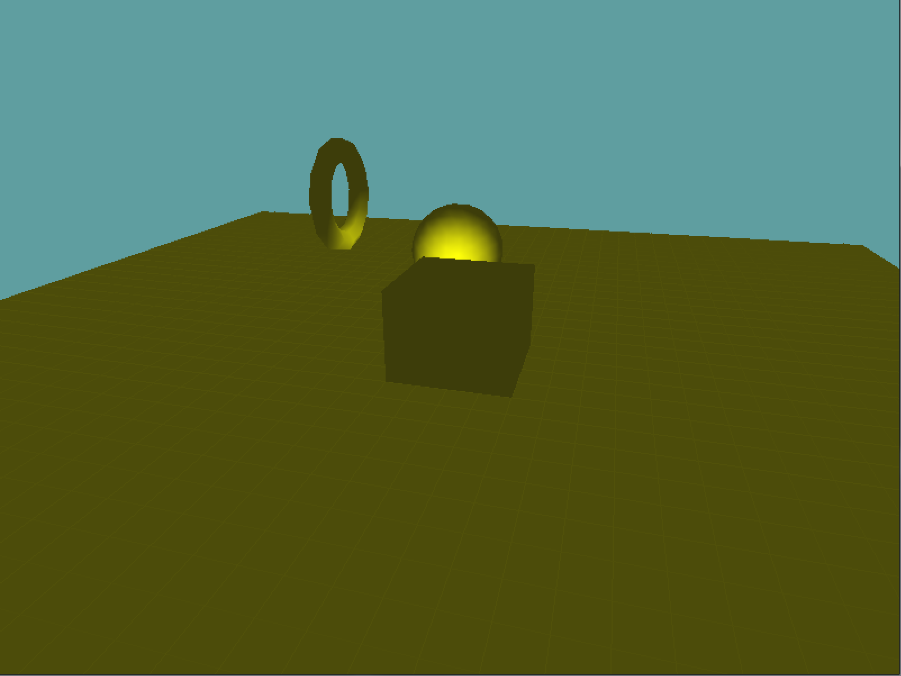
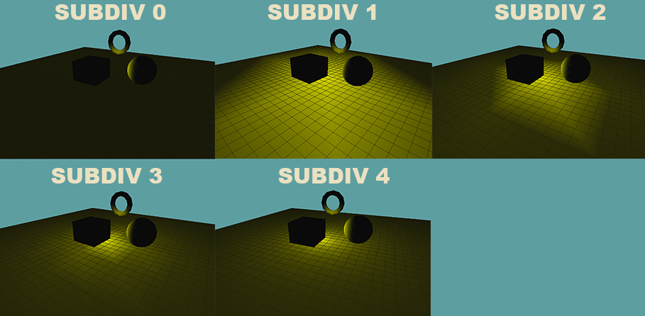
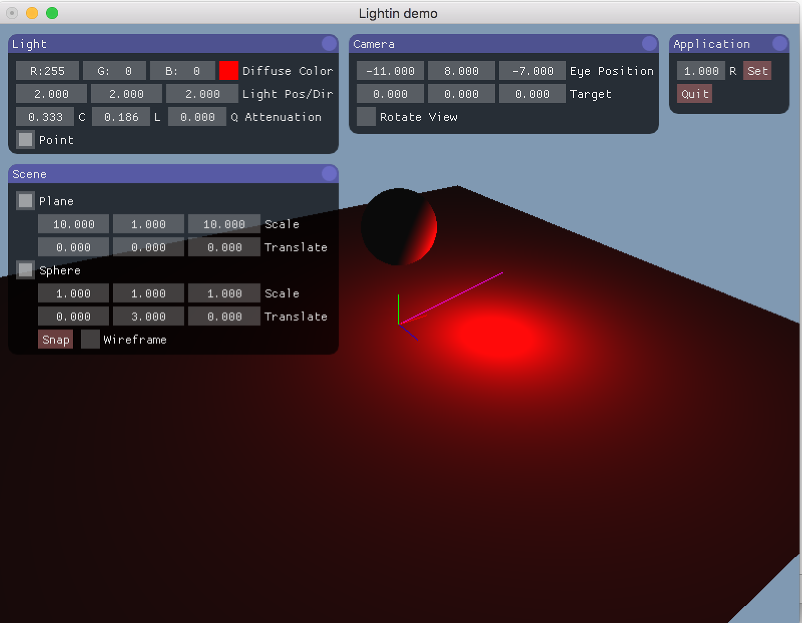
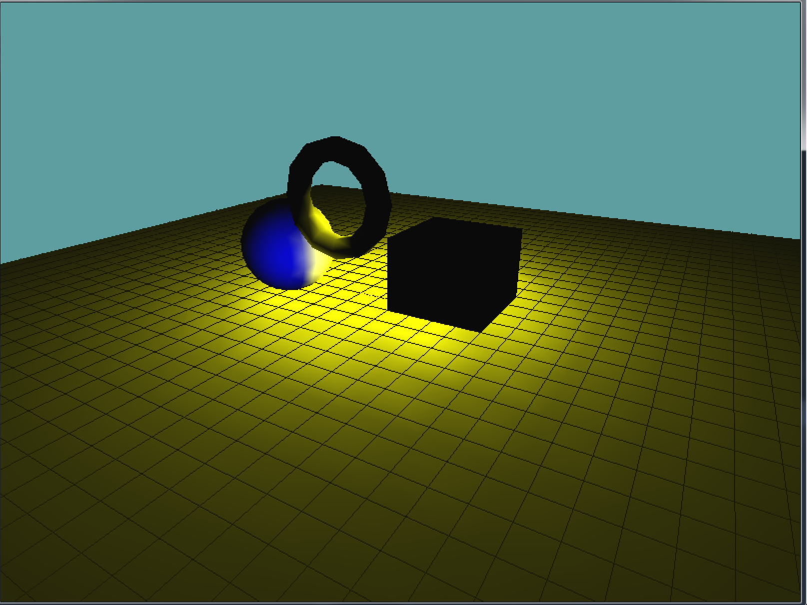
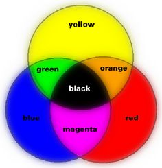
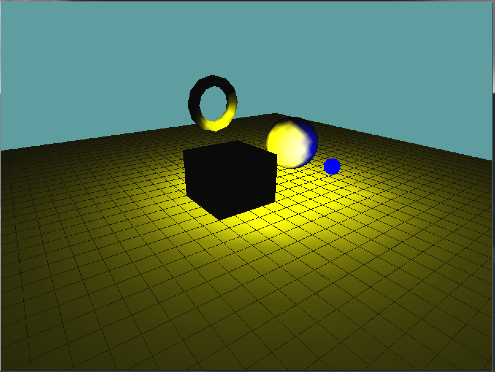
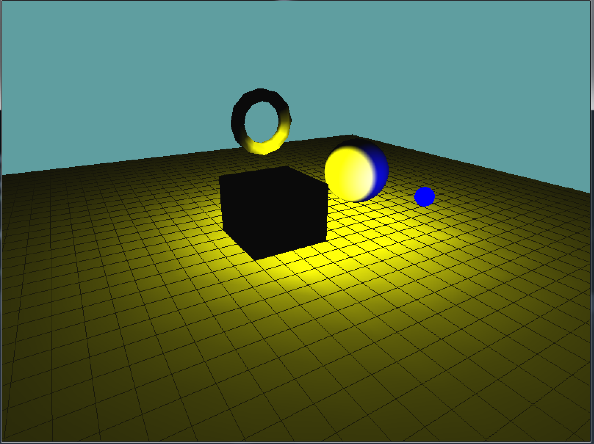

#Point Lights  
The code for point lights is very similar to the code for directional lights. You can think of a directional light as the sun, a point light is more like a light-bulb. It's a point in space that emits light, the further the light gets from the point, the less it's influance is. 

Unlike directional lights, point lights do have a position, which means the matrix stack and the model-view matrix become incredibly important. You ALWAYS have to set the position of a point light in your render loop, after the view matrix has been set

## Single Static Light
Lets start by adding a single, static point light to our test scene. We will have the light be near origin, and large enough to illuminate all objects in the scene. For this, the light will be yellow. 

In the Initialize function enable lighting and light 0. Set the color of the light to yellow RBG(1, 1, 0). Remember, to set the color of a light you need to set it's ambient, diffuse and specular components. Also, the lgiht color is a 4 component array, the last component being alpha!

Still in initialize, after the color of the light is set up, we need to set the lights position. The position is a 4 component vector (float array),with the W component being 1.

```
// Having a W of 1 makes the lgiht a point light with a position
float[] position = new float[] { 0f, 1f, 0f, 1f };
GL.Light(LightName.Light0, LightParameter.Position, position);
```

If you run your game now, you get the following scene:


That does not look right. Not at all. The whole scene is lit, nothing about that says point light to me. Before continuing reading, think about why you think this is broken.

Well, a point light has two major properties, a position and a radius. And frankly, we set the position wrong. Remember, the Position is affected by what's in the __modelview__ matrix. But in the Initialize function, that matrix is essentially trash! So, we must also set the position of the light in the render function. After the modelview is built, but before we render anything.

```
 GL.LoadMatrix(Matrix4.Transpose(lookAt).Matrix);

float[] position = new float[] { 0f, 1f, 0f, 1f };
GL.Light(LightName.Light0, LightParameter.Position, position);

grid.Render();
```

With that code in place, the scene now looks like this:



That looks so much better! It's actually starting to look like a lightbulb eluminating the scene! But why is everything an ugly mustard color? That doesn't look right! Well, that's the ambient component of the light. Remember how light works, the diffuse component is applied to an object where the light touches it. The ambient component is applied everywhere, it represents light that bounced around a lot and is now just ambient. The specular component is shininess.

With a large light, like the sun, or a super intense light, like what they use on a construction site it makes sense to have an ambient component. But with a small light (like a light bulb) it does not. Usually a bulb is only strong enough to light a small area, not a large room! With that being said, change the ambient term from yellow to black. This should leave the diffuse term yellow, the ambient term black and the specular term white. 

This will leave your scene looking like this:


Wow, we almost have it! Some things are black, there is a yellow light that fades over distance, there is just one problem. Look at the ground. It's not lit! Before reading on, think about why this might be occuring.

The answer is a tad technical, but this has to do with how OpenGL handles lights. See, OpenGL doesn't calculate lights per pixel, it calculates the light color of every vertex. When drawing a triangle, it calculates the color of all 3 vertices, and then just interpolates them like normal.

Remember how the ground (under the grid) is just two large triangles? Well, none of the triangle's vertices happen to fall into the attenuation zone. Therefore, the gound is rendered as if it was ALL outside the attenuation zone, even the parts that are inside. This is a VERY common problem with per vertex point lights. Large meshes tend to get lit wrong.

How can we fix this? By adding more vertices! The higher density your mesh is (the more tesselated your mesh is), the more accurate your lighting will become. I'm going to give you some code that takes a quad, and divides it into 4 quads before rendering. It's a recursive function, so you can sub-divide a quad as many times as you want. Add this to the ```Grid``` class:

```
private static void SubdivideQuad(float l, float r, float t, float b, float y, int subdivLevel, int target) {
    if (subdivLevel >= target) {
        GL.Vertex3(l, y, t);
        GL.Vertex3(l, y, b);
        GL.Vertex3(r, y, b);

        GL.Vertex3(l, y, t);
        GL.Vertex3(r, y, b);
        GL.Vertex3(r, y, t);
    }
    else {
        float half_width = Math.Abs(r - l) * 0.5f;
        float half_height = Math.Abs(b - t) * 0.5f;

        SubdivideQuad(l, l + half_width, t, t + half_height, y, subdivLevel + 1, target);
        SubdivideQuad(l + half_width, r, t, t + half_height, y, subdivLevel + 1, target);
        SubdivideQuad(l, l + half_width, t + half_height, b, y, subdivLevel + 1, target);
        SubdivideQuad(l + half_width, r, t + half_height, b, y, subdivLevel + 1, target);
    }
}
```

Now modify the ```Render``` function so it takes an optional subvidision paramater (0 by default), and instead of manually drawing out two large triangles it calls the subdivide function i just gave you:

```
public void Render(int subdiv = 0) {
    // Draw grid
    if (RenderSolid) {
        GL.Color3(0.4f, 0.4f, 0.4f);
        GL.Begin(PrimitiveType.Triangles);
        {
            GL.Normal3(0.0f, 1.0f, 0.0f);
            SubdivideQuad(-10, 10, -10, 10, -0.01f, 0, subdiv);
        }
        GL.End();
    }
    
    // ... rest of code is unchanged
```

Now change the render function of your demo scene to use a subdivision of 1. See what it looks like. When it doesn't look good, change it to 2, repeat until it tooks good. I decided 4 would be the one i use. This is because 4 is the first subdivision where you can see the light as a circle on the ground!



Almost there, one last problem, why is the cube black! On every side! The answer is so simple it's hard to track the bug down sometimes. The light is INSIDE the box! Because the light is inside the geometry, all the faces face the same way as the light, and no face is lit. Change the light position to:

```
float[] position = new float[] { 0.5f, 1f, 0.5f, 1f };
```

Now as your scene rotates, you will see one of the sides of the cube lit! 

Thats it, we're done. It may seem like we went trough a lot of issues to get a single point light up, that's because we did. I made sure to include all of the major mistakes that get made when seeing up lights above. Chances are you will make those mistakes (i still do), when that happens i want you to have the tools to fix them

## Attenuation

For this section, start with the scene we got at the end of the last section. Now that we can render a point light in the scene, and have it look pretty ok, how do we change the radius / size of the light?

That's where attenuation comes in. Like the color of the light, you can set it's attenuation in Intialize for now, it doesn't need to be set every frame. If you remember, attenuation is an inverse function (it starts with 1.0f /... ). This means the lower the attenuation factors, the stronger / larger the light.

Up to this point our point light has used the default attenuation values set by OpenGL. The default attenuation is:

* Constant, 1
* Linear, 0
* Quadratic, 0

Now, seeing how a point light can be visualized as essentially a large sphere, common sense would tell us that there is some way to configure attenuation by defining a radius and some strength. There is not. The attenuation model OpenGL choose looks physically accurate, but there is no common sense way to configure it. You just have to play with the numbers.

For example, try setting a "neutral" attenuation like so:

```
GL.Light(LightName.Light0, LightParameter.ConstantAttenuation, 0.25f);
GL.Light(LightName.Light0, LightParameter.LinearAttenuation, 0.25f);
GL.Light(LightName.Light0, LightParameter.QuadraticAttenuation, 0.0f);
```

The lighting in the scene has barley changed. The center is a bit more well-lit, but the area of effect for the light is almost unchanged.

Lets try introducing a quadratic term:

```
GL.Light(LightName.Light0, LightParameter.ConstantAttenuation, 0.25f);
GL.Light(LightName.Light0, LightParameter.LinearAttenuation, 0.25f);
GL.Light(LightName.Light0, LightParameter.QuadraticAttenuation, 0.25f);
```

As you can see, the area of effect for the light remains mainly the same, however the brightness of the light has been reduced significantly.

Like i mentioned previously, the closer to 0 your attenuation factors are the stronger the light is. Lets expand the lights area of influence, as well as it's brightness. Try the following:

```
GL.Light(LightName.Light0, LightParameter.ConstantAttenuation, 0.01f);
GL.Light(LightName.Light0, LightParameter.LinearAttenuation, 0.1f);
GL.Light(LightName.Light0, LightParameter.QuadraticAttenuation, 0.0f);
```

All of a sudden the point light is huge! That's all there is to point lights. You set a position, keeping in mind that the modelview matrix effects this position, and you make sure to configure the lights attenuation.

## Finding good attenuation
One of the hardest things to do with point lights is finding a decent attenuation factor. Artists will play around with the attenuation numbers for hours before choosing the final attenuation of a light.

How did i find the attenuation numbers we used in the above examples? I wrote a small program:



The program is simple, it has a few geometry objects (VERY HIGHLY TESSELATED), i subdivide everything by 10 to ensure there are enough verts that the lighting looks great. This pulls my CPU up to 50% usage whenever i run the program, but i only run it for short ammounts of time.

In this program i can type in numbers for the lights attenuation factors, color, position, etc. I can also click and drag on the text boxes to step each factor the attenuation by 0.001f

I highly suggest making something similar. Tough not required, it will REALLY help you out later. The test scene we have set up right now is actually a really good start. If you don't want to invest time in writing a UI, you can make your interaction be simple.

If i was to write a simple interaction application (which is what i did in school), pressing Q and W would step the constant factor by 0.001f, A & S would step the Linear factor by 0.001f, and Z & X would step the quadratic factor by 0.001f. Similarly i'd have E & R, D & F, C & V also modifying the appropriate factors by 0.01f, and T & Y, G & H, B & N modifying the factors by 0.1f. I'd makethe P button reset all attenuation to 0.

So, if you set up your input to modify the attenuation, how can you read back what it is? You could build a font rendering interface, it's something you've already done for the dungeon game. OR you could do what i do for quick and dirty programs, set the title bar every frame!

```
MainGameWindow.Window.Title = "Constant:" + constantFactor + ", Linear: " + linearFactor + ", Quadratic: " + quadraticFactor;
```

This way you can build a quick application for yourself that will let you play with attenuation settings in about an hour. It might not be super user friendly, but it will get the job done.

You don't have to buildthis application as a part of this chapter, but if you decide invest the time in building it now it might save you some trouble down the line.

## Local lights

A common use of point lights is to use them as local lights. That is lights that are attached to objects, and move with objects. In an entity-component system, you might have a ```PointLightComponent``` class for this that you can attach to a game object. I might configure a scene like this

```
Root (game object)
    World (game object)
        Lamp (game object)
            Light (game object with light component)
        Lamp (game object)
            Light (game object with light component)
```

That way each lamp object also has a light object that is offset relative to it. And i don't have to find the world position for every light, because the light is relative to the lamp, each light will have the same relative offset.

A really creative use of a local light is [Navi](https://goo.gl/LTC5WP) from zelda. Navi is local to link, wherever link moves Navi follows. But Navi also moves independently, flying around link. Navi has a small radius that eluminates wherever she is. The designers leveraged this, by making navi also be used as a lighting device, whenever you read a sign she flies to it and slightly eluminates it, putting emphasis on the sign being read.

With that in mind, let's create a simple local light. We're going to keep the scene illuminated by our yello light, but we're going to add a local red point light to the sphere. This will only light the sphere. Once the light is added, we will animate it to orbit the shere, because local lights don't have to be static.

Start by enabling Light1 in the initialize function. Set it's diffuse color to red, ambient color to black and specular color to white. Set the attenuation of this new light to the default values, Constant: 1, Linear: 0, Quadratic: 0. So far everything has been pretty standard. Now comes the part that makes this light a local light.

We are going to enable Ligh 1 just before the sphere is drawn, and Disable it right after, this ensures that only the sphere is lit. Then, we are going to set the light position AFTER the model matrix for the sphere has been configured.

```
// Only affect sphere
GL.Enable(EnableCap.Light1);
GL.Color3(1.0f, 0.0f, 0.0f);
GL.PushMatrix();
{
    GL.Translate(2.5f, 1.0f, -0.5f);
    // Set light position, so it's relative to sphere
    position = new float[] { -2f, 0f, -2f, 1f };
    GL.Light(LightName.Light1, LightParameter.Position, position);
    
    Primitives.DrawSphere();
}
GL.PopMatrix();
// Only affect sphere
GL.Disable(EnableCap.Light1);
```

Because the model-view matrix effects the light at the time that we set the lights position, and we set the lights position AFTER the model matrix of the sphere has been applied, this light will move with the sphere.  So if you move the sphere, (by changing ```GL.Translate(2.5f, 1.0f, -0.5f);```), the light will move with it! This is what your scene should look like:



That's the basic implementation of a local light. Let's try getting a bit more fancy with it by actually orbiting the light around the sphere! First things first, let's add a new variable for the angle of the light orbit to the class:

```
namespace GameApplication {
    class LocalLightSample : Game{
        Grid grid = null;
        Vector3 cameraAngle = new Vector3(0.0f, -25.0f, 10.0f);
        float lightAngle = 0.0f;
```

In update, we're going to rotate this light faster than the camera:

```
public override void Update(float dTime) {
    cameraAngle.X += 30.0f * dTime;
    lightAngle += 90.0f * dTime;
}
```

Now rendering gets a bit tricky. We could do something crazy and figure out how to configure the positon of the light based on the light angle, but that involves a bunch of math that we don't really need to do. Instead, we can simply move the __modelview__ matrix into the position that we want to render the light at, render the light at (0,0,0) relative to the modelview matrix, then restore the modelview matrix before rendering the sphere.

```
GL.Enable(EnableCap.Light1);
GL.Color3(1.0f, 0.0f, 0.0f);
GL.PushMatrix();
{
    // Apply the sphere translation
    GL.Translate(2.5f, 1.0f, -0.5f
    
    // Move the light into place
    GL.PushMatrix();
    {
        // Orbit the light around the y axis
        GL.Rotate(lightAngle, 0f, 1f, 0.0f);
        GL.Translate(-2f, 0f, -2f);
        
        // Render light where the model-view matrix is. No translation.
        position = new float[] { 0f, 0f, 0f, 1f };
        GL.Light(LightName.Light1, LightParameter.Position, position);
    }
    // Get rid of the light transform, restore the sphere translation
    GL.PopMatrix();
    
    Primitives.DrawSphere();
}
GL.PopMatrix();
GL.Disable(EnableCap.Light1);
```

That works, you application now looks the same, but the light is moving around. Take note of what happens when the blue light passes over a section of the sphere that's lit yellow. The geometry turns white! Why is that? Doesn't blue + yellow = green?



In the real world, that would be the case, but computers approximate color with RGB values. The sphere is it yellow, which is RGB(1, 1, 0), then a blue light passes over, blue is RGB(0, 0, 1). What happens when you combine (add) the two vectors RGB(1, 1, 0) + RGB(0, 0, 1), the result equals RGB(1, 1, 1), which is white. This is a really good example of where computer graphics fall short, by approximating colors into RGB channels we loose some of the properties that real world colors have.

The scene looks great, it's almost where we want to to be, but it's really hard to tell where the blue light is. I mean, it's easy to see it's effect on the sphere, but it's hard to tell where the actual light is. Let's fix that. We can visualize the blue light by rendering a small, unlit blue sphere at the lights position. This should be easy, since we already have the modelview matrix configured with the lights model matrix.

```
GL.Enable(EnableCap.Light1);
GL.Color3(1.0f, 0.0f, 0.0f);
GL.PushMatrix();
{
    GL.Translate(2.5f, 1.0f, -0.5f);
    GL.PushMatrix();
    {
        GL.Rotate(lightAngle, 0f, 1f, 0.0f);
        GL.Translate(-2f, 0f, -2f);

        position = new float[] { 0f, 0f, 0f, 1f };
        GL.Light(LightName.Light1, LightParameter.Position, position);
        
        // Disable lighting, we want the visualization sphere to be a solid color
        GL.Disable(EnableCap.Lighting);
        // We want the visual light sphere to be small
        GL.Scale(0.25f, 0.25f, 0.25f);
        // And blue
        GL.Color3(0f, 0f, 1f);
        // Draw the light visualization
        Primitives.DrawSphere();
        // Re-enable lighting for the rest of the scene
        GL.Enable(EnableCap.Lighting);
    }
    GL.PopMatrix();
    // This is still what draws the sphere
    Primitives.DrawSphere();
}
GL.PopMatrix();
GL.Disable(EnableCap.Light1);
```

Now it's easy to tell where the blue light is. The scene looks like this:



## Details

There is one last modification i want to make to the above scene. Right now the lighting on the sphere looks kind of bad. That's because the sphere is made up of a small number of triangles. Remember, lighting is done on a per vertex basis, the further the vertices of a triangle are (that is, the larger a triangle is), the more the lighting has to interpolate. Interpolating essentially kills attenuation and causes the artifacts we see on screen. We can fix this by adding more triangles to the sphere. Change the draw call of the sphere (the one that is rendered, not the light preview) to sub-divide 5 times.

```
Primitives.DrawSphere(5);
```

The resulting scene now has much more accurate lighting for the sphere

