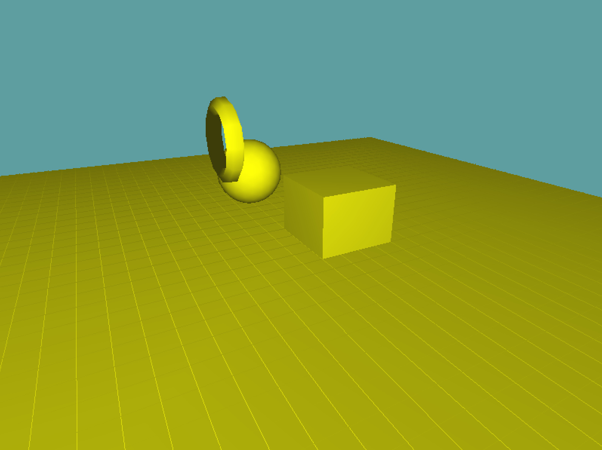
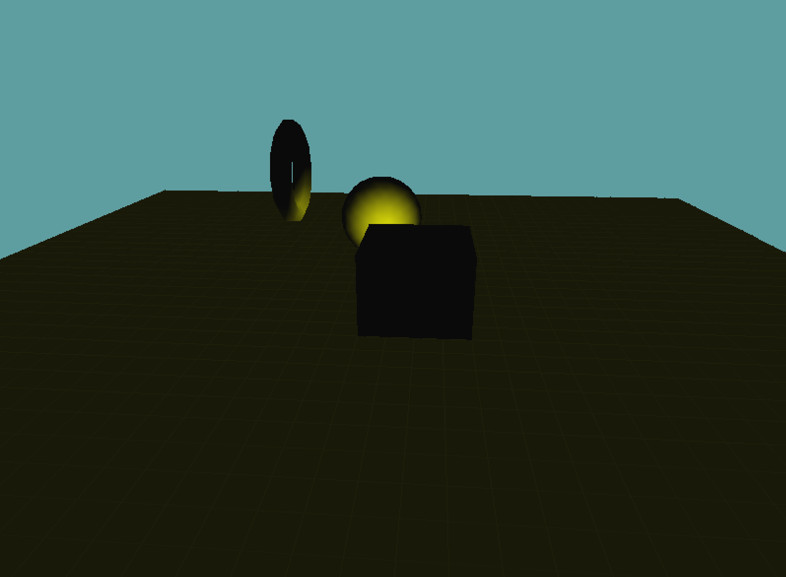

#Point Lights  
The code for point lights is very similar to the code for directional lights. You can think of a directional light as the sun, a point light is more like a light-bulb. It's a point in space that emits light, the further the light gets from the point, the less it's influance is. Unlike directional lights, point lights do have a position, which means the matrix stack and the model-view matrix become incredibly important.

## Single Static Light
Lets start by adding a single, static point light to our test scene. We will have the light be near origin, and large enough to illuminate all objects in the scene. For this, the light will be yellow. 

In the Initialize function enable lighting and light 0. Set the color of the light to yellow RBG(1, 1, 0). Remember, to set the color of a light you need to set it's ambient, diffuse and specular components. Also, the lgiht color is a 4 component array, the last component being alpha!

Still in initialize, after the color of the light is set up, we need to set the lights position. The position is a 4 component vector (float array),with the W component being 1.

```
// Having a W of 1 makes the lgiht a point light with a position
float[] position = new float[] { 0f, 1f, 0f, 1f };
GL.Light(LightName.Light0, LightParameter.Position, position);
```

If you run your game now, you get the following scene:



That does not look right. Not at all. The whole scene is lit, nothing about that says point light to me. Before continuing reading, think about why you think this is broken.

Well, a point light has two major properties, a position and a radius. And frankly, we set the position wrong. Remember, the Position is affected by what's in the __modelview__ matrix. But in the Initialize function, that matrix is essentially trash! So, we must also set the position of the light in the render function. After the modelview is built, but before we render anything.

```
 GL.LoadMatrix(Matrix4.Transpose(lookAt).Matrix);

float[] position = new float[] { 0f, 1f, 0f, 1f };
GL.Light(LightName.Light0, LightParameter.Position, position);

grid.Render();
```

With that code in place, the scene now looks like this:


That looks so much better! It's actually starting to look like a lightbulb eluminating the scene! But why is everything an ugly mustard color? That doesn't look right! Well, that's the ambient component of the light. Remember how light works, the diffuse component is applied to an object where the light touches it. The ambient component is applied everywhere, it represents light that bounced around a lot and is now just ambient. The specular component is shininess.

With a large light, like the sun, or a super intense light, like what they use on a construction site it makes sense to have an ambient component. But with a small light (like a light bulb) it does not. Usually a bulb is only strong enough to light a small area, not a large room! With that being said, change the ambient term from yellow to black. This should leave the diffuse term yellow, the ambient term black and the specular term white. 

This will leave your scene looking like this:



Wow, we almost have it! Some things are black, there is a yellow light that fades over distance, there is just one problem. Look at the ground. It's not lit! Before reading on, think about why this might be occuring.

The answer is a tad technical, but this has to do with how OpenGL handles lights. See, OpenGL doesn't calculate lights per pixel, it calculates the light color of every vertex. When drawing a triangle, it calculates the color of all 3 vertices, and then just interpolates them like normal.

Remember how the ground (under the grid) is just two large triangles? Well, none of the triangle's vertices happen to fall into the attenuation zone. Therefore, the gound is rendered as if it was ALL outside the attenuation zone, even the parts that are inside. This is a VERY common problem with per vertex point lights. Large meshes tend to get lit wrong.

How can we fix this? By adding more vertices! The higher density your mesh is (the more tesselated your mesh is), the more accurate your lighting will become. I'm going to give you some code that takes a quad, and divides it into 4 quads before rendering. It's a recursive function, so you can sub-divide a quad as many times as you want. Add this to the ```Grid``` class:

```
private static void SubdivideQuad(float l, float r, float t, float b, float y, int subdivLevel, int target) {
    if (subdivLevel >= target) {
        GL.Vertex3(l, y, t);
        GL.Vertex3(l, y, b);
        GL.Vertex3(r, y, b);

        GL.Vertex3(l, y, t);
        GL.Vertex3(r, y, b);
        GL.Vertex3(r, y, t);
    }
    else {
        float half_width = Math.Abs(r - l) * 0.5f;
        float half_height = Math.Abs(b - t) * 0.5f;

        SubdivideQuad(l, l + half_width, t, t + half_height, y, subdivLevel + 1, target);
        SubdivideQuad(l + half_width, r, t, t + half_height, y, subdivLevel + 1, target);
        SubdivideQuad(l, l + half_width, t + half_height, b, y, subdivLevel + 1, target);
        SubdivideQuad(l + half_width, r, t + half_height, b, y, subdivLevel + 1, target);
    }
}
```

Now modify the ```Render``` function so it takes an optional subvidision paramater (0 by default), and instead of manually drawing out two large triangles it calls the subdivide function i just gave you:

```
public void Render(int subdiv = 0) {
    // Draw grid
    if (RenderSolid) {
        GL.Color3(0.4f, 0.4f, 0.4f);
        GL.Begin(PrimitiveType.Triangles);
        {
            GL.Normal3(0.0f, 1.0f, 0.0f);
            SubdivideQuad(-10, 10, -10, 10, -0.01f, 0, subdiv);
        }
        GL.End();
    }
    
    // ... rest of code is unchanged
```

Now change the render function of your demo scene to use a subdivision of 1. See what it looks like. When it doesn't look good, change it to 2, repeat until it tooks good. I decided 4 would be the one i use. This is because 4 is the first subdivision where you can see the light as a circle on the ground!


```
GL.Light(LightName.Light0, LightParameter.ConstantAttenuation, 0.25f);
GL.Light(LightName.Light0, LightParameter.LinearAttenuation, 0.25f);
GL.Light(LightName.Light0, LightParameter.QuadraticAttenuation, 0.0f);
```