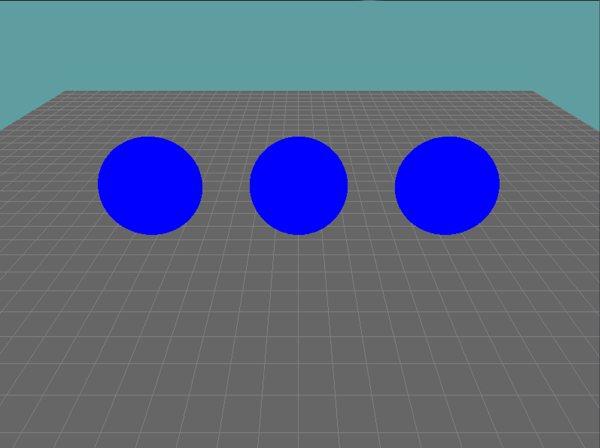
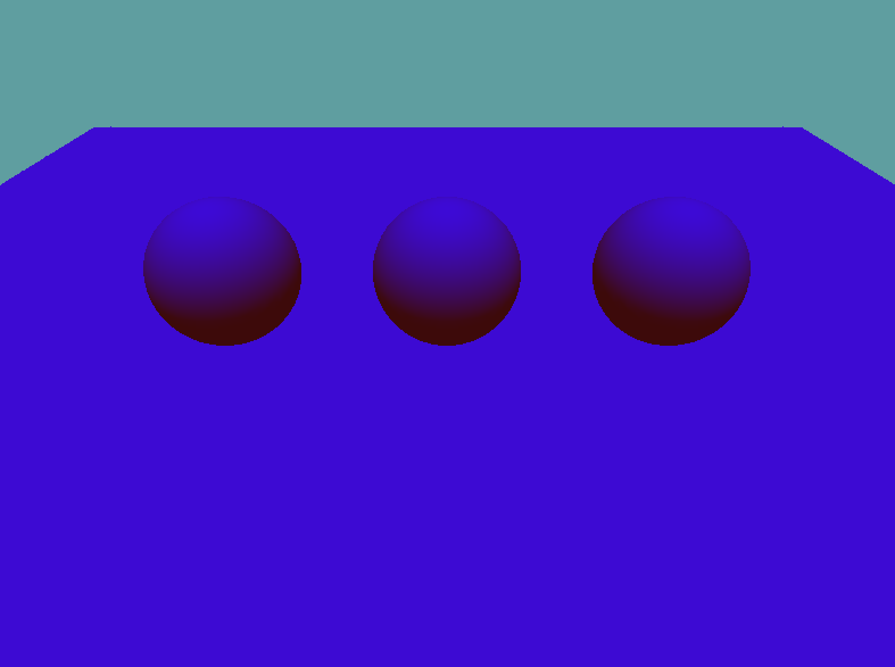

# Test scene

Lets go ahead and set up a test scene. This scene will be used as the base for all our shading execrises. We're going to render 3 spheres, each will be shaded differently troughout the exercises.

* You should be in a perspective projection, with a 60 degree field of view
  * The base class already does this, but review the code. 
  * I'm concerned that this bit isn't being practiced!
  * Take note that it's set in the constructor and resize function
  * Also, pay attention to the viewport. Every time projection is set, so is the viewport
* Set up your view matrix
  * The camera should be positioned at (0, 5, -7)
  * The camera should be looking at (0, 0, 0)
* Add a solid grid as the ground. 
  * You can use a subdivision of 0, we're only using directional lights
* Render 3 spheres, each with a subdivision level of 3
  * One at (-3, 1, 0)
  * One at (0, 1, 0)
  * One at (3, 1, 0)

Running your game, you should see this:

With the basic scene set up, lets add a light. We're going to add a red light to the scene. It's going to shine directly onto the spheres.

* Enable lighting
* Enable light 0 
  * All configuration from here on will be affecting light 0
* It's a direcitonal light. It should shine from the direction {0, 1, 1}
  * Remember, the difference between a directional and a point light is the W component
* Set the ambient color to red
* Set the diffuse color to blue
* Set the specular color to white (1, 1, 1)

The default values for everything else are fine. Your scene should now look like this:

