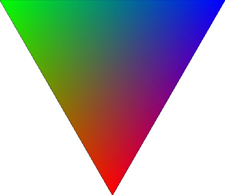

#Shading
So far we've talked about and used GL.Color to set the color of each vertex. But how does OpenGL decide what color to use in the middle of a triangle (not at a vertex)? If all 3 vertices are the same color, then obviously the middle will be that color. But what happens if you use a different color for each vertex? List so:

```
GL.Begin(PrimitiveType.Triangles);
    GL.Color3(1.0f, 0.0f, 0.0f);
    GL.Vertex3(0.0f, 0.5f, 0.0f);
    
    GL.Color3(0.0f, 1.0f, 0.0f);
    GL.Vertex3(-0.5f, 0.0f, 0.0f);
    
    GL.Color3(0.0f, 0.0f, 1.0f);
    GL.Vertex3(0.5f, 0.0f, 0.0f);
GL.End();
```

To find out lets simplify the problem. Imagine a line with two different colors. Let's keep things simple, one vertex is black, the other is white. So, what color is the line it's self? Well, that entireley depends on the shading-model being used.

Shading can either be __flat__ or __smooth__. When flat shading is used the entire primitive is drawn with a single color. 

When using flat shading, each vertex in a primitive can have a different color, OpenGL must chose one of them for the color of the primitives. For lines, triangles and quads the color of the __last__ vertex is used. For triangle strips, triangle fans and quad strips the color of the __last__ vertex in each sub-triangle is used. For polygons, the color of the __first__ vertex is used.

The line we discussed earlyer would be white if it was flat shaded. Because the last vertex is white.

Smooth shading on the other hand is based on the __Gouraud Shading Model__. This is the more realistic of the two shading models. In this mode, colors are interpolated along the face of the primitive.

The line with smooth shading would look like this:


Smooth shading on a polygon works the same way as it does for a line. For example, here is a triangle:



