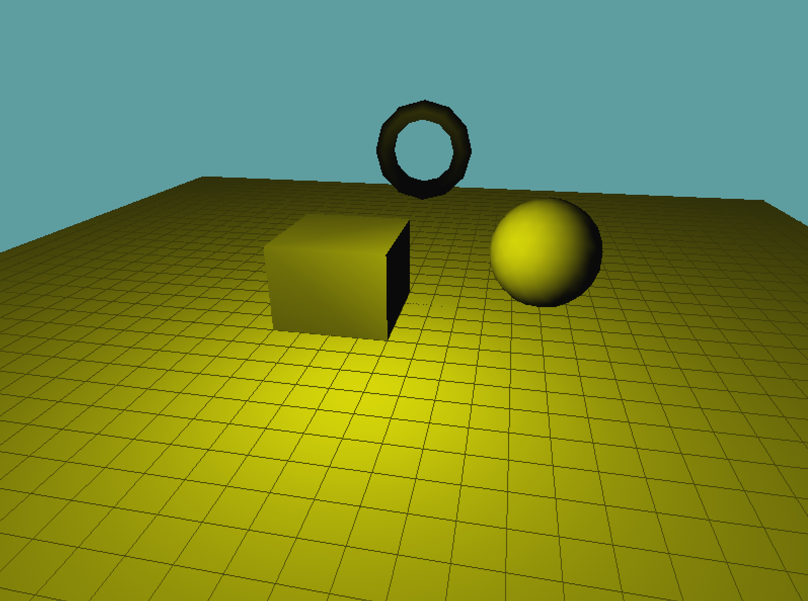
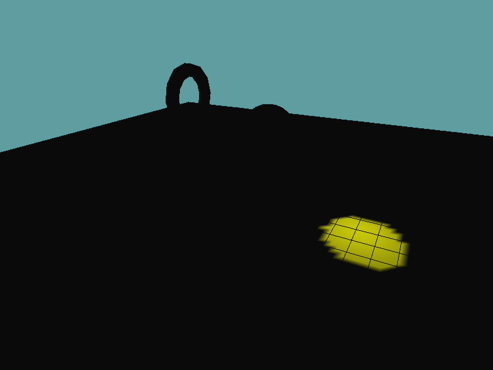
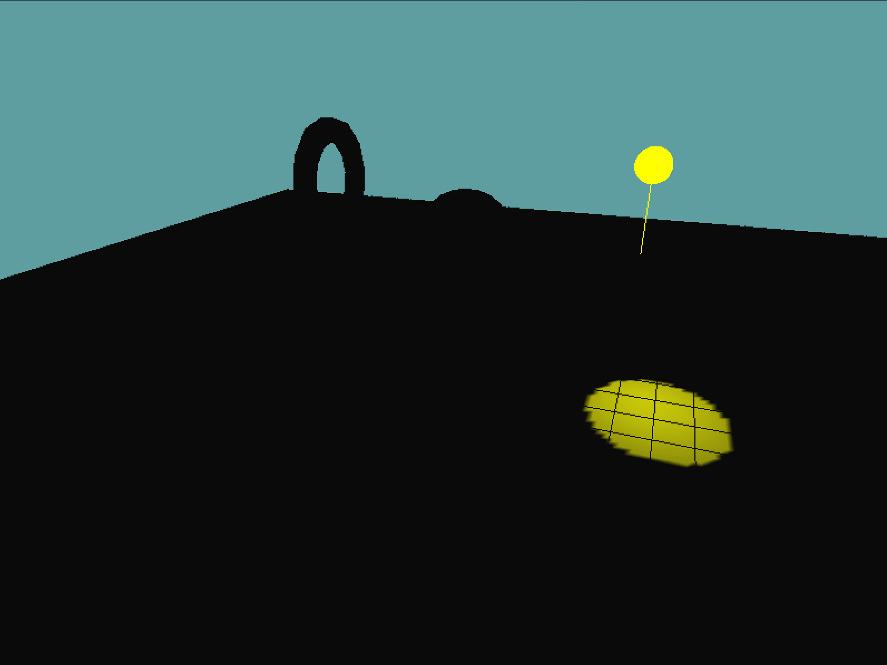
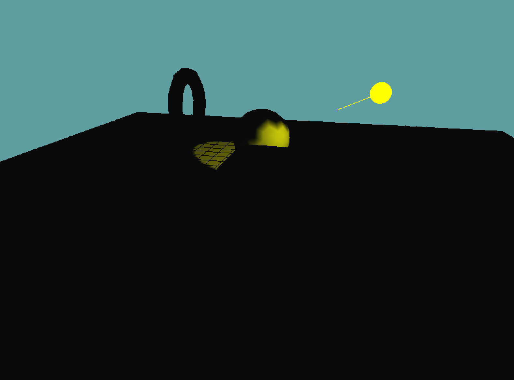

# Spot Light    
The spot light is probably the least used of the three light types OpenGL provides. Why is that? Well, the attenuation calculation for a spot light is the same as that of a point light, but in addition to that OpenGL needs to do math to only light a cone, not a sphere. Limiting the light to a cone shape makes spot lights considerably more expensive than point lights. So much so, that things a spot light would be perfect for like street lamps are most often implemented with point lights instead.

So, if spot lights are more expensive, and point light generally have the same look to them, is there a reason to know about spot lights? Or even to implement them? Yes there is. Sometimes using a PointLight will not suffice. If the shape of the light matters, a spot light is the only way to go. Like luigis manor:


We're going to go trough implementing a simple spot light together. All the advanced lighting topics (local lights, moving lights, etc...) have been covered in the Directional Light and Point Light sections. So this section should be pretty short.

## Implementation

Lets start with the unlit test scene we set up in the begenning. 
Enable lighting and light 0. Configure light 0 to have a diffuse term of yellow, an ambient term of black and a specular term of white.

Set the position of this light to  (0, 3, 3, 1). Unlike the colors, you can't configure the lights position in the Initialize function. Just like a Point Light, a Spot light must be defined in eye space. Therefore you have to set it after the view matrix is set.

Your scene should be lit like this (once you let it rotate a bit):



Set your grid subdivision to as high as you can while still maintaining a smooth framerate. For me this is 8. At a subdivision level of 8 my game rotates smoothly, at 9 the frame gets super laggy. At 10 my scene moves maybe two seconds every frame and my graphics card catches fire.

Next, let's set the properties that make up a spot light, these are ```SpotCutoff```, ```SpotExponent``` and ```SpotDirection```. For an review of how these work, check the "Spotlights" section of "Light Sources", because they have already been covered there i'm not going to cover them here. We're just going to use them.

You can set these properties in the ```Initialize``` function, as they don't change frame to frame. We're going to set a cutoff of 15, an exponent of 5 and a direction of  (0, -1, 0):

```
float[] direction = { 0f, -1f, 0f };
GL.Light(LightName.Light0, LightParameter.SpotCutoff, 15f);
GL.Light(LightName.Light0, LightParameter.SpotExponent, 5f);
GL.Light(LightName.Light0, LightParameter.SpotDirection, direction);
```

If you run your game and let it rotate you should see the below image. If your whole scene is black that means your grid's vertices are all outside of the spot lights reach, it needs to be sub-divided more. (You need a minimum of 4. At subdiv level 4 you will see a light blob). The below image is with subdivision level 8.



## Cleanup
That's it. The above code is really all there is to spot lights! Let's do a few quick cleanup steps to pull this demo together.

First and foremost, it always helps to be able to visualize where a light is. To do this, we're going to render a small sphere at the position of the light, and a line in its direction. If you're feeling brave try to implement the code without looking at the below example.

Render the visualization geometry for the light after the grid is rendered:

```
 public override void Render() {
    // ... Set eye position, configure look at matrix

    GL.Light(LightName.Light0, LightParameter.Position, pos);

    grid.Render(8);

    GL.Disable(EnableCap.Lighting);
    GL.PushMatrix();
    {
        GL.Translate(pos[0], pos[1], pos[2]);
        GL.Scale(0.25f, 0.25f, 0.25f);
        GL.Color3(1f, 1f, 0f);
        Primitives.DrawSphere();

        GL.Begin(PrimitiveType.Lines);
        
        GL.Vertex3(0f, 0f, 0f);
        // direction for me = new float[] {0, -1, 0};
        Vector3 lightDirection = new Vector3(direction[0], direction[1], direction[2]);
        lightDirection.Normalize();
        GL.Vertex3(lightDirection[0] * 5.0f, lightDirection[1] * 5f, lightDirection[2] * 5f);
        
        GL.End();
    }
    GL.PopMatrix();
    GL.Enable(EnableCap.Lighting);
    
    // ... Rest of code is unchanged
```

With the light visualization code in place, your scene should look like this:



And finally, let's tilt the light so it actually lighs up some geometry other than the floor! Change the direction fo the light from (0, -1, 0) to (-2, -1, -3). The scene after rotating a bit will look like this:



There are a few artifacts left in here. For example, once the scene rotates enough the light visualizers direction points in a different direction than the light. Or when the light hits the edge of the ground plane, the grid indicators get lit (because the grid vertex will now fall into a light). 

The above issues are expected, we're going to acknowledge that they exist, but it's not worth spending time to fix them.