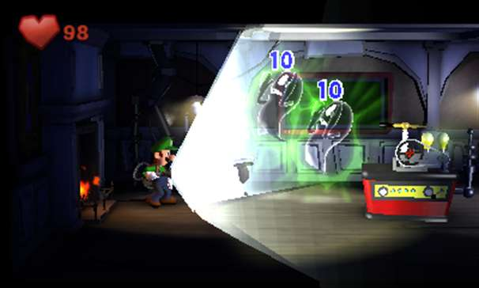

# Spot Light    
The spot light is probably the least used of the three light types OpenGL provides. Why is that? Well, the attenuation calculation for a spot light is the same as that of a point light, but in addition to that OpenGL needs to do math to only light a cone, not a sphere. Limiting the light to a cone shape makes spot lights considerably more expensive than point lights. So much so, that things a spot light would be perfect for like street lamps are most often implemented with point lights instead.

So, if spot lights are more expensive, and point light generally have the same look to them, is there a reason to know about spot lights? Or even to implement them? Yes there is. Sometimes using a PointLight will not suffice. If the shape of the light matters, a spot light is the only way to go. Like luigis manor:

We're going to go trough implementing a simple spot light together. All the advanced lighting topics (local lights, moving lights, etc...) have been covered in the Directional Light and Point Light sections. So this section should be pretty short.

## Implementation

Lets start with