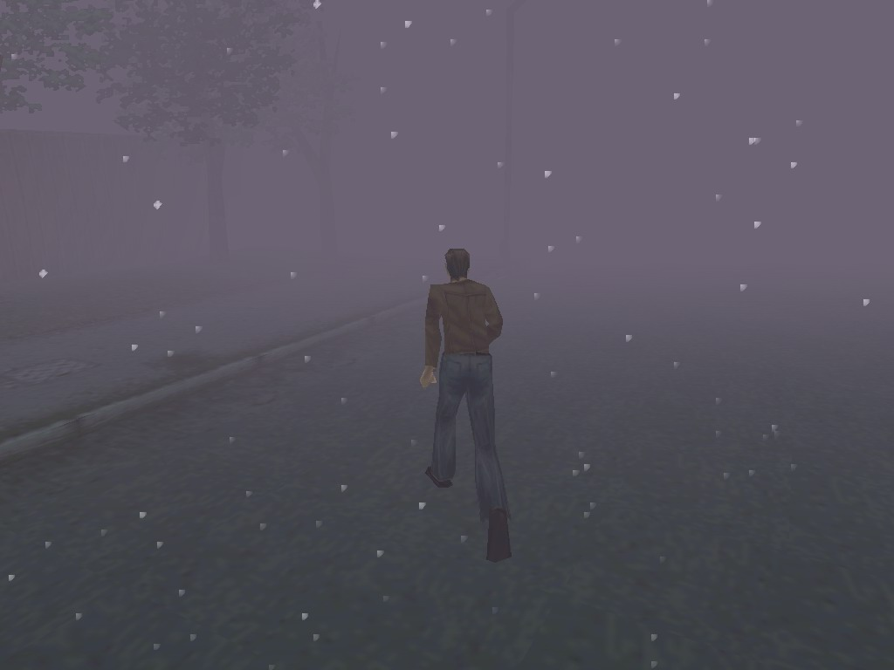

## Blending and Fog

Up to this point we've used RGBA for a lot of things. Every material color has an alpha component. Even lights have an alpha component! Yet, setting this to 0.5 does not add alpha to our scene at all.

OpenGL let's you actually use the Alpha component to draw translusent and transparent primites trough a process known as blending. 

In addition to blending, OpenGL also offers fog. Fog is great to fade objects in the distance out. If something is at the end of your view frustum, it's better to fade it out and make your world look like it's in a fog than it is to have a hard cut-off point that shows players that they are viewing the world trough a limited window.

Perhaps the most famous use of fog is the original silent hill. The PS1 could not draw many triangles (weak processor). To avoid drawing too many triangles and loosing framerate, the developers had to set the camera frustums far plane pretty close to a distance of about 25 (compared to the 1000 we set ours to). 

This short frustum caused objects farther than 25 game units to not render, making things like building pop in and out of view. To compensate for this, the developers added a heavy fog to the game to limit the players visibility. Really, it was just used to hide the fact that anything further than 25 units would pop out of existance.

They used this heavy fog to add an air of mistery to the game, and accidentally gave rise to modern horror games.

