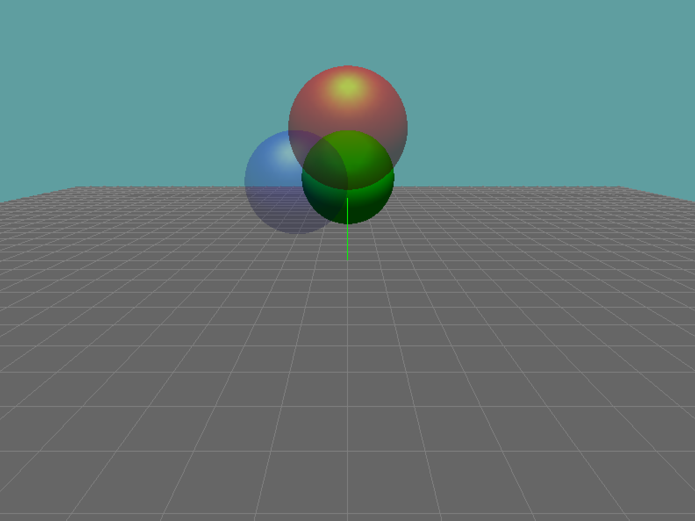

## During the initial setup function
This is the code we used to get the demo scene set up

### Initialize

```
public override void Initialize() {
    base.Initialize();
    GL.Enable(EnableCap.Lighting);
    GL.Enable(EnableCap.Light0);

    GL.Light(LightName.Light0, LightParameter.Position, new float[] { 0f, 1f, 1f, 0f });
    GL.Light(LightName.Light0, LightParameter.Ambient, new float[] { .2f, .2f, .2f, 1f });
    GL.Light(LightName.Light0, LightParameter.Diffuse, new float[] { .8f, .8f, .8f, 1f });
    GL.Light(LightName.Light0, LightParameter.Specular, new float[] { 1f, 1f, 1f, 1f });

    GL.Material(MaterialFace.FrontAndBack, MaterialParameter.Specular, new float[] { 1f, 1f, 1f, 1f });
    GL.Material(MaterialFace.FrontAndBack, MaterialParameter.Shininess, 20f);
    
    GL.Enable(EnableCap.ColorMaterial);
    GL.ColorMaterial(MaterialFace.FrontAndBack, ColorMaterialParameter.AmbientAndDiffuse);

    GL.LightModel(LightModelParameter.LightModelAmbient, new float[] { 0f, 0f, 0f, 1f });
}
```

### Render

```
public override void Render() {
    Matrix4 lookAt = Matrix4.LookAt(new Vector3(0f, 2f, -7f), new Vector3(0f, 0f, 0f), new Vector3(0f, 1f, 0f));
    GL.LoadMatrix(Matrix4.Transpose(lookAt).Matrix);

    GL.Disable(EnableCap.Lighting);
    grid.Render();
    GL.Enable(EnableCap.Lighting);

    GL.Color3(0f, 1f, 0f);
    GL.PushMatrix();
        GL.Translate(0f, 1f, 3f);
        Primitives.DrawSphere(3);
    GL.PopMatrix();

    GL.Color3(0f, 0f, 1f);
    GL.PushMatrix();
        GL.Translate(1f, 1f, 2f);
        Primitives.DrawSphere(3);
    GL.PopMatrix();

    GL.Color3(1f, 0f, 0f)
    GL.PushMatrix();
        GL.Translate(0f, 2f, 1f);
        Primitives.DrawSphere(3);
    GL.PopMatrix();
}
```

At this point, your scene should look like this:


### Initialize

```
public override void Initialize() {
    base.Initialize();
    GL.Enable(EnableCap.Lighting);
    GL.Enable(EnableCap.Light0);

    GL.Light(LightName.Light0, LightParameter.Position, new float[] { 0f, 1f, 1f, 0f });
    GL.Light(LightName.Light0, LightParameter.Ambient, new float[] { .2f, .2f, .2f, 1f });
    GL.Light(LightName.Light0, LightParameter.Diffuse, new float[] { .8f, .8f, .8f, 1f });
    GL.Light(LightName.Light0, LightParameter.Specular, new float[] { 1f, 1f, 1f, 1f });

    GL.Material(MaterialFace.FrontAndBack, MaterialParameter.Specular, new float[] { 1f, 1f, 1f, 1f });
    GL.Material(MaterialFace.FrontAndBack, MaterialParameter.Shininess, 20f);
    
    GL.Enable(EnableCap.ColorMaterial);
    GL.ColorMaterial(MaterialFace.FrontAndBack, ColorMaterialParameter.AmbientAndDiffuse);

    GL.LightModel(LightModelParameter.LightModelAmbient, new float[] { 0f, 0f, 0f, 1f });
    
    // NEW
    GL.Enable(EnableCap.Blend);
    GL.BlendFunc(BlendingFactorSrc.SrcAlpha, BlendingFactorDest.OneMinusSrcAlpha);
}
```

### Render

```
public override void Render() {
    Matrix4 lookAt = Matrix4.LookAt(new Vector3(0f, 2f, -7f), new Vector3(0f, 0f, 0f), new Vector3(0f, 1f, 0f));
    GL.LoadMatrix(Matrix4.Transpose(lookAt).Matrix);

    GL.Disable(EnableCap.Lighting);
    grid.Render();
    GL.Enable(EnableCap.Lighting);

    GL.Color4(0f, 1f, 0f, 1f);
    GL.PushMatrix();
        GL.Translate(0f, 1f, 3f);
        Primitives.DrawSphere(3);
    GL.PopMatrix();

    GL.Color4(0f, 0f, 1f, .25f);
    GL.PushMatrix();
        GL.Translate(1f, 1f, 2f);
        Primitives.DrawSphere(3);
    GL.PopMatrix();

    GL.Color4(1f, 0f, 0f, .5f)
    GL.PushMatrix();
        GL.Translate(0f, 2f, 1f);
        Primitives.DrawSphere(3);
    GL.PopMatrix();
}
```

Having made these changes, your scene should now look like this:

