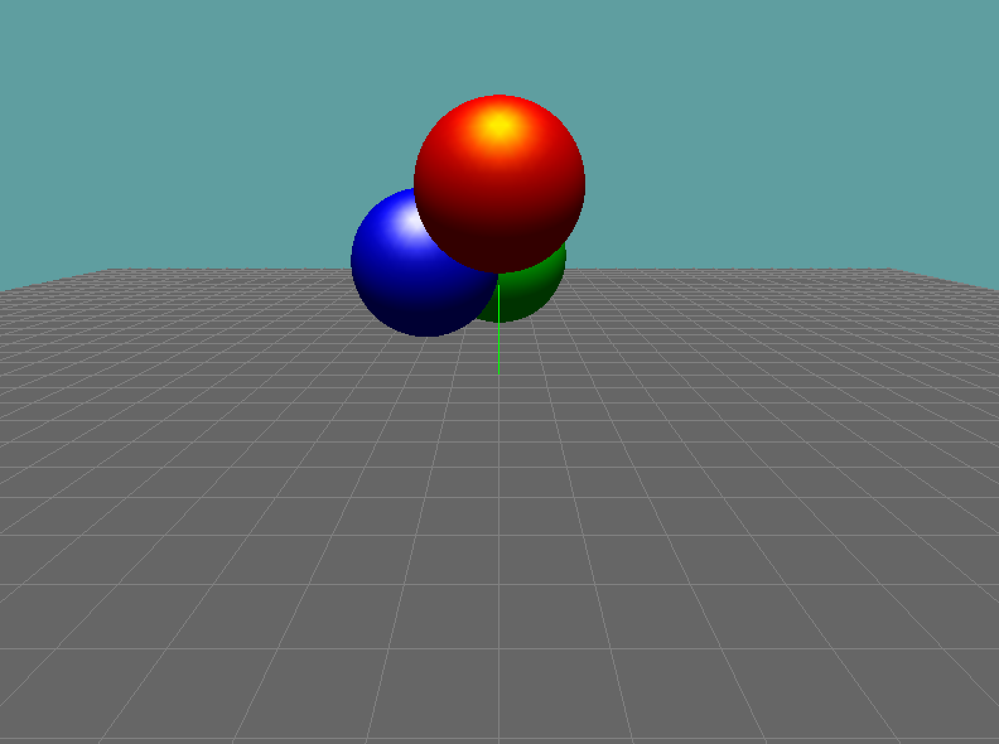

# Blend Practice

We're going to real quick try to render a scene which uses blending. This exercise will also re-inforce lessons we've learned in the materials section. The code i used to get this practice challenge done is provided in the next section "Solution". Try to do this code on your own before looking at my implementation.

First, set up a test scene. In this scene your camera will not be moving!

### Initialize

* Enable lighting, we're going to use only one light
* Set the lights position to 0, 1, 1, it's a direcitonal light
  * REMEMBER TO SET A W 
* Set a uniform low ambient color (dark gray)
  * I suggest (.2, .2, .2, 1) 
* Set a uniform high diffuse color (light gray)
  * I suggest (.8, .8, .8, 1) 
* Set a specular color of white
* Set the specular property of the front and back of the material to white
* Set the mateiral specular exponent to 20
* Enable color tracking for the ambient AND diffuse components
* Turn OFF the global ambient light by setting it to black
  * We never wrote code for this, it was discussed in "The Lighting Model"

### Render

* Position your camera at (0, 2, -7)
* Have the camera looking at (0, 0, 0)
* Render an UNLIT solid grid
* Set the material ambient and diffuse color to green
  * Remember, color tracking (Mateiral Color) is turned on!
* Draw a sphere at: (0, 1, 3)
* Set the material color to blue
* Draw a sphere at: (1, 1, 2)
* Set the material color to red
* Draw a sphere at (0, 2, 1)

At this point, your scene should look like this:



### Now for some blending

Inside Initialize
* Enable blending

Inside Render: 
* To indicate we're going to use alpha, change ```GL.Color3``` to ```GL.Color4```
* Set the alpha component of the green sphere at 1
* Set the alpha component of the blue sphere to 0.25
* Set the alpha component of the red sphere to 0.5