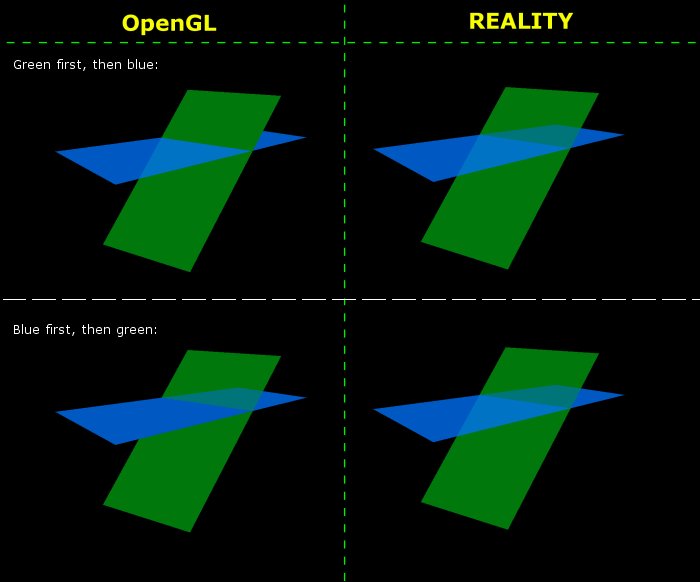

# Problems with blending

Even if you order your prolygons perfectly, and use the perfect blend functions there are still blending scenarios OpenGL will fail to handle. Some of these are unsolvable, so we avoid situations that may cause them in games. 

Unsolvable is a lie. We can solve them, in OpenGL with a technique known as depth-peeling, but it's an advanced technique that is expensive and will slow the games framerate WAY down. So we just avoid these issues.

## Intersecting alpha
What happens when two primites with alpha intersect? Which one should be drawn first? Consider this image:

* Both blue and green planes have alpha
* In the top, the part of the blue plane that's behind the green isn't showing
* In the bottom, the part of the green that's behind the blue isn't showing

You can see how this is a very sticky situation. Don't ever have two transparent objects cross each other.

## Polygon Cycle

When multiple polygons cross each other, we refer to that as cycling. You only need 3 triangles to create an unsortable cycle, consider the following:

If all 3 of those triangles have alpha, which one do you draw first?