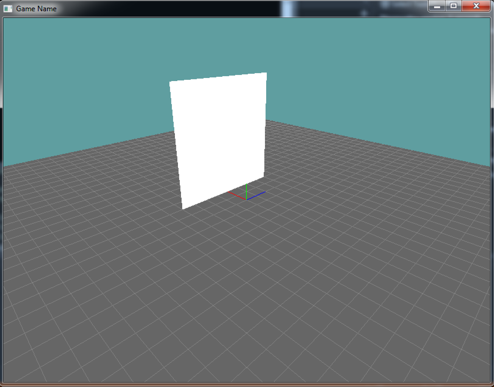
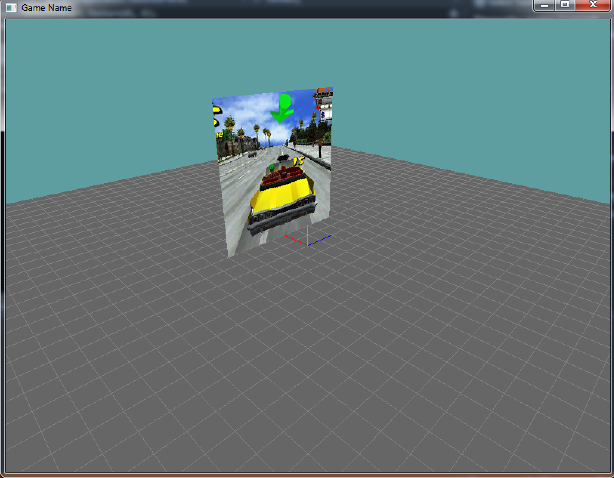
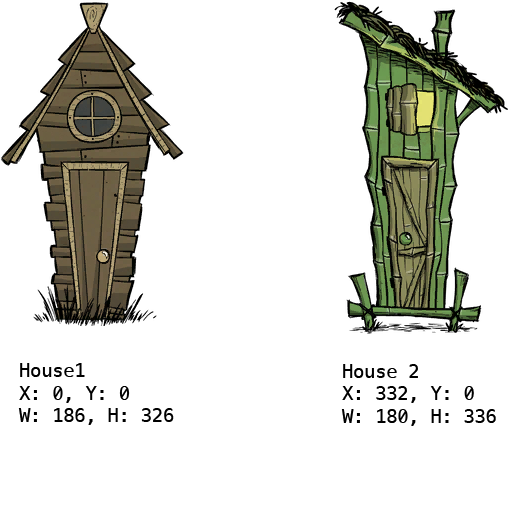
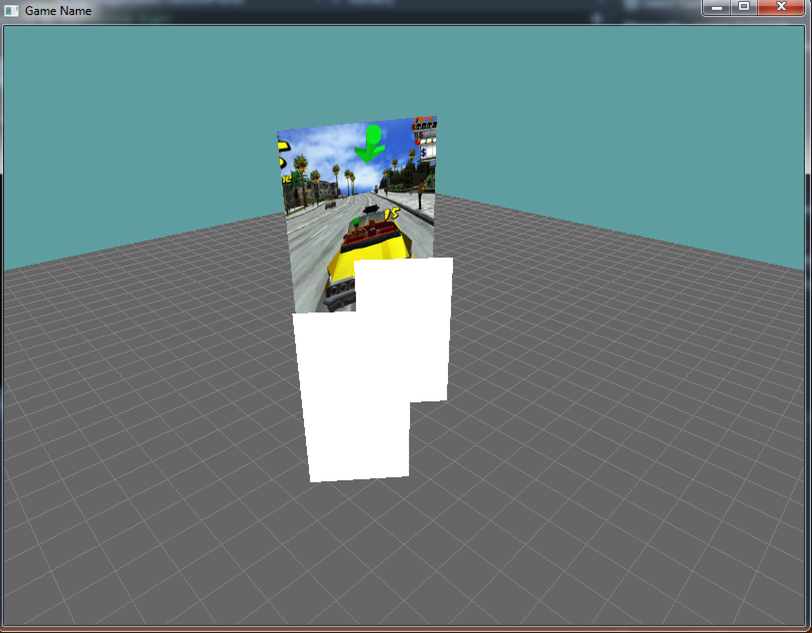
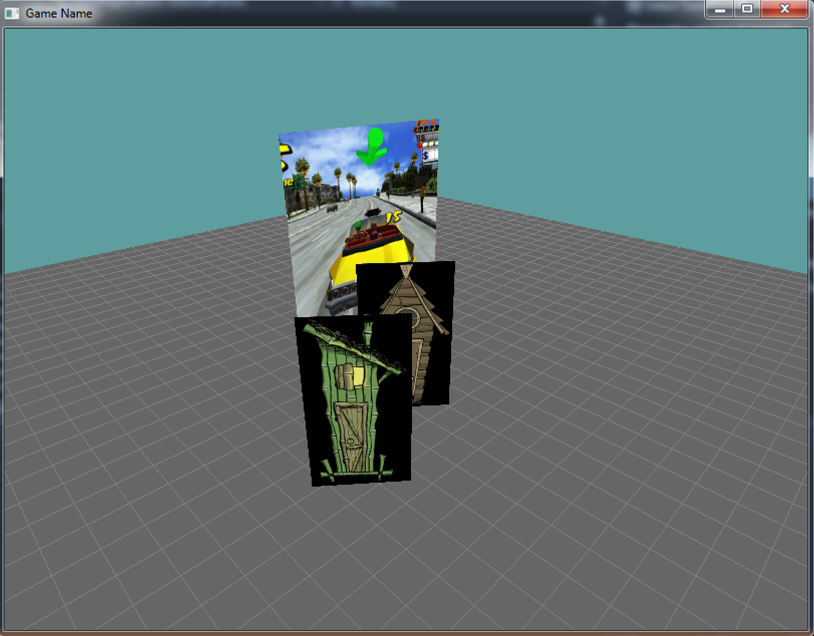
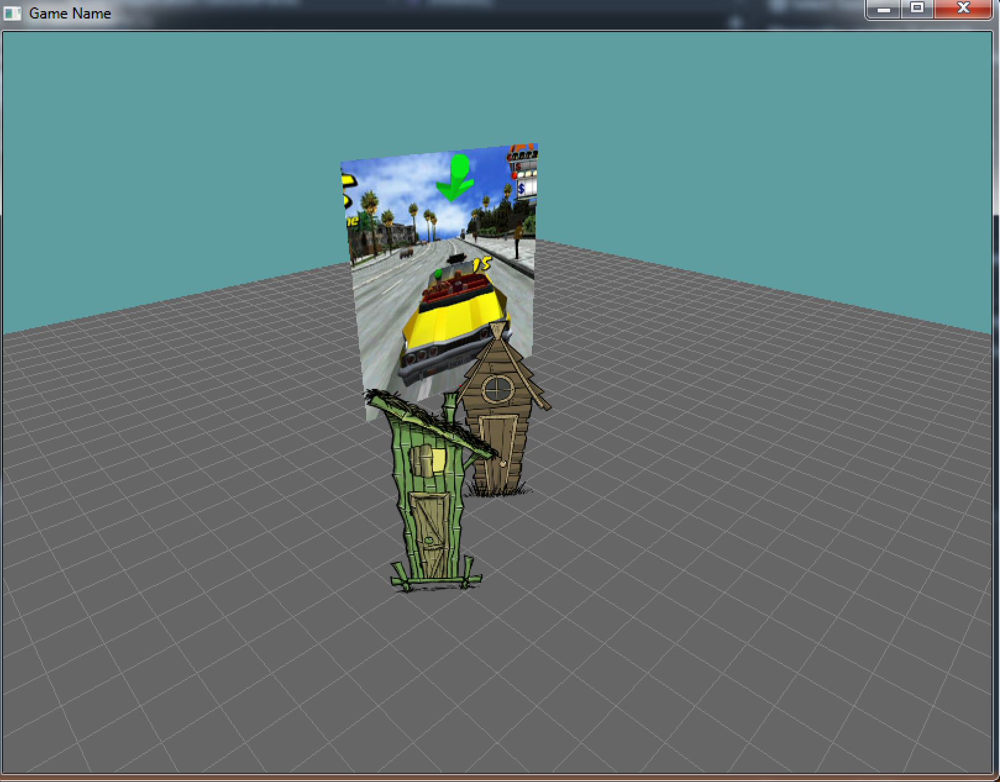

# Putting it all together

Now we know everything we need to know to make a simple textured scene! Nothing left to do except actually make something textured! In this section i'm going to walk you trough setting up a simple textured scene, but the actual texturing work will be up to you.

## Putting together the test scene

The name of this new test scene will be ```TexturedPlanes```, so create it in a file called **TexturedPlanes.cs**. For the last few examples, they have all extended a sample scene, not the empty game scene. I want to make sure we start from scratch here, notice that the ```TexturedPlanes``` class extends the ```Game``` scene, not the ```LightingExample``` class like the lighting examples before this.

So, we're going to need to make a member grid, inside the intialize function we will make a new grid. Also inside of initialize we need to enable depth testing for a proper depth buffer, as well as face culling. The shutdown function is going to stay empty for now.

```cs
using System.Drawing;
using System.Drawing.Imaging;
using OpenTK.Graphics.OpenGL;
using Math_Implementation;

namespace GameApplication {
    class TexturedPlanes : Game {
        protected Grid grid = null;

        public override void Initialize() {
            base.Initialize();
            grid = new Grid(true);
            GL.Enable(EnableCap.DepthTest);
            GL.Enable(EnableCap.CullFace);
        }
        
        public override void Shutdown() {
            base.Shutdown();
        }
```

The render function is going to set the camera at position (-7, 5, -7), looking at point (0, 0, 0). So we are going to load the appropriate view matrix. 

Then we're going to render our standard grid background. Take note, when we draw the grid we disable texturing, then re-enable texturing. This is because the grid color should come from GL.Color3, not the active texture.

```cs
        public override void Render() {
            Matrix4 lookAt = Matrix4.LookAt(new Vector3(-7.0f, 5.0f, -7.0f), new Vector3(0.0f, 0.0f, 0.0f), new Vector3(0.0f, 1.0f, 0.0f));
            GL.LoadMatrix(Matrix4.Transpose(lookAt).Matrix);
            
            GL.Disable(EnableCap.Texture2D);
            GL.Disable(EnableCap.DepthTest);
            grid.Render();
            GL.Enable(EnableCap.DepthTest);
            GL.Enable(EnableCap.Texture2D);
        }
```

Finally the resize function is going to set the viewport and load an updated projection matrix, then set the active matrix back to the modelview matrix.

```cs
        public override void Resize(int width, int height) {
            GL.Viewport(0, 0, width, height);
            GL.MatrixMode(MatrixMode.Projection);
            float aspect = (float)width / (float)height;
            Matrix4 perspective = Matrix4.Perspective(60.0f, aspect, 0.01f, 1000.0f);
            GL.LoadMatrix(Matrix4.Transpose(perspective).Matrix);
            GL.MatrixMode(MatrixMode.Modelview);
        }
    }
}
```

At this point, the test scene should look like this:


Now, let's add a quad to the scene that is to be rendered. We are going to draw this quad using two triangles. I'll make sure to comment the code to specify which vertex is which corner of the quad. Because we use two triangles, two of the corners will be defined twice. 

Modify the Render function, by adding this code at it's end:

```cs
GL.Color3(1f, 1f, 1f);
GL.Begin(PrimitiveType.Triangles);

GL.Vertex3(1, 4,  2); // Top Right
GL.Vertex3(1, 4, -2); // Top Let
GL.Vertex3(1, 0, -2); // Bottom Left

GL.Vertex3(1, 4,  2); // Top Right
GL.Vertex3(1, 0, -2); // Bottom Left
GL.Vertex3(1, 0,  2); // Bottom Right

GL.End();
```

Your scene should now look like this:



## On your Own

First, make an assets directory and save this image into it:


Remember, you have to set visual studio's working directory to one above the asset directory for loading resources! Just like with the 2D games.

We are going to do everything inline for now, so no LoadTexture helper function. Back to our code, do the following:

* Make a new integer member variable
  * This is going to be a texture handle
* In initialize, enable texturing
* In initialize, generate a texture handle
  * Assign the result to the member variable you created earlyer 
* In initialize, bind the new texture handle 
* In initialize, set the min and mag filters to linear
* In initialize, load the texture data into the handle
  * This can be done in 5 lines of code, again no helper function
  * If you get stuck, look at the "Loading Help" sub page
* In shutdown, delete the texture handle
  * Remember to unbind it first! 
* In render, bind the texture handle before drawing the quad
  * You MUST do this before GL.Begin
* In Render, add UV coordinates to each vertex 

Running your game should show the textured quad. It should look like this:



Before we render the quad we set the color to white with this code: ```GL.Color3(1f, 1f, 1f);```. Try setting that to blue to see how vertex colors affect textures. 

## Adding some detail
Rendering a textured quad is interesting, but we can make this a bit better. Let's add two more quads and explore how to render images with some alpha in them! Just like above, i'm going to walk you trough adding the geometry for these images to the scene, but then it's going to be all you when it comes to actually texturing them.

First things first tough, save the following image to your Assets directory. I call my version of it houses.png



Let's modify the render function. After the crazy taxy texture is rendered, add the following code:

```cs
// TODO: When you do texturing, remove the Disable call
GL.Disable(EnableCap.Texture2D);

// House 1
GL.Color3(1f, 1f, 1f);
    GL.PushMatrix();
        GL.Translate(-1f, 0.5f, -1f);
        GL.Rotate(-130f, 0f, 1f, 0f);
        GL.Scale(0.57f, 1f, 1f);
        GL.Scale(3f, 3f, 3f);
        GL.Begin(PrimitiveType.Triangles);
        GL.Vertex3(0.5, 0.5, 0);//top right
        GL.Vertex3(-0.5, 0.5, 0);//top left
        GL.Vertex3(-0.5, -0.5, 0);//bottom left

        GL.Vertex3(0.5, 0.5, 0);//top right
        GL.Vertex3(-0.5, -0.5, 0);//bottom left
        GL.Vertex3(0.5, -0.5, 0);//bottom Right
    GL.End();
GL.PopMatrix();

// House 2
GL.Color3(1f, 1f, 1f);
GL.PushMatrix();
    GL.Translate(-2f, 0.5f, -3f);
    GL.Rotate(-130f, 0f, 1f, 0f);
    GL.Scale(0.53f, 1f, 1f);
    GL.Scale(3f, 3f, 3f);
    GL.Begin(PrimitiveType.Triangles);
        GL.Vertex3(0.5, 0.5, 0);//top right
        GL.Vertex3(-0.5, 0.5, 0);//top left
        GL.Vertex3(-0.5, -0.5, 0);//bottom left

        GL.Vertex3(0.5, 0.5, 0);//top right
        GL.Vertex3(-0.5, -0.5, 0);//bottom left
        GL.Vertex3(0.5, -0.5, 0);//bottom Right
    GL.End();
GL.PopMatrix();

// TODO: When you do texturing, remove the Enable call
GL.Enable(EnableCap.Texture2D);
```

For now we disable texturing before drawing the quads, then enable it after were done. We do this so we can confirm that the white boxes are rendered correctly. If we didn't do this, the color of those boxes would be undefined, as OpenGL would try to read the color from the texture, for a model with no UV coordinates.

What this does is simple. We render a plane with a width of 1 and a height of 1 (a depth of 0). Then we use matrix transformations to move the plane into position in the world, rotate it towards the camera, adjust it's aspect ratio and scale it up. The following lines adjust the aspect ratio:

```
...
    GL.Scale(0.57f, 1f, 1f);
...
    GL.Scale(0.53f, 1f, 1f);
...
```

Where do 0.57 and 0.53 come from? Just like with the screen aspect ratio, any aspect is width divided by height. The first building is 186/326 which equals 0.57. The second building is 180/336 which equals 0.53. Of course i'm rounding the number a bit ;). 

The size and location of the texture bits is on the actual texture sheet. The aspect ratio of an image is the scale of it's width compared to its height. So at a scale of 1, the width of an image is it's aspect.

Running the game, your scene should look like this:



## On Your Own
Now that we have some sample planes rendering, let's actually texture them. You are going to have to do this bit on your own. Just like above, don't make a helper function, write out all the code.

* First, create another class scope texture handle
  * Even tough we're texturing 2 objects, they are in an atlas 
* In initialize, generate a new handle for this texture
* In initialize, bind the newly created handle
* In initialize, set min and mag filters
* In initialize, load the png file into this new texture handle
* In shutdown, delete the actual texture handle
  * Set the member variable to -1, to signify that it's invalid
* In Render, remove the enable and disable texturing around the two new quads
* Before rendering the quads, bind the houses texture
  * It's a good idea to bind 0 at the end of the render loop
* In render, add UV coordinates for each square
  * To display each house you will need to know where it's
  * rectangle is and bring it into (normalized) uv space.

Once you havedone all of that, running the game should look like this:



Well, that's cool. But it's not. Why is the alpha section of the image black? It has alpha pixels! Shouldn't it be transparent?!?!?

Yes and no. The fact is, those are transparent pixels. But if you remember, transparency is not magic. It's not free. And it's not on by default. Let's fix this. Do the following

* In initialize enable blending
* In initialize set the blend function

Once you have done that, your scene will look like this:



One more thing you can try. To see how the order of the sprites effects transparency, try moving the code that renders house 2 above the code that renders house 1. Just to see the artifacts it causes. You need to know what it looks like when you have wrong z-order for alpha blending, and this is the perfect example to check out. 

Here is what that would look like: