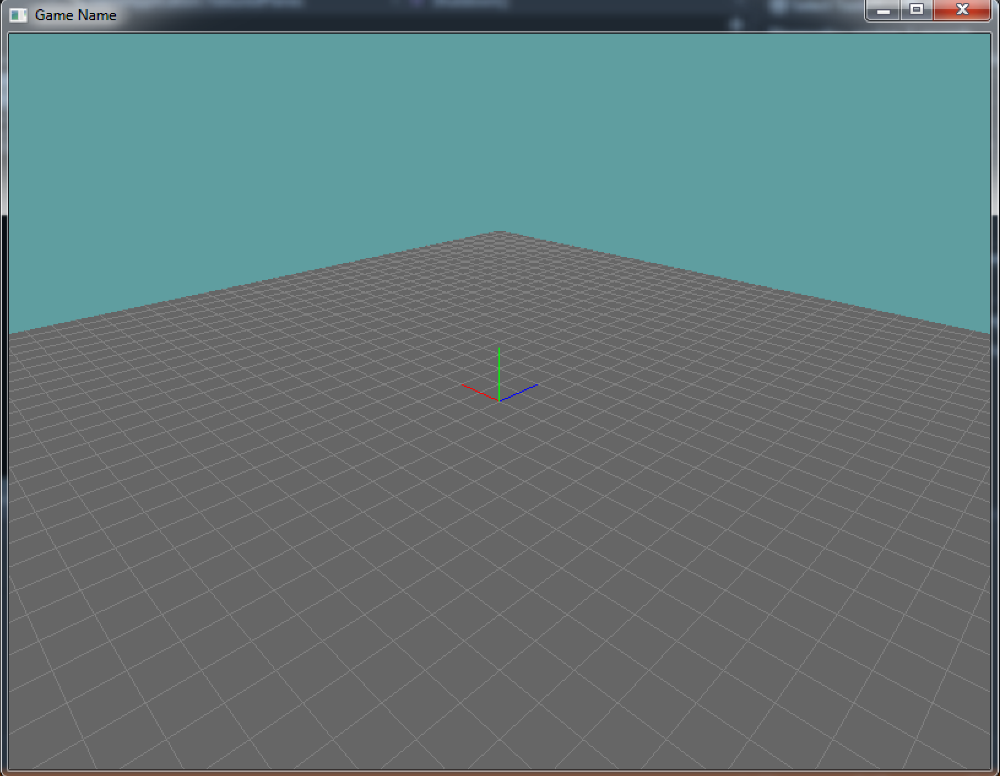
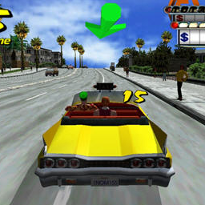

# Putting it all together

Now we know everything we need to know to make a simple textured scene! Nothing left to do except actually make something textured! In this section i'm going to walk you trough setting up a simple textured scene, but the actual texturing work will be up to you.

## Putting together the test scene

The name of this new test scene will be ```TexturedPlanes```, so create it in a file called **TexturedPlanes.cs**. For the last few examples, they have all extended a sample scene, not the empty game scene. I want to make sure we start from scratch here, notice that the ```TexturedPlanes``` class extends the ```Game``` scene, not the ```LightingExample``` class like the lighting examples before this.

So, we're going to need to make a member grid, inside the intialize function we will make a new grid. Also inside of initialize we need to enable depth testing for a proper depth buffer, as well as face culling. The shutdown function is going to stay empty for now.

```cs
using System.Drawing;
using System.Drawing.Imaging;
using OpenTK.Graphics.OpenGL;
using Math_Implementation;

namespace GameApplication {
    class TexturedPlanes : Game {
        protected Grid grid = null;

        public override void Initialize() {
            base.Initialize();
            grid = new Grid(true);
            GL.Enable(EnableCap.DepthTest);
            GL.Enable(EnableCap.CullFace);
        }
        
        public override void Shutdown() {
            base.Shutdown();
        }
```

The render function is going to set the camera at position (-7, 5, -7), looking at point (0, 0, 0). So we are going to load the appropriate view matrix. 

Then we're going to render our standard grid background. Take note, when we draw the grid we disable texturing, then re-enable texturing. This is because the grid color should come from GL.Color3, not the active texture.

```cs
        public override void Render() {
            Matrix4 lookAt = Matrix4.LookAt(new Vector3(-7.0f, 5.0f, -7.0f), new Vector3(0.0f, 0.0f, 0.0f), new Vector3(0.0f, 1.0f, 0.0f));
            GL.LoadMatrix(Matrix4.Transpose(lookAt).Matrix);
            
            GL.Disable(EnableCap.Texture2D);
            GL.Disable(EnableCap.DepthTest);
            grid.Render();
            GL.Enable(EnableCap.DepthTest);
            GL.Enable(EnableCap.Texture2D);
        }
```

Finally the resize function is going to set the viewport and load an updated projection matrix, then set the active matrix back to the modelview matrix.

```cs
        public override void Resize(int width, int height) {
            GL.Viewport(0, 0, width, height);
            GL.MatrixMode(MatrixMode.Projection);
            float aspect = (float)width / (float)height;
            Matrix4 perspective = Matrix4.Perspective(60.0f, aspect, 0.01f, 1000.0f);
            GL.LoadMatrix(Matrix4.Transpose(perspective).Matrix);
            GL.MatrixMode(MatrixMode.Modelview);
        }
    }
}
```

At this point, the test scene should look like this:



Now, let's add a quad to the scene that is to be rendered. We are going to draw this quad using two triangles. I'll make sure to comment the code to specify which vertex is which corner of the quad. Because we use two triangles, two of the corners will be defined twice. 

Modify the Render function, by adding this code at it's end:

```cs
GL.Color3(1f, 1f, 1f);
GL.Begin(PrimitiveType.Triangles);

GL.Vertex3(1, 4,  2); // Top Right
GL.Vertex3(1, 4, -2); // Top Let
GL.Vertex3(1, 0, -2); // Bottom Left

GL.Vertex3(1, 4,  2); // Top Right
GL.Vertex3(1, 0, -2); // Bottom Left
GL.Vertex3(1, 0,  2); // Bottom Right

GL.End();
```

Your scene should now look like this:


## On your Own

First, make an assets directory and save this image into it:



Remember, you have to set visual studio's working directory to one above the asset directory for loading resources! Just like with the 2D games.

We are going to do everything inline for now, so no LoadTexture helper function. Back to our code, do the following:

* Make a new integer member variable
  * This is going to be a texture handle
* In initialize, enable texturing
* In initialize, generate a texture handle
  * Assign the result to the member variable you created earlyer 
* In initialize, bind the new texture handle 
* In initialize, set the min and mag filters to linear

## Adding some detail

## On Your Own