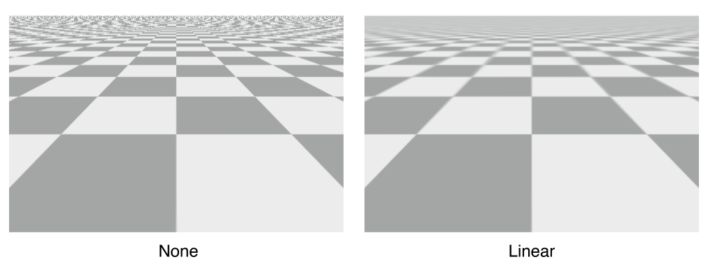
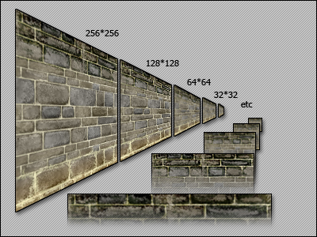
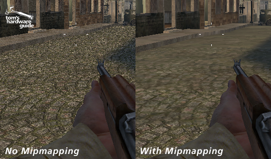
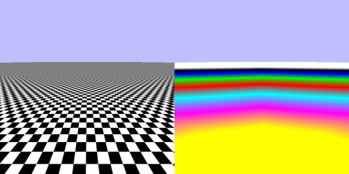
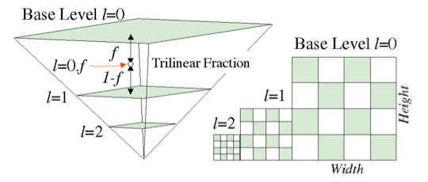
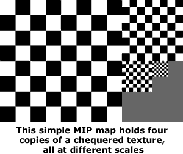
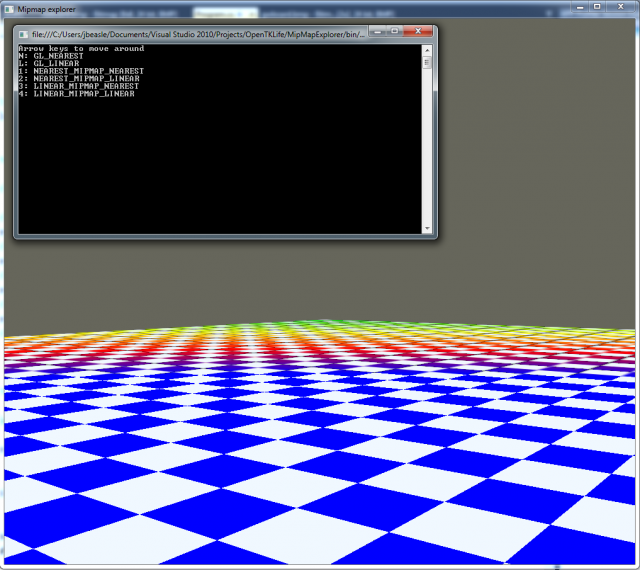

#Mip Mapping

Mip mapping is a technique used to prevent texel swimming. Before we can talk about how mip mapping works, we need to discuss what texel swimming is, and why it's a problem. consider the following image:



The left side shows a scene without mip mapping, the right side shows the same scene with linear mip mapping. Notice how even tough the image is a straight grid, off in the distance a wavy distortion startes to happen. This phenomenon is called texel swimming. 

Texel happens because the further away a textured pixel is, the more super sampled it becomes. That is, the span of 3 pixels on the source image are compressed into perhaps a single pixel on screen. When applying a perspective distortion to an image, the swimming artifacts appear.

How does mip mapping solve this? By using several resolutions of an image in memory, and sampling the correct one depending on how far away screen pixel is. This way you are more likeley to get a 1 to 1 texture mapping from source to screen and less likeley to see texel swimming. Consider the following image:



The further away you view the wall segment, the smaller the version of the image you need to sample. That is, the closer a wall the more detail it needs (sample a 256x256 version of the wall texture) but the further away the wall is, the less textures it is on screen. That means when the wall is far away a 32 x 32 version of the wall texture has enough detail.

Of course because you are sampling an image at different resolutions the resulting image will look blurred based on what resolution the specific image is sampled at. Take a look:


This may seem unreasonable, i mean doesn't blurring the image make the world look worse? In simple cases yes. But look at this example scene, it's not a complex scene, but adding mip-mapping makes a LOT of difference in the overall quality:



## Texture piramid

Like i said mip mapping is based on the pixel being rendered's distance to the camera. This image demonstrated the different mip levels being used



The way to visualize what pixel uses what mip is by thinking of the pixel as a texture pyramid:



The closer a pixel is to the camera, the closer it is the mip level 0. The further it is from the camera, the closer it is to a deeper mip level (like 2). So what does a mip mapped image look like in memory? Like this:



It's still a single texture, but that single texture is now larger, and holds multiple copies of the image at different scales. For example, if a base texture is 1024x1024, the mipmapped version of that texture will have a resolution of 1536x1024 and will contain resized versions of the image. (1536 = 1024 + 512)

When a mip map texture is generated, the image keeps being halved until it is only a single pixel. Each time the image is halved it's called a new mip level. The base image is level 0, the last level could be anything depending on the size of the original image.

## Where do mip maps come from?
A natural next question to ask is where do mip maps come from? There are two possible sources for mip maps. Most of the time you will have OpenGL generate mip maps for you. But it's also possible to upload a texture that is pre-mipmapped. 

Some graphics cards don't support uploading pre-mipmapped images as they store the mip format in a proprietary way. Because of this, to reach as many devices as possible, we tend to let OpenGL generate mipmaps for as as the default.

The best argument for uploading pre-mipmapped images comes from [this OpenTK](http://www.opentk.com/node/2575) article. They use a different colored image for each mip-level to debug the application and make it look better. Their multi-image mip looks like this when rendered:



## Lets see some code!

You don't have to follow along with this code, BUT when you do make a 3D world you will need it. As such, while you don't HAVE to follow along, you most certainly CAN. You can mip-map any scene that uses textures. The best place to start would be to add mip-maps to the scene from the [Putting it all together](Ex1.md) section.

Mip mapping happens when a texture is being put trough the min and mag filters. As such, the first step is to modify the min filter. Instead of using ```TextureMinFilter.Linear``` as the argument use  ```TextureMinFilter.LinearMipmapLinear```. 

Take note, mip mapping is for min filters only, as such the ```TextureMinFilter``` enum contains this option, but the ```TextureMagFilter``` enum does not.

With all that being said, keep the mag filter on linear and configure the min filter  like so:

```cs
GL.TexParameter(TextureTarget.Texture2D, TextureParameterName.TextureMinFilter, (int)TextureMinFilter.LinearMipmapLinear);
```

Then, you simply call ```GL.GenerateMipmap``` and specify a texture target to generate the mipmap for. Like so:

```cs
GL.GenerateMipmap(GenerateMipmapTarget.Texture2D);
```

And thats all there is to it. Mip mapping is now enabled, and mip-maps are now generated. But just to be compleate, let's take a look at loading a full texture with mip-mapping:

```cs
Bitmap bmp = new Bitmap("SomeImageFile.png");
BitmapData bmp_data = bmp.LockBits(new Rectangle(0, 0, bmp.Width, bmp.Height), ImageLockMode.ReadOnly, System.Drawing.Imaging.PixelFormat.Format32bppArgb);
GL.TexImage2D(TextureTarget.Texture2D, 0, PixelInternalFormat.Rgba, bmp_data.Width, bmp_data.Height, 0, OpenTK.Graphics.OpenGL.PixelFormat.Bgra, PixelType.UnsignedByte, bmp_data.Scan0);
// GENERATED HERE!
GL.GenerateMipmap(GenerateMipmapTarget.Texture2D);
bmp.UnlockBits(bmp_data);
bmp.Dispose();
```