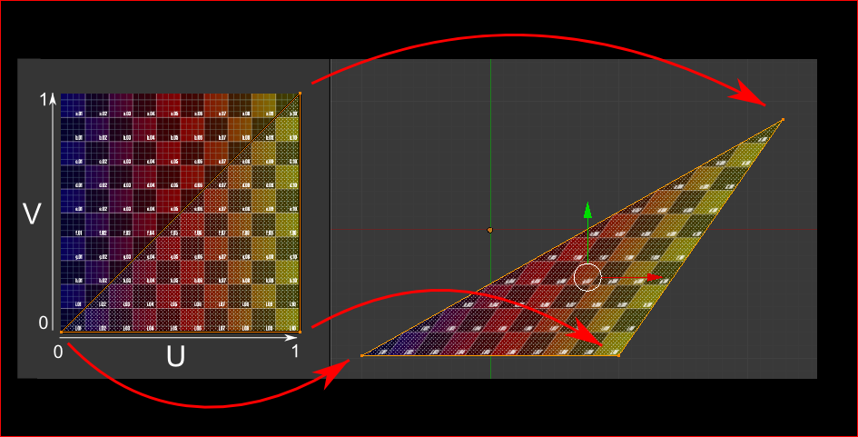

# Texture Coordinates

Now that we can load and unload textures it's finally time to texture something! In order to apply a texture to a 3D model, you must first specify some texture coordinates for each vertex of that model. So far we've given a vertex a position, a color, a normal; now we add texture coordinates to the list of attributes a vertex can have.

Texture coordinates have some special vocabulary. We call the texture coordinates __UV coordinates__. This is because a texture is not read on an X-Y axis like you might expect, rather a texture is read using a U-V axis. The U axis is horizontal, the V axis is vertical. 0, 0 is in the bottom left. When we use subscript notation, U comes first: (U, V)

The other thing to know about U-V space is that it is normalized. It doesn't matter if a texture is 124x124, 256x256, 512x1024 or whatever. The U-V coordinate space always extends from 0 to 1. The center pixel of an image is always at point (0.5f, 0.5f).

In this image, the left side shows a png picture, the right side shows the picture being applyed onto a triangle. The triangle is also outlined on top of the image. The UV coordinates of this triangles vertices are (0, 0), (1, 1), (1, 0). 



What happens when your texture isn't a square? Let's say you have 512x1024. Then the UV coordinate (0.5f, 0.5f) maps to the pixel at  256x512. I can't stress this enough, __images should always be square and a power of two__. This will help keep coordinates simple, and will run faster on your graphics card.

While we're talking about textures, let's review why a power of two textue is faster on a graphics card. A U-V coordinate doesn't map to a pixel, it maps to a __texel__. As such, each pixel on an image might take up one or more pixels on the actual render target, or no pixels at all. In order to convert texels to pixels, a graphics card must divide by 2.

If you remember WAY back to when we started programming, we briefley talked about bitshifting. Let's take the binary number for 4 for example: ```0000 0100```. If we right shift this by 1 ```>> 1``` the result is two: ```000 0010```. We just achived the same thing as a division by two, except this is about 500 times less expensive than division! This trick only works with powers of two.