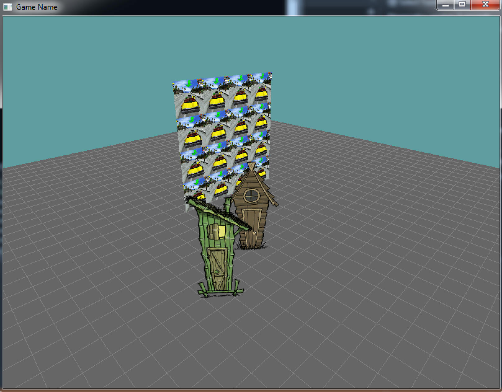

# Texture Paramaters

You can tell OpenGL how to treat different properties of textures using the ```GL.TexParameter``` function. We've already used the function when telling OpenGL how to handle the min and mag filters for the textures being loaded. What other texture paramaters can we control?

## Texture Wrapping
There are a few paramaters we can control using ```GL.TexParameter```, but the only ones we care about are mip-mapping and texture wrapping. So what is texture wrapping?

We've seen what happens when you have a quad which is mapped within the 0 to 1 uv range, like so:

```
GL.Begin(PrimitiveType.Quads);
    GL.TexCoord2(0, 1);             // What part of the texture to draw
    GL.Vertex3(left, bottom, 0.0f); // Where on screen to draw it
    
    GL.TexCoord2(1, 1);             // What part of the texture to draw
    GL.Vertex3(right, bottom, 0.0f);// Where on screen to draw it
    
    GL.TexCoord2(1, 0);             // What part of the texture to draw
    GL.Vertex3(right, top, 0.0f);   // Where on screen to draw it
    
    GL.TexCoord2(0, 0);             // What part of the texture to draw
    GL.Vertex3(left, top, 0.0f);    // Where on screen to draw it
GL.End();
```

But what happens if you exceed that range? For instance, what if your texture coords dont go to one, but they go to 2... Or -7. Like this:

```
GL.Begin(PrimitiveType.Quads);
    GL.TexCoord2(0, 3);             // What part of the texture to draw
    GL.Vertex3(left, bottom, 0.0f); // Where on screen to draw it
    
    GL.TexCoord2(3, 3);             // What part of the texture to draw
    GL.Vertex3(right, bottom, 0.0f);// Where on screen to draw it
    
    GL.TexCoord2(3, 0);             // What part of the texture to draw
    GL.Vertex3(right, top, 0.0f);   // Where on screen to draw it
    
    GL.TexCoord2(0, 0);             // What part of the texture to draw
    GL.Vertex3(left, top, 0.0f);    // Where on screen to draw it
GL.End();
```

This is where texture wrapping comes into play. The texture wrapping paramater tells OpenGL how to handle this exact scenario. There are 4 possible values you could set wrapping to:

* __Repeat__ Will tile the texture
* __MirroredRepeat__ Will tile the texture, with each tile being flipped
* __ClampToEdge__ Will use the edge pixel of a texture to determine the remaining colors
* __ClampToBorder__ Will use a solid border color to fill the remaining pixels

This might sound a bit confusing at first, so lets take a look at how each option acts in a real world situation


You can set different paramaters for the X and Y axis. You specify each axis as ```TextureParameterName.TextureWrapS``` for the X and ```TextureParameterName.TextureWrapT``` for the Y. For example, if you wanted to set a texture to repeat on both axis, you would use this code:

```
GL.TexParameter(TextureTarget.Texture2D, TextureParameterName.TextureWrapS, (int)TextureWrapMode.Repeat);
GL.TexParameter(TextureTarget.Texture2D, TextureParameterName.TextureWrapT, (int)TextureWrapMode.Repeat);
```

There is one more paramater you have to set if you use the ```ClampToBorder``` paramater, and that's the border color. You can set the border color like this:

```
GL.TexParameter(TextureTarget.Texture2D, TextureParameterName.TextureBorderColor, new float[] { r, g, b, a});
```

## On your own

Modify the sample scene we've been working with so that the crazy taxi image is uv'd from -2 to 2 instead of 0 to 1. Make sure the wrapping paramaters on both axis are set to repeat. The final image should look like this:

