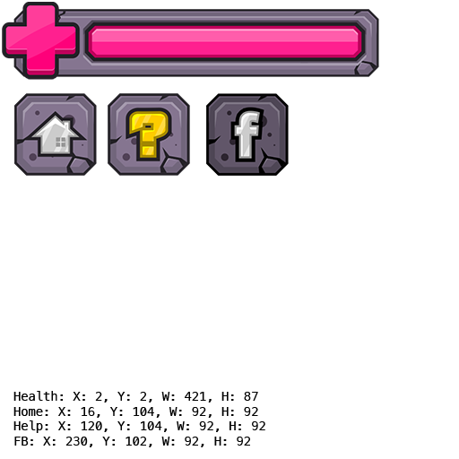

# Implementing a simple UI

We're going to modify the demo scene we've been working with to have a simple UI. By the time we're done, the demo scene will look like this:

# TODO

First, download the following texture into your assets directory:



The first thing you want to do is make a ```RenderUI``` function. You can leave it blank for now, just have it stubbed in. This is where to code to render your UI will go.

* Add a new integer variable to the class to hold the UI
* In initialize, load the UI texture
  * Remember to unload it in shutdown
* Refactor your render function into a ```RenderWorld``` function
  * That is, render should set the modelview matrix
  * Then call ```RenderWorld```
* After the world is rendered:
  * Set a pixel perfect Orthographic projection matrix
    * Remember, back up the old one
  * Load identity for the view matrix
    * Remember, back up the old one
  * Call your ```RenderUI``` function
  * Restore the projection and view matrices

Running your game at this point, everything should render as it did before. It's a really good place to check and make sure nothing is broken yet.