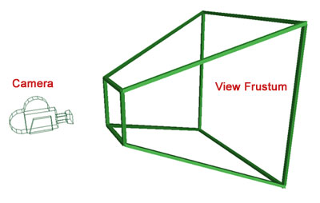

# Frustum Culling

Halfspace culling was a good start, but it's far from optimal. For one, you don't have a 180 degree field of view, the camera can usually only see about 60 degrees wide. Also, it does not take any of the other planes into account. Things might be out of view to the left, right, top, bottom, they may be too far or behind the camera.

This is where Frustum Culling comes in. We don't use frustum culling in conjunction with halfspace culling, INSTEAD OF halfspace culling we do frustum culling. 

This method revolves around the cameras frusutm:



Basically if an object is not inside the green frustum it will not be rendered. The math behind frustum culling isn't much different than the math behind Half Space Culling. It's the same thing actually!

To do Furstum culling, we first extract the 6 planes that make up the Frustum from the modelview matrix. Then, we do a half space test with ALL 6 planes. If the point is in front of all 6 planes then we render the object. If any one fails, we reject the object from being rendered.

## Extracting planes

Recall the plane equation

```
a * x + b * y + c * z + d = 0
```

To extract the planes of a frustum, you need the __viewProjection__ matrix, which you get by multiplying the projection and view matrices together. The plane values can be found by adding or subtracting one of the first three rows of the __viewProjection__ matrix from the fourth row.

* __Left Plane__ Row 1 (addition)
* __Right Plane__ Row 1 Negated (subtraction)
* __Bottom Plane__ Row 2 (addition)
* __Top Plane__ Row 2 Negated (subtraction)
* __Near Plane__ Row 3 (addition)
* __Far Plane__ Row 3 Negated (subtraction)

So, assuming that matrix ```mp``` is the view-projection matrix, you could get the left and right planes like so:

```cs
Matrix4 mv =  perspective * view;

Vector4 row1 = new Vector4(mv[0, 0], mv[0, 1], mv[0, 2], mv[0, 3]);
Vector4 row4 = new Vector4(mv[3, 0], mv[3, 1], mv[3, 2], mv[3, 3]);

Vector4 p1 = row4 + row1;
Vector4 p2 = row4 - row1;

Plane left = new Plane();
left.n = new Vector3();
left.n.X = p1.X;
left.n.Y = p1.Y;
left.n.Z = p1.Z;
left.d = p1.w;

Plane right = new Plane();
right.n = new Vector3();
right.n.X = p2.X;
right.n.Y = p2.Y;
right.n.Z = p2.Z;
right.d = p2.w;
```

## Frustum Culling

Once you have all the planes of a matrix, the actual Frustum Culling comes down to doing 6 half space tests. Assume that we have our frustum defined like so:

```cs
Plane[] frustum = new Plane[6];

void Init() {
  for (int i = 0; i < 6; ++i) {
    frustum[i] = new Plane();
  }
  
  ExtractPlanes(); // Fill the global frustum variable with planes
}
```

Now that we have a frustum, the culling code becomes very simple, first we use a helper function to test if a point is inside a frustum:

```cs
public bool PointInFrustum(Plane[] frustum, Vector3 point) {
    foreach (Plane plane in frustum) {
        if (Plane.HalfSpace(plane, point) < 0) {
            return false;
        }
    }
    return true;
}
```

And finally you just use it in your render function for anything that you want to have culled:

```cs
void Render() {
    if (PointInFrustum(frustum, object.Position)) {
      object.Render();
    }
}
```

## Implementation

As you can see above it's useful to make a Vector4 into a Plane, so lets add a new helper function to the Plane class to create one from a Vector:

```cs
public static Plane FromNumbers(Vector4 numbers) {
    Plane p = new Plane();
    p.n = new Vector3();
    p.n.X = numbers.X;
    p.n.Y = numbers.Y;
    p.n.Z = numbers.Z;
    p.d = numbers.W;
    return p;
}
```

Next we need to make two member variables:

```cs
Plane[] frustum = new Plane[6];
float aspect = 0f;
```

The resason for frustum is pretty self explanatory, you need a frustum to do frustum culling. The aspect, not so much. We need an aspect ratio to recreate the projection matrix to extract planes from.

Aspect is actually already defined in the ```Resize``` function, take out the local definition of aspect from ```Resize``` so that it sets the value of the member variable.

Now, we have an array of 6 Planes, but we do not have 6 planes. We only allocated the array. Let's allocate the actual planes in the ```Initialize``` function.

```cs
... old code
MouseState mouse = OpenTK.Input.Mouse.GetState();
LastMousePosition = new Vector2(mouse.X, mouse.Y);
// NEW
for (int i = 0; i < 6; ++i) {
    frustum[i] = new Plane();
}
// OLD
viewMatrix = Move3DCamera(0f);
... old code
```

Now that the actual planes have been created we have a frustum. Let's update the ```Move3DCamera``` function to populate this frustum. We're not going to take out any code (the near plane generation), we're just going to add new code to generate a frustum as well.

After the cameraPlane (near plane) has been created, make a projection matrix, then use that to make a __viewProjection__ matrix. Then, extract each row into a Vector4:

```cs
... old code
cameraPlane = Plane.ComputePlane(left, right, up);
// NEW
Matrix4 perspective = Matrix4.Perspective(60.0f, aspect, 0.01f, 1000.0f);
Matrix4 mv =  perspective * cameraViewMatrix;

Vector4 row1 = new Vector4(mv[0, 0], mv[0, 1], mv[0, 2], mv[0, 3]);
Vector4 row2 = new Vector4(mv[1, 0], mv[1, 1], mv[1, 2], mv[1, 3]);
Vector4 row3 = new Vector4(mv[2, 0], mv[2, 1], mv[2, 2], mv[2, 3]);
Vector4 row4 = new Vector4(mv[3, 0], mv[3, 1], mv[3, 2], mv[3, 3]);

... old code
```
